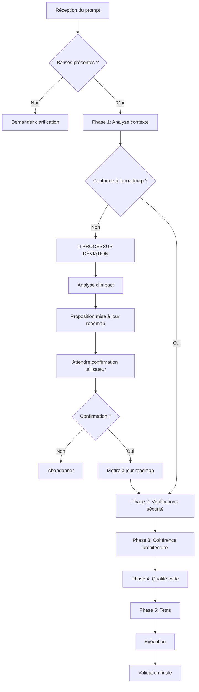
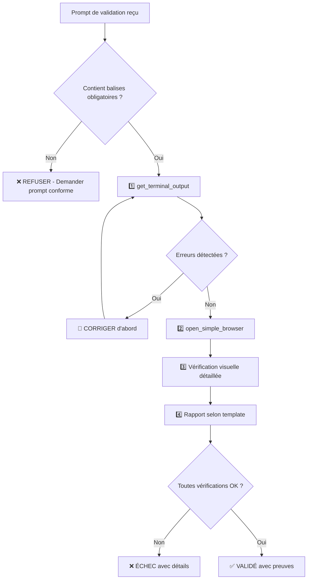
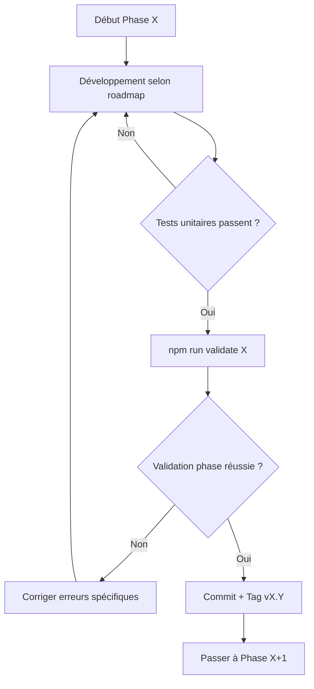
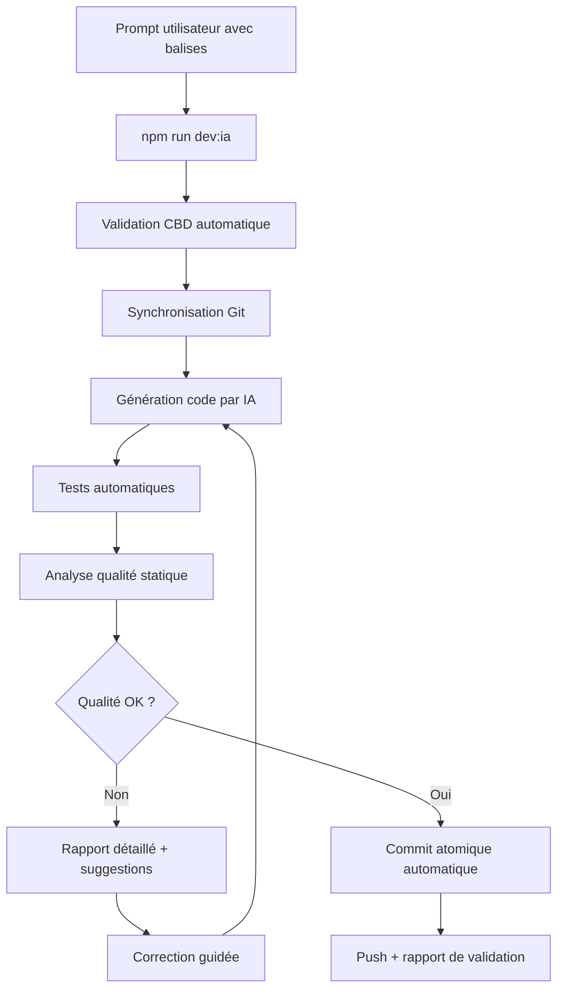

# 🤖 CBD - DOC_CoPilot_Practices - Check Before Doing (Version Optimisée)

> **Guide de collaboration optimisée Humain ↔ IA pour FunLearning V1.0**  
> Version: 2.0 | Date: 30/08/2025

---

## 📋 **Sommaire**

1. [🎯 Objectif et Principe](#-objectif-et-principe)
2. [🚀 Quick Start](#-quick-start)
3. [🔍 Processus de Vérification](#-processus-de-vérification)
   - [🌐 Tests d'URL et Validation Visuelle](#-tests-durl-et-validation-visuelle---obligatoire)
   - [🎯 Prompts Requis pour une VRAIE Vérification](#-prompts-requis-pour-une-vraie-vérification)
4. [📝 Templates de Prompts](#-templates-de-prompts)
5. [🛡️ Sécurité et Qualité](#-sécurité-et-qualité)
   - [🎯 RECOMMANDATION ABSOLUE : Approche TDD](#-recommandation-absolue--approche-tdd-test-driven-development)
6. [🐞 Mode Débogage](#-mode-débogage)
7. [⚡ Automatisation](#-automatisation)
8. [❓ FAQ et Résolution d'Erreurs](#-faq-et-résolution-derreurs)
9. [📚 Références](#-références)

---

> **🚨 ALERTE CRITIQUE - LECTURE OBLIGATOIRE**  
> **Section [🎯 Prompts Requis pour une VRAIE Vérification](#-prompts-requis-pour-une-vraie-vérification)** : Cette section définit les prompts OBLIGATOIRES pour éviter les erreurs de validation URL. **Toute validation d'URL sans suivre ce protocole est considérée comme DÉFAILLANTE.**

> **🎯 RÈGLE ABSOLUE TDD - OBLIGATOIRE**  
> **Section [🎯 RECOMMANDATION ABSOLUE : Approche TDD](#-recommandation-absolue--approche-tdd-test-driven-development)** : L'approche Test-Driven Development (TDD) est **OBLIGATOIRE** pour tout développement FunLearning. **Aucun code fonctionnel ne doit être écrit sans tests préalables.**

---

## 🎯 **Objectif et Principe**

### **Mission du CBD**

Ce document définit le **protocole de vérification automatique** que l'IA doit suivre **AVANT** d'exécuter toute action demandée par l'utilisateur.

### **🤝 Principe fondamental**

- **Utilisateur** = Chef de projet (définit QUOI faire)
- **IA** = Exécutant expert (définit COMMENT faire + vérifications)

### **🎯 Objectifs**

- ✅ Éviter les erreurs communes
- ✅ Maintenir la cohérence architecturale
- ✅ Assurer la qualité du code
- ✅ Accélérer le développement

---

## 🚀 **Quick Start**

> **🎯 RÈGLE FONDAMENTALE :** Approche TDD (Test-Driven Development) **OBLIGATOIRE** - Écrire les tests AVANT le code fonctionnel

### **Format de Prompt Obligatoire**

Chaque demande DOIT contenir ces balises :

```markdown
[CONTEXT] Phase X.Y de la roadmap FunLearning V1.0
[TDD] Tests créés/validés AVANT implémentation
[FILE] chemin/vers/fichier.ext
[CMD] commande à exécuter
[TEST] npm run test:specific
[CHECK] Critère de validation
```

### **🚨 Format Spécial pour Tests URL (OBLIGATOIRE)**

```markdown
[CONTEXT] Validation Phase X.Y selon DOC_CoPilot_Practices
[TDD] Tests automatisés validés pour cette fonctionnalité
[VERIFICATION] URL http://localhost:XXXX/path
[CONSOLE] Analyser OBLIGATOIREMENT get_terminal_output
[VISUAL] Vérifier rendu réel Web Viewer
[REPORT] Template DOC_CoPilot obligatoire
[CRITICAL] Séquence 1️⃣Terminal → 2️⃣Console → 3️⃣Visuel → 4️⃣Rapport
```

### **Exemple Complet avec TDD**

```markdown
[CONTEXT] Phase 1.8 - Authentification Firebase
[TDD] Tests auth créés et validant les scénarios edge cases
[FILE] src/routes/auth/login/+page.svelte
[CMD] npm run dev
[TEST] npm run test:auth
[CHECK] Le formulaire s'affiche et la connexion fonctionne
```

---

## 🔍 **Processus de Vérification**

### **🔄 Workflow Automatique de l'IA**



### **🗺️ Processus de Gestion Roadmap Hiérarchique (3 Niveaux)**

> **💡 Feedback Intégré :** Approche roadmap structurée en 3 niveaux avec contrôle d'alignement et évaluation des déviations

#### **📊 Structure Hiérarchique Roadmap**

```
📁 roadmap/
├── ROADMAP_LEARNING_SUMMARY.md      # Niveau 1: Vue d'ensemble exécutive
├── ROADMAP_LEARNING.md               # Niveau 2: Détail des phases
└── phases/                           # Niveau 3: Détail granulaire
    ├── Phase_01_Setup.md
    ├── Phase_02_Firebase.md
    ├── Phase_03_Core_Features.md
    ├── Phase_04_Advanced_Features.md
    ├── Phase_05_Production.md
    └── templates/
        └── TEMPLATE_Phase.md
```

**Niveau 1 - SUMMARY** : Vision stratégique, jalons majeurs, releases
**Niveau 2 - ROADMAP** : Phases détaillées, objectifs, dépendances
**Niveau 3 - PHASES** : Tasks granulaires, critères d'acceptation, métriques

#### **🔄 Workflow d'Alignement Obligatoire**

##### **📋 Avant Démarrage de Nouvelle Phase**

```markdown
[CONTEXT] PRE-PHASE - Alignement roadmap hiérarchique
[MANDATORY] Vérification 3 niveaux OBLIGATOIRE avant démarrage

🎯 ÉTAPE 1: Validation Niveau 1 (Summary)
[FILE] roadmap/ROADMAP_LEARNING_SUMMARY.md
[CHECK] Objectifs stratégiques toujours valides
[CHECK] Jalons majeurs cohérents
[CHECK] Timeline globale respectée
[VALIDATION] ✅ Niveau 1 confirmé

🎯 ÉTAPE 2: Validation Niveau 2 (Roadmap)  
[FILE] roadmap/ROADMAP_LEARNING.md
[CHECK] Phase actuelle conforme au plan
[CHECK] Dépendances phases précédentes validées
[CHECK] Prérequis phase suivante définis
[VALIDATION] ✅ Niveau 2 confirmé

🎯 ÉTAPE 3: Validation Niveau 3 (Phase Détaillée)
[FILE] roadmap/phases/Phase*XX*[nom].md
[CHECK] Tasks granulaires définies
[CHECK] Critères d'acceptation mesurables
[CHECK] Scripts de validation prêts
[VALIDATION] ✅ Niveau 3 confirmé

🚀 DÉMARRAGE AUTORISÉ: Tous niveaux alignés
```

##### **📊 Fin de Phase - Évaluation des Déviations**

```markdown
[CONTEXT] POST-PHASE - Évaluation déviations et alignement

🔍 ÉTAPE 1: Analyse Écarts Phase Terminée
[FILE] roadmap/phases/Phase*XX*[nom].md
[COMPARE] Objectifs planifiés vs réalisés
[MEASURE] Métriques attendues vs obtenues
[IDENTIFY] Déviations et causes racines
[REPORT] Génération rapport déviations

📊 ÉTAPE 2: Impact sur Niveaux Supérieurs
[ANALYZE] Impact sur ROADMAP_LEARNING.md
[ANALYZE] Impact sur ROADMAP_LEARNING_SUMMARY.md
[ASSESS] Répercussions phases suivantes
[RECOMMEND] Ajustements nécessaires

🎯 ÉTAPE 3: Proposition Alignement
[GENERATE] Propositions correction 3 niveaux
[VALIDATE] Cohérence inter-niveaux
[CONFIRM] Approbation avant ajustements
```

#### **📦 Scripts NPM Roadmap Hiérarchique**

```json
// package.json - Scripts alignement roadmap
{
  "scripts": {
    "roadmap:validate": "node tools/roadmap-alignment-checker.js",
    "roadmap:sync": "node tools/roadmap-sync.js",
    "roadmap:deviation-check": "node tools/roadmap-deviation-analyzer.js",
    "roadmap:phase-start": "npm run roadmap:validate && node tools/phase-starter.js",
    "roadmap:phase-end": "node tools/phase-evaluator.js && npm run roadmap:deviation-check",
    "roadmap:generate-summary": "node tools/roadmap-summary-generator.js",
    "roadmap:auto-align": "node tools/roadmap-auto-aligner.js"
  }
}
```

#### **🎯 Workflow Intégré Phase Start/End**

```bash
# Démarrage nouvelle phase - Validation 3 niveaux obligatoire
npm run roadmap:phase-start

🔍 Vérification alignement roadmap 3 niveaux...
═══════════════════════════════════════════════════════════
🟢 Niveau 1 (Summary): 95.2%
🟢 Niveau 2 (Roadmap): 89.7%
🟢 Niveau 3 (Phase): 92.1%
🟢 Alignement Croisé: 88.9%
═══════════════════════════════════════════════════════════
✅ STATUT GLOBAL: ALIGNÉ (91.5%)

🚀 Phase 3 - Core Features autorisée au démarrage
📋 Objectifs validés: Interface contenu + Exercices interactifs
⏱️  Timeline: 15 jours estimés
📊 Métriques: Coverage 85% + Performance < 2s

# Fin de phase - Évaluation déviations
npm run roadmap:phase-end

📊 Analyse déviations Phase 3 terminée...
═══════════════════════════════════════════════════════════
✅ Objectifs Atteints: 4/4
🟡 Métriques: Coverage 87% (+2% vs 85% cible)
🔴 Timeline: 18 jours (+3 jours vs 15 estimés)
═══════════════════════════════════════════════════════════

🎯 IMPACT ANALYSE:
• Phase 4: Retard 3 jours répercuté
• Release v1.2: Date maintenue (buffer disponible)
• Roadmap global: Pas d'impact majeur

💡 RECOMMANDATIONS:
• Intégrer retard buffer Phase 4
• Cause délai: Complexité exercices sous-estimée
• Action préventive: Revoir estimation Phase 5
```

### **🛡️ Processus de Gestion des Déviations Roadmap**

**OBLIGATOIRE** : Toute demande qui dévie de la roadmap définie DOIT déclencher ce processus :

#### **📊 Étape 1 : Analyse d'Impact Automatique**

```markdown
🔍 ANALYSE D'IMPACT DÉTECTÉE

**Demande** : [Description de la demande]
**Phase Roadmap Actuelle** : [Phase X.Y]
**Déviation Détectée** : [Description de l'écart]

�📋 IMPACT ANALYSIS :

- 🎯 **Objectifs Phase** : [Impact sur objectifs actuels]
- ⏱️ **Planning** : [Retard estimé en jours]
- 🔗 **Dépendances** : [Autres phases impactées]
- 🛠️ **Architecture** : [Changements techniques requis]
- 🧪 **Tests** : [Tests supplémentaires nécessaires]
- 💰 **Effort** : [Complexité supplémentaire 1-5]

⚠️ RISQUES IDENTIFIÉS :

- [Risque 1 avec niveau de criticité]
- [Risque 2 avec niveau de criticité]

🎯 RECOMMANDATIONS :

- Option A : [Adapter dans phase actuelle]
- Option B : [Reporter à phase ultérieure]
- Option C : [Modifier roadmap globalement]
```

#### **📝 Étape 2 : Proposition de Mise à Jour Roadmap**

```markdown
📋 PROPOSITION MISE À JOUR ROADMAP

**Modifications Suggérées** :

🔄 Phase [X.Y] Modifiée :

- Ancien objectif : [...]
- Nouvel objectif : [...]
- Durée : [ancien] → [nouveau]
- Nouvelles étapes : [liste]

📅 Planning Révisé :
| Phase | Avant | Après | Delta |
|-------|-------|-------|-------|
| P[X] | [date] | [date] | +[X] jours |
| P[Y] | [date] | [date] | +[X] jours |

🎯 Validation Modifiée :

- Nouveaux critères : [liste]
- Tests supplémentaires : [liste]
- Scripts à adapter : [liste]

❓ CONFIRMATION REQUISE :
Acceptez-vous ces modifications de roadmap ?

- [ ] ✅ OUI - Procéder avec la nouvelle roadmap
- [ ] ❌ NON - Garder roadmap actuelle et reporter
- [ ] 🔄 MODIFIER - Ajuster la proposition
```

#### **⚡ Étape 3 : Attente Confirmation Obligatoire**

L'IA DOIT attendre la confirmation explicite avant de procéder :

```markdown
⏸️ EXECUTION SUSPENDUE

En attente de votre décision sur la proposition de modification roadmap.

AUCUNE ACTION ne sera entreprise sans votre confirmation explicite.

Pour continuer, répondez avec :

- "✅ CONFIRME" - Accepter les modifications
- "❌ REFUSE" - Garder roadmap actuelle
- "🔄 AJUSTE [détails]" - Modifier la proposition
```

#### **🔄 Templates Roadmap Hiérarchique**

##### **Template ROADMAP_xxx_SUMMARY.md**

```markdown
# ROADMAP [PROJECT] SUMMARY

## 🎯 Vision Exécutive

**Objectif Stratégique :** [Vision 1 phrase]
**Timeline Globale :** [Date début] → [Date fin estimée]
**Budget/Effort :** [Estimation globale]

## 📊 Jalons Majeurs

- **🚀 MVP Ready :** [Date] - [Critères]
- **📱 Beta Release :** [Date] - [Critères]
- **🌟 Production :** [Date] - [Critères]
- **🎨 V2 Features :** [Date] - [Critères]

## 📈 KPIs Globaux

- **Performance :** [Objectif]
- **Qualité :** [Objectif]
- **Adoption :** [Objectif]

## 🚨 Risques Stratégiques

- **[Risque 1] :** [Impact] - [Mitigation]
- **[Risque 2] :** [Impact] - [Mitigation]

## 📊 Dashboard Exécutif

- **Avancement Global :** [%]
- **Budget Consommé :** [%]
- **Risques Actifs :** [Nombre]
- **Timeline Respect :** [%]
```

##### **Template Phase*XX*[nom].md**

```markdown
# PHASE [XX] - [NOM PHASE]

## 🎯 Objectifs Phase

**Objectif Principal :** [1 phrase claire]
**Durée Estimée :** [X jours]
**Dépendances :** [Phase(s) précédente(s)]

## ✅ Critères de Validation

### Fonctionnels

- [ ] [Critère fonctionnel 1]
- [ ] [Critère fonctionnel 2]

### Techniques

- [ ] [Critère technique 1]
- [ ] [Critère technique 2]

### Qualité

- [ ] Coverage tests : [X%]
- [ ] Performance : [Critère]
- [ ] Sécurité : [Critère]

## 📊 Métriques Spécifiques

- **Complexité :** [Métrique]
- **Vélocité :** [Métrique]
- **Bugs :** [Limite acceptée]

## 🔄 Tasks Granulaires

### Sprint 1

- [ ] [Task 1] - [Estimation]
- [ ] [Task 2] - [Estimation]

### Sprint 2

- [ ] [Task 3] - [Estimation]
- [ ] [Task 4] - [Estimation]

## 🎯 Definition of Done Phase

- [ ] Tous critères fonctionnels validés
- [ ] Toutes métriques qualité atteintes
- [ ] Documentation mise à jour
- [ ] Review code effectuée
- [ ] Tests automatisés passent
- [ ] Démonstration réussie
```

#### **⚡ Scripts NPM Roadmap Complémentaires**

```json
// package.json - Scripts roadmap automation
{
  "scripts": {
    "roadmap:validate": "node tools/roadmap-alignment-checker.js",
    "roadmap:sync": "node tools/roadmap-sync.js",
    "roadmap:deviation-check": "node tools/roadmap-deviation-analyzer.js",
    "roadmap:phase-start": "npm run roadmap:validate && node tools/phase-starter.js",
    "roadmap:phase-end": "node tools/phase-evaluator.js && npm run roadmap:deviation-check",
    "roadmap:generate-summary": "node tools/roadmap-summary-generator.js",
    "roadmap:auto-align": "node tools/roadmap-auto-aligner.js",
    "roadmap:learning-from-deviations": "node tools/roadmap-learning-engine.js"
  }
}
```

#### **🎯 Exemple d'Utilisation Workflow Complet**

```bash
# Démarrage nouvelle phase avec validation 3 niveaux
npm run roadmap:phase-start

🔍 Vérification alignement roadmap 3 niveaux...
═══════════════════════════════════════════════════════════
🟢 Niveau 1 (Summary): 95.2%
🟢 Niveau 2 (Roadmap): 89.7%
🟢 Niveau 3 (Phase): 92.1%
🟢 Alignement Croisé: 88.9%
═══════════════════════════════════════════════════════════
✅ STATUT GLOBAL: ALIGNÉ (91.5%)

🚀 Phase 3 - Core Features autorisée au démarrage
📋 Objectifs validés: Interface contenu + Exercices interactifs
⏱️  Timeline: 15 jours estimés
📊 Métriques: Coverage 85% + Performance < 2s

# Fin de phase avec évaluation déviations
npm run roadmap:phase-end

📊 Analyse déviations Phase 3 terminée...
═══════════════════════════════════════════════════════════
✅ Objectifs Atteints: 4/4
🟡 Métriques: Coverage 87% (+2% vs 85% cible)
🔴 Timeline: 18 jours (+3 jours vs 15 estimés)
═══════════════════════════════════════════════════════════

🎯 IMPACT ANALYSE:
• Phase 4: Retard 3 jours répercuté
• Release v1.2: Date maintenue (buffer disponible)
• Roadmap global: Pas d'impact majeur

💡 RECOMMANDATIONS:
• Intégrer retard buffer Phase 4
• Cause délai: Complexité exercices sous-estimée
• Action préventive: Revoir estimation Phase 5

# Auto-apprentissage des patterns
npm run roadmap:learning-from-deviations

📚 Analyse patterns déviations...
═══════════════════════════════════════════════════════════
🔍 Pattern détecté: Sous-estimation complexité UI
📊 Occurrence: 3/5 dernières phases
💡 Facteur correction: +30% temps estimation UI
📈 Application: Prochaines phases avec composants UI
═══════════════════════════════════════════════════════════

🎯 Auto-ajustements appliqués:
• Phase 5 UI avancée: 12j → 16j (+33%)
• Phase 6 Tests UI: 8j → 10j (+25%)
• Buffer Phase 7: 2j → 4j (+100%)

✅ Roadmap auto-ajusté avec apprentissage historique
```

### **📋 Checklist de Vérification Enrichie**

| Phase | Vérification               | Commande/Action                                      | ✅  |
| ----- | -------------------------- | ---------------------------------------------------- | --- |
| 0     | **Documentation centrale** | Consulter [DOC_README.md](./DOC_README.md)           | □   |
| 0.5   | **🎯 TDD OBLIGATOIRE**     | Tests écrits AVANT code fonctionnel                  | □   |
| 1     | **Conformité roadmap**     | Vérifier alignement avec DOC_ROADMAP_LEARNING.md     | □   |
| 2     | **Références modulaires**  | Identifier documents à mettre à jour                 | □   |
| 3     | Contexte identifié         | Référence roadmap                                    | □   |
| 4     | Environnement prêt         | `npm run check:env`                                  | □   |
| 5     | Structure respectée        | Validation architecture                              | □   |
| 6     | Sécurité OK                | `npm audit`                                          | □   |
| 7     | **Tests TDD passants**     | `npm run test` + validation cycle RED-GREEN-REFACTOR | □   |

### **🌐 Tests d'URL et Validation Visuelle - OBLIGATOIRE**

> **⚠️ RÈGLE CRITIQUE** : Lors de tout test d'URL avec `open_simple_browser`, l'IA DOIT systématiquement :

#### **📋 Protocole de Validation Obligatoire**

1. **🔍 Vérification Console** - **TOUJOURS EN PREMIER**

   ```markdown
   ✅ OBLIGATOIRE : Examiner la console du navigateur pour :

   - ❌ Erreurs JavaScript (rouge)
   - ⚠️ Avertissements TypeScript/Svelte (orange)
   - 🔗 Erreurs de chargement de ressources (404, etc.)
   - 🚨 Erreurs de compilation en temps réel
   ```

2. **👁️ Vérification Visuelle** - **ENSUITE SEULEMENT**

   ```markdown
   ✅ OBLIGATOIRE : Vérifier dans le Web Viewer :

   - 🎨 Rendu visuel correct (pas de mise en page cassée)
   - 📱 Responsive design fonctionnel
   - 🔘 Interactions utilisateur (boutons, liens, navigation)
   - ⚡ Animations et transitions fluides
   - 📊 Données affichées correctement
   ```

3. **📝 Rapport de Validation**

   ```markdown
   ✅ TEMPLATE OBLIGATOIRE de conclusion :

   **🌐 VALIDATION URL : [URL_TESTÉE]**

   **Console :**

   - Erreurs JS : [Aucune / Listées ci-dessous]
   - Avertissements : [Aucun / Listés ci-dessous]
   - Ressources : [Toutes chargées / Problèmes détectés]

   **Visuel :**

   - Rendu : [✅ Correct / ❌ Problèmes détectés]
   - Navigation : [✅ Fonctionnelle / ❌ Liens cassés]
   - Responsive : [✅ OK / ❌ Ajustements nécessaires]

   **Conclusion :** [✅ VALIDÉ / ⚠️ AVEC RÉSERVES / ❌ ÉCHEC]
   ```

#### **🚨 Conséquences du Non-Respect**

- **ERREUR CRITIQUE** : Conclure "tout est parfait" sans vérifier console/visuel
- **RÉSULTAT** : Bugs cachés, régressions non détectées, expérience utilisateur dégradée
- **OBLIGATION** : Toujours faire ces vérifications AVANT de valider une URL

### **🎯 Prompts Requis pour une VRAIE Vérification**

> **⚠️ SECTION CRITIQUE** : Cette section définit les prompts OBLIGATOIRES pour éviter les erreurs de validation

#### **📋 Template de Prompt OBLIGATOIRE pour Tests URL**

```markdown
[CONTEXT] Validation Phase X.Y selon DOC_CoPilot_Practices
[VERIFICATION] URL http://localhost:XXXX/path
[CONSOLE] Analyser OBLIGATOIREMENT toutes erreurs/avertissements serveur avec get_terminal_output
[VISUAL] Vérifier rendu réel dans Web Viewer avant toute conclusion
[REPORT] Fournir rapport détaillé selon template DOC_CoPilot
[CRITICAL] NE PAS conclure "tout parfait" sans ces vérifications
[SEQUENCE] 1️⃣ Terminal → 2️⃣ Console → 3️⃣ Visuel → 4️⃣ Rapport
```

#### **🚫 Erreurs Critiques à Éviter - Exemples Réels**

**❌ ERREUR TYPE 1 : Saut d'étape console**

```markdown
MAUVAIS COMPORTEMENT :

- Ouvrir URL avec open_simple_browser
- Conclure "rendu correct" immédiatement
- Ignorer get_terminal_output

BON COMPORTEMENT :

1. get_terminal_output AVANT open_simple_browser
2. Analyser toutes les erreurs détectées
3. Corriger les erreurs AVANT validation visuelle
```

**❌ ERREUR TYPE 2 : Conclusion hâtive**

```markdown
MAUVAIS :
"✅ Rendu correct de la page matière"

BON :
"🔍 CONSOLE : ReferenceError document detected
❌ ERREUR CRITIQUE nécessitant correction AVANT validation"
```

**❌ ERREUR TYPE 3 : Ignorance des erreurs 500**

```markdown
MAUVAIS :
Voir erreur 500 et continuer comme si de rien n'était

BON :
"🚨 ERREUR 500 DÉTECTÉE - ARRÊT IMMÉDIAT
Correction obligatoire avant poursuite"
```

#### **✅ Séquence de Validation OBLIGATOIRE**



#### **📝 Template de Réponse OBLIGATOIRE**

```markdown
## 🔍 VALIDATION COMPLÈTE SELON DOC_COPILOT

### **1️⃣ VÉRIFICATION CONSOLE**

**Terminal Output :**
```

[Copier-coller EXACT du terminal]

```

**Analyse :**
- ❌ Erreurs critiques : [Liste détaillée OU "Aucune"]
- ⚠️ Avertissements : [Liste détaillée OU "Aucun"]
- 🔗 Ressources : [Statut chargement]

### **2️⃣ VÉRIFICATION VISUELLE**
**URL testée :** [URL_EXACTE]
**Rendu observé :**
- Layout : [Description précise]
- Navigation : [Test des liens]
- Responsive : [Test mobile/desktop]
- Interactions : [Test boutons/formulaires]

### **3️⃣ RAPPORT FINAL**
**🌐 VALIDATION URL : [URL]**

**Console :**
- Erreurs JS : [DÉTAIL EXACT]
- Avertissements : [DÉTAIL EXACT]
- Ressources : [STATUT EXACT]

**Visuel :**
- Rendu : [✅ Correct AVEC DÉTAILS / ❌ Problèmes AVEC DÉTAILS]
- Navigation : [✅ Fonctionnelle AVEC TESTS / ❌ Liens cassés AVEC DÉTAILS]
- Responsive : [✅ OK AVEC TESTS / ❌ Ajustements nécessaires AVEC DÉTAILS]

**Conclusion :** [✅ VALIDÉ / ⚠️ AVEC RÉSERVES / ❌ ÉCHEC]
**Actions requises :** [Si applicable]
```

#### **🎯 Prompt Anti-Erreur pour l'Utilisateur**

**Pour obtenir une validation rigoureuse, utilisez :**

```markdown
[CRITICAL-CHECK] Phase X.Y
[URL] http://localhost:XXXX/path  
[FORCE-CONSOLE] Vérifier get_terminal_output AVANT open_simple_browser
[FORCE-VISUAL] Inspecter Web Viewer en détail APRÈS console
[NO-SHORTCUTS] Interdiction de conclure sans les 4 étapes
[FULL-REPORT] Template DOC_CoPilot obligatoire
```

### **📚 Documentation à Vérifier Systématiquement**

#### **📋 ADR - Architecture Decision Records (OBLIGATOIRE)**

> **Principe fondamental** : Documenter chaque décision technique majeure pour maintenir la cohérence architecturale et faciliter l'onboarding.

##### **🏗️ Structure ADR Standardisée**

```markdown
# ADR-XXX: [Titre de la décision]

**Date**: YYYY-MM-DD  
**Statut**: [Proposé | Accepté | Déprécié | Remplacé par ADR-YYY]  
**Décideurs**: [Noms ou rôles]  
**Tags**: [#database #auth #performance #security]

## Contexte et Problème

[Description du contexte business/technique qui nécessite une décision]

## Contraintes et Forces

- Contrainte 1 (ex: Budget limité)
- Contrainte 2 (ex: Délai court)
- Force 1 (ex: Facilité de maintenance)
- Force 2 (ex: Performance requise)

## Solutions Considérées

### Option 1: [Nom de la solution]

- ✅ Avantages: ...
- ❌ Inconvénients: ...
- 💰 Coût: ...

### Option 2: [Nom de la solution]

- ✅ Avantages: ...
- ❌ Inconvénients: ...
- 💰 Coût: ...

## Décision

[Solution choisie et justification détaillée]

## Conséquences

### Positives

- ✅ Bénéfice 1
- ✅ Bénéfice 2

### Négatives

- ⚠️ Risque 1 + Plan de mitigation
- ⚠️ Risque 2 + Plan de mitigation

### Neutres

- 📝 Point d'attention 1
- 📝 Point d'attention 2

## Implémentation

- [ ] Étape 1: [Action concrète]
- [ ] Étape 2: [Action concrète]
- [ ] Étape 3: [Validation]

## Liens

- [Référence technique 1]
- [ADR connexe: ADR-XXX]
- [Documentation: DOC_XXX.md]
```

##### **📁 Organisation des ADR**

```
docs/ADR/
├── README.md                          # Index de tous les ADR
├── ADR-001-database-choice.md         # Firestore vs PostgreSQL
├── ADR-002-auth-strategy.md           # Firebase Auth vs Supabase
├── ADR-003-frontend-framework.md      # SvelteKit vs Next.js
├── ADR-004-state-management.md        # Stores Svelte vs Redux
├── ADR-005-testing-strategy.md        # Vitest vs Jest + Playwright
├── ADR-006-deployment-platform.md     # Vercel vs Netlify vs AWS
├── ADR-007-monitoring-solution.md     # Sentry vs LogRocket
├── ADR-008-performance-optimization.md # Stratégie cache + CDN
└── template-ADR.md                    # Template vide réutilisable
```

##### **🚀 Exemples ADR Concrets pour FunLearning**

```markdown
# ADR-001: Utilisation de Firestore au lieu de PostgreSQL

**Date**: 2025-08-31  
**Statut**: Accepté  
**Décideurs**: Équipe technique  
**Tags**: #database #firebase #mvp #scalability

## Contexte et Problème

Besoin d'une base de données pour stocker le contenu éducatif (matières, compétences, exercices) et la progression utilisateur. Choix entre solution relationnelle classique (PostgreSQL) et NoSQL serverless (Firestore).

## Contraintes et Forces

- ⏱️ Délai MVP: 6 semaines
- 💰 Budget initial limité
- 🎯 Scalabilité future requise (10k+ utilisateurs)
- 🔐 Authentification intégrée souhaitée
- 📱 Support temps réel pour progression

## Solutions Considérées

### Option 1: PostgreSQL + Supabase

- ✅ Requêtes SQL complexes
- ✅ Relations normalisées
- ❌ Configuration complexe
- ❌ Coût serveur dès le début
- 💰 ~$25/mois minimum

### Option 2: Firestore + Firebase Auth

- ✅ Serverless (pas de gestion serveur)
- ✅ Authentification intégrée
- ✅ Temps réel natif
- ✅ Free tier généreux (50k lectures/jour)
- ❌ Requêtes complexes limitées
- ❌ Coût imprévisible à grande échelle
- 💰 Gratuit puis pay-as-you-go

## Décision

**Firestore + Firebase Auth** pour accélérer le MVP et bénéficier de l'écosystème Firebase intégré.

## Conséquences

### Positives

- ✅ MVP livrable en 6 semaines (vs 8-10 avec PostgreSQL)
- ✅ Authentification Google intégrée
- ✅ Synchronisation temps réel automatique
- ✅ Pas de serveur à maintenir

### Négatives

- ⚠️ **Coût imprévisible** → Mitigation: Monitoring quotidien + alertes à 80% du budget
- ⚠️ **Vendor lock-in Firebase** → Mitigation: Abstraction services dans `/lib/database/`
- ⚠️ **Requêtes limitées** → Mitigation: Dénormalisation adaptée + cache local

### Neutres

- 📝 Apprentissage courbe Firestore rules
- 📝 Migration future possible vers PostgreSQL si nécessaire

## Implémentation

- [x] Configuration Firebase projet
- [x] Setup Firestore rules de sécurité
- [x] Abstraction services database (`/lib/firebase/`)
- [x] Monitoring coûts (alertes Slack)
- [ ] Documentation patterns Firestore (`DOC_Firebase_Patterns.md`)

## Liens

- [Firebase Pricing](https://firebase.google.com/pricing)
- [ADR connexe: ADR-002-auth-strategy.md]
- [Documentation: DOC_Firebase_Setup.md]
```

##### **🤖 Script Automatisation ADR**

```javascript
// scripts/generate-adr.js - Générateur ADR automatique
const fs = require("fs");
const path = require("path");
const readline = require("readline");

class ADRGenerator {
  constructor() {
    this.adrDir = path.join(__dirname, "../docs/ADR");
    this.templatePath = path.join(this.adrDir, "template-ADR.md");
    this.rl = readline.createInterface({
      input: process.stdin,
      output: process.stdout,
    });
  }

  async generateADR() {
    console.log("🏗️ Générateur ADR - Architecture Decision Record\n");

    const title = await this.ask("📝 Titre de la décision: ");
    const tags = await this.ask("🏷️ Tags (séparés par des espaces): ");
    const context = await this.ask("📋 Contexte (problème à résoudre): ");

    const adrNumber = this.getNextADRNumber();
    const fileName = `ADR-${adrNumber.toString().padStart(3, "0")}-${title
      .toLowerCase()
      .replace(/\s+/g, "-")}.md`;

    const adrContent = this.generateADRContent({
      number: adrNumber,
      title,
      tags: tags
        .split(" ")
        .map((tag) => `#${tag}`)
        .join(" "),
      context,
      date: new Date().toISOString().split("T")[0],
    });

    fs.writeFileSync(path.join(this.adrDir, fileName), adrContent);
    this.updateADRIndex(adrNumber, title, fileName);

    console.log(`✅ ADR créé: docs/ADR/${fileName}`);
    console.log(
      `📝 À compléter: Solutions considérées, Décision, Conséquences`
    );

    this.rl.close();
  }

  ask(question) {
    return new Promise((resolve) => {
      this.rl.question(question, resolve);
    });
  }

  getNextADRNumber() {
    const adrFiles = fs
      .readdirSync(this.adrDir)
      .filter((file) => file.startsWith("ADR-") && file.endsWith(".md"))
      .map((file) => parseInt(file.match(/ADR-(\d+)/)[1]))
      .sort((a, b) => b - a);

    return adrFiles.length > 0 ? adrFiles[0] + 1 : 1;
  }

  generateADRContent(data) {
    const template = fs.readFileSync(this.templatePath, "utf8");
    return template
      .replace("{{NUMBER}}", data.number.toString().padStart(3, "0"))
      .replace("{{TITLE}}", data.title)
      .replace("{{DATE}}", data.date)
      .replace("{{TAGS}}", data.tags)
      .replace("{{CONTEXT}}", data.context);
  }

  updateADRIndex(number, title, fileName) {
    const indexPath = path.join(this.adrDir, "README.md");
    let indexContent = fs.existsSync(indexPath)
      ? fs.readFileSync(indexPath, "utf8")
      : this.createADRIndexTemplate();

    const newEntry = `| ADR-${number
      .toString()
      .padStart(3, "0")} | [${title}](${fileName}) | Proposé | ${
      new Date().toISOString().split("T")[0]
    } |`;

    // Insérer avant la ligne de fermeture du tableau
    indexContent = indexContent.replace(
      "<!-- NEW_ADR_HERE -->",
      `${newEntry}\n<!-- NEW_ADR_HERE -->`
    );

    fs.writeFileSync(indexPath, indexContent);
  }

  createADRIndexTemplate() {
    return `# Architecture Decision Records (ADR)

## Index des Décisions

| ADR | Titre | Statut | Date |
|-----|-------|--------|------|
<!-- NEW_ADR_HERE -->

## Statuts
- **Proposé**: En cours de discussion
- **Accepté**: Décision approuvée et appliquée  
- **Déprécié**: Ne plus utiliser (mais pas supprimé)
- **Remplacé**: Remplacé par un ADR plus récent

## Utilisation
\`\`\`bash
# Créer un nouvel ADR
npm run adr:new

# Lister tous les ADR
npm run adr:list

# Valider la cohérence des ADR
npm run adr:validate
\`\`\`
`;
  }
}

// Usage: npm run adr:new
new ADRGenerator().generateADR();
```

##### **🤖 Automatisation Avancée des ADR**

> **💡 Feedback Intégré :** Automatiser davantage les ADR pour réduire la friction et améliorer la traçabilité

###### **📋 Générateur ADR Interactif Intégré**

```bash
# Commande intégrée à l'orchestrateur dev:ia
npm run adr:new --interactive

# Exemple de session IA interactive :
✨ Générateur ADR Intelligent
📍 Contexte détecté : Nouveau composant d'authentification
❓ Quelle décision technique doit être documentée ?
   > Choix de la librairie d'authentification

❓ Quelles options avez-vous considérées ? (séparez par des virgules)
   > Firebase Auth, Auth0, NextAuth.js, Solution custom

❓ Quel est le critère principal de décision ?
   > Simplicité d'intégration et coût

❓ Y a-t-il des contraintes spécifiques ?
   > Doit s'intégrer avec Firestore, budget limité

✅ ADR-045-auth-library-choice.md généré !
🏷️  Tag Git créé : adr-045
� Commit automatique : "docs: Add ADR-045 for auth library choice"
```

###### **🔗 Intégration Git Automatique**

```json
// package.json - Scripts ADR enrichis
{
  "scripts": {
    "adr:new": "node tools/adr-generator-interactive.js",
    "adr:link": "node tools/adr-git-linker.js",
    "adr:validate": "node tools/adr-validator.js",
    "adr:commit": "node tools/adr-commit-helper.js"
  }
}
```

```bash
# Hook Git automatique (pre-commit)
#!/bin/sh
# Détection intelligente de besoin d'ADR
if git diff --cached --name-only | grep -E "(config|core|architecture|auth|database)" > /dev/null; then
  echo "🔍 Changement architectural détecté"
  echo "📋 Un ADR est-il nécessaire ? (y/n/auto)"
  read -r response
  case $response in
    y) npm run adr:new --interactive ;;
    auto) npm run adr:auto-detect ;;
    *) echo "⚠️  Pensez à documenter cette décision plus tard" ;;
  esac
fi

# Vérification de référence ADR dans le commit
if git log --format=%B -n 1 | grep -q "ADR-[0-9]"; then
  adr_ref=$(git log --format=%B -n 1 | grep -o "ADR-[0-9]\+")
  git tag "$adr_ref" 2>/dev/null || echo "🏷️  Tag $adr_ref déjà existant"
fi
```

###### **🎯 Détection Automatique de Besoin d'ADR**

```javascript
// tools/adr-auto-detect.js - Détection intelligente
class ADRAutoDetector {
  static triggers = {
    "package.json": ["dependencies", "devDependencies"],
    "config/*": ["database", "auth", "api"],
    "src/lib/*": ["new framework", "new library"],
    "docker*": ["deployment", "infrastructure"],
    "README.md": ["architecture change"],
  };

  static async detectADRNeed(changedFiles) {
    const suggestions = [];

    for (const file of changedFiles) {
      const trigger = this.matchTrigger(file);
      if (trigger) {
        const suggestion = await this.generateSuggestion(file, trigger);
        suggestions.push(suggestion);
      }
    }

    return suggestions;
  }

  static async generateSuggestion(file, trigger) {
    return {
      title: `Decision needed for ${trigger} in ${file}`,
      context: `Change detected in ${file} affecting ${trigger}`,
      priority: this.calculatePriority(file, trigger),
      autoGenerate: true,
    };
  }
}
```

##### **�📦 Scripts NPM ADR**

```json
// package.json - Scripts ADR automatisés
{
  "scripts": {
    "adr:new": "node scripts/generate-adr.js",
    "adr:interactive": "node tools/adr-generator-interactive.js",
    "adr:auto-detect": "node tools/adr-auto-detect.js",
    "adr:list": "node scripts/list-adr.js",
    "adr:validate": "node scripts/validate-adr.js",
    "adr:migrate": "node scripts/migrate-old-decisions.js",
    "adr:link-git": "node tools/adr-git-linker.js",
    "docs:adr": "npm run adr:list && npm run adr:validate"
  }
}
```

###### **🚀 Améliorations Automatisation ADR**

> **💡 Feedback Intégré :** Système ADR entièrement automatisé avec détection intelligente, hooks Git, et statistiques

**📦 Scripts NPM Enrichis**

```json
// package.json - Scripts ADR automatisés et intelligents
{
  "scripts": {
    "adr:new": "node scripts/generate-adr.js",
    "adr:interactive": "node tools/adr-generator-interactive.js",
    "adr:auto-detect": "node tools/adr-auto-detect.js",
    "adr:auto-generate": "node tools/adr-auto-generator.js",
    "adr:schedule-reminder": "node tools/adr-reminder-scheduler.js",
    "adr:check-reminders": "node tools/adr-reminder-checker.js",
    "adr:list": "node scripts/list-adr.js",
    "adr:validate": "node scripts/validate-adr.js",
    "adr:migrate": "node scripts/migrate-old-decisions.js",
    "adr:link-git": "node tools/adr-git-linker.js",
    "adr:install-hooks": "node tools/install-adr-git-hooks.js",
    "adr:stats": "node tools/adr-statistics.js",
    "adr:setup-complete": "npm run adr:install-hooks && npm run adr:validate && npm run adr:check-reminders && npm run adr:stats",
    "docs:adr": "npm run adr:list && npm run adr:validate"
  }
}
```

**🎯 Installation Complète du Système ADR**

```bash
# Installation et configuration complète
npm run adr:setup-complete

# Résultat attendu :
🔧 Installation des hooks Git pour ADR...
✅ Hook pre-commit ADR installé avec succès
📋 Validation structure ADR...
✅ Structure ADR conforme
📅 Vérification rappels en attente...
✅ Aucun rappel ADR en attente
📊 Génération statistiques ADR...
═════════════════════════════════════════════
📋 Total ADR: 8
📈 Répartition par statut:
  • Accepté: 6 (75.0%)
  • Proposé: 2 (25.0%)
🎯 Couverture architecturale:
  ✅ Database (Firestore)
  ✅ Authentication (Firebase Auth)
  ✅ Frontend Framework (SvelteKit)
  ✅ State Management (Svelte Stores)
  ❌ Monitoring & Analytics
  ❌ Deployment Strategy
═════════════════════════════════════════════
💡 Recommandation: 2 domaines architecturaux non couverts
```

**🤖 Intégration Orchestrateur dev:ia**

Le système ADR est maintenant intégré dans l'orchestrateur principal :

```javascript
// Intégration automatique dans UTIL_dev_ia_orchestrator.js
class DevIAOrchestrator {
  async executeOperation(operation) {
    // ... autres vérifications

    // Vérification ADR automatique
    const adrCheck = await this.checkADRNeeded(operation);
    if (adrCheck.required && !adrCheck.created) {
      console.log("⚠️  ADR requis pour cette opération");
      console.log(`💡 Utilisez: npm run adr:new --interactive`);

      if (operation.blocking) {
        throw new Error("ADR requis avant de continuer");
      }
    }

    // ... suite de l'opération
  }

  async checkADRNeeded(operation) {
    const suggestions = await ADRAutoDetector.detectADRNeed(operation.files);
    return {
      required: suggestions.length > 0,
      suggestions,
      created: false, // À implémenter selon le flux
    };
  }
}
```

**🔍 Exemple d'Usage Complet**

```bash
# Scénario: Développeur modifie la configuration Firebase

git add firebase.json src/lib/firebase.js
git commit -m "Update Firebase configuration for new features"

# Hook Git automatique se déclenche :
🔍 Changements architecturaux détectés:
  • firebase.json
  • src/lib/firebase.js

🤖 Suggestions ADR automatiques:
  • Firebase Configuration Update (priorité: high)
  • Authentication Strategy Change (priorité: medium)

❓ Un ADR est-il nécessaire ? (y/n/auto/later)
> y

🚀 Lancement du générateur ADR interactif...

✨ Générateur ADR Intelligent - Firebase Configuration Update

❓ Pourquoi cette modification de configuration Firebase ?
> Ajout de nouvelles collections Firestore pour le système de gamification

❓ Quelles alternatives avez-vous considérées ?
> Restructuration collections existantes vs nouvelles collections vs base externe

❓ Quels sont les impacts sur la sécurité ?
> Nouvelles règles Firestore nécessaires, permissions utilisateurs à adapter

❓ Y a-t-il des implications de performance ?
> Indexes composites requis, impact limité car données de gamification légères

✅ ADR-015-firebase-gamification-config.md généré !
🏷️  Tag Git créé : adr-015
💾 Continuer le commit ? (y/n)
> y

✅ Commit réalisé avec référence ADR automatique
```

#### **✅ Obligatoire Après Chaque Implémentation**

- **[DOC_README.md](./DOC_README.md)** - Hub central (ce document liste TOUS les autres)
- **[DOC_ROADMAP_LEARNING.md](./DOC_ROADMAP_LEARNING.md)** - Progression phases
- **Références modulaires concernées** - Selon domaine impacté

#### **🔄 Conditionnel Selon Type de Modification**

Consulter la section **"🎯 Workflow de Validation CBD"** dans [DOC_README.md](./DOC_README.md) pour la liste complète des documents à vérifier selon le type de changement.

#### **🤖 Automatisation Documentation (Recommandé)**

**💡 Problème identifié** : La maintenance manuelle des README pour chaque dossier devient fastidieuse et source d'obsolescence.

**🚀 Solution : Génération Automatique**

- **Script automatisé** : `npm run docs:generate`
- **Templates dynamiques** : Extraction d'informations depuis commentaires spéciaux
- **Intégration orchestrateur** : Validation cohérence documentation automatique

**📝 Commentaires Spéciaux Standardisés**

```javascript
/**
 * @criticality HIGH|MEDIUM|LOW
 * @depends path/to/dependency1.ts, path/to/dependency2.ts
 * @description Description fonctionnelle du module
 * @phase 1|2|3|4|5|6 - Phase roadmap concernée
 * @category auth|data|ui|test|config
 */
```

**🛠️ Script de Génération Automatique**

```bash
[CMD] npm run docs:generate           # Génère tous les README
[CMD] npm run docs:validate          # Vérifie cohérence documentation
[CMD] npm run docs:sync              # Synchronise avec hub central
```

**🔗 Intégration CBD**

- Vérification automatique documentation dans `npm run dev:ia`
- Alerte si commentaires manquants sur nouveaux fichiers
- Validation cohérence README vs code réel

---

## 📝 **Templates de Prompts**

### **🏗️ Template ADR - Décision Architecturale**

```markdown
[CONTEXT] ADR - [Titre de la décision]
[PROBLEM] [Description du problème technique à résoudre]
[OPTIONS] [Liste des solutions considérées avec avantages/inconvénients]
[DECISION] [Solution choisie avec justification]
[CONSEQUENCES] [Impact positif/négatif identifié]
[IMPLEMENTATION] [Étapes d'implémentation concrètes]
[FILE] docs/ADR/ADR-XXX-[titre].md
[CMD] npm run adr:new
[CHECK] ADR documenté, décision justifiée, plan d'action défini
```

**Exemple concret** :

```markdown
[CONTEXT] ADR - Choix solution de monitoring
[PROBLEM] Besoin de tracking erreurs et performance en production
[OPTIONS] Sentry vs LogRocket vs Datadog (coût, features, intégration)
[DECISION] Sentry pour erreurs + Web Vitals natif pour performance  
[CONSEQUENCES] + Gratuit jusqu'à 5k erreurs/mois, - Pas de session replay
[IMPLEMENTATION] Installation @sentry/sveltekit, configuration hooks
[FILE] docs/ADR/ADR-007-monitoring-solution.md
[CMD] npm run adr:new
[CHECK] Monitoring opérationnel, alertes configurées, coûts maîtrisés
```

### **📋 Template Validation avec ADR**

```markdown
[CONTEXT] Phase X.Y - [Fonctionnalité]
[ADR-CHECK] Vérifier ADR existants liés à cette implémentation
[DECISION-NEW] Si nouvelle décision technique → Créer ADR
[FILE] [Fichiers impactés]
[CMD] [Commandes]
[TEST] [Tests]
[CHECK] Code conforme aux ADR, nouvelles décisions documentées
[ADR-UPDATE] Mettre à jour statut ADR si applicable
```

### **🔍 Déviation de Roadmap (Template Spécialisé)**

```markdown
[CONTEXT] DÉVIATION ROADMAP - [Description de la demande]
[ROADMAP-CURRENT] Phase X.Y - [Objectif actuel]
[DEVIATION] [Description précise de l'écart]
[JUSTIFICATION] [Raison de la déviation]
[IMPACT-ANALYSIS] Demande d'analyse d'impact complète
[CONFIRMATION-REQUIRED] OUI - Attendre validation avant exécution
[CHECK] Roadmap mise à jour et validée avant action
```

**Exemple concret** :

```markdown
[CONTEXT] DÉVIATION ROADMAP - Ajout système de notifications push
[ROADMAP-CURRENT] Phase 2.3 - Interface contenu Markdown
[DEVIATION] Ajout notifications push non prévu dans Phase 2
[JUSTIFICATION] Demande utilisateur urgente pour engagement
[IMPACT-ANALYSIS] Analyser impact sur Phase 2 et 3
[CONFIRMATION-REQUIRED] OUI - Validation obligatoire
[CHECK] Proposition roadmap révisée acceptée
```

### **�🔧 Création de Composant**

```markdown
[CONTEXT] Phase X.Y - Nom de la fonctionnalité
[FILE] src/components/MonComposant.svelte
[FILE] src/lib/types/MonComposant.types.ts
[CMD] npm run dev
[TEST] npm run test:component:MonComposant
[CHECK] Composant s'affiche, props typés, accessible
```

### **� Post-Mortem Rapide (Template CoPilot)**

```markdown
[CONTEXT] POST-MORTEM - [Titre du problème]
[PROBLEM] [Description brève du problème rencontré]
[ROOT-CAUSE] [Cause racine en 1 phrase]
[QUICK-FIX] [Solution appliquée immédiatement]
[PREVENTION] [Action pour éviter récurrence]
[IMPACT] [Temps perdu : XminXXh, Complexité : 1-5]
[FILE] LOG_POSTMORTEM.md
[CMD] npm run postmortem:analyze
[CHECK] Leçon documentée, amélioration identifiée
[AUTO-IMPROVE] Si pattern récurrent → Suggestion CBD amélioré
```

**Exemple concret** :

```markdown
[CONTEXT] POST-MORTEM - Erreur import Firebase dans Vitest
[PROBLEM] Tests échouent avec "Cannot find module 'firebase/app'"
[ROOT-CAUSE] Configuration Vitest ne supporte pas imports ES modules Firebase
[QUICK-FIX] Ajouté transformIgnorePatterns dans vitest.config.js
[PREVENTION] Template Vitest avec config Firebase pré-configurée
[IMPACT] 45min, Complexité : 3/5
[FILE] LOG_POSTMORTEM.md
[CMD] npm run postmortem:analyze
[CHECK] Pattern documenté, template Vitest amélioré
[AUTO-IMPROVE] Nouvelle vérification dans VALID_environment.js
```

### **�🐛 Correction de Bug**

```markdown
[CONTEXT] Fix bug #123 - Description du problème
[FILE] src/path/to/buggy-file.ts
[TEST-REPRO] npm run test:bug:123 (doit échouer)
[FIX] Description de la correction
[TEST-FINAL] npm run test:bug:123 (doit passer)
[CHECK] Bug corrigé sans régression
```

### **📚 Documentation**

```markdown
[CONTEXT] Documentation pour fonctionnalité X
[FILE] DOC*FEATURE_X.md
[CMD] npm run docs:build
[CHECK] Documentation claire et à jour avec préfixe DOC*
```

### **🔄 Refactoring**

```markdown
[CONTEXT] Refactoring module X pour améliorer performance
[FILE] src/lib/modules/X.ts
[TEST-BEFORE] npm run test:X (tous passent)
[REFACTOR] Description des changements
[TEST-AFTER] npm run test:X (tous passent)
[CHECK] Performance améliorée, comportement identique
```

---

## 🎮 **Exemples Réels pour FunLearning**

> **💡 Feedback Intégré :** Exemples concrets de prompts spécifiques au projet FunLearning pour illustrer l'usage pratique du framework

### **📋 Exemple : Génération d'un Cours de Maths (Phase 3)**

#### **🧮 Contenu Éducatif - Fractions 6ème**

```markdown
[CONTEXT] Phase 3.2 - Génération contenu "Fractions 6ème"
[FILE] src/routes/mathematiques/6eme/fractions/+page.svelte
[FILE] src/lib/firebase/courses.js
[FILE] src/lib/components/ExerciceInteractif.svelte
[CMD] npm run generate:content --mvp --matiere mathematiques --niveau 6eme --competence fractions
[TEST] npm run test:content --filter "Fractions 6ème"
[CHECK]

- Le contenu est généré dans Firestore (`competences/maths-6eme-fractions`)
- La page s'affiche sans erreur (`npm run dev`)
- Les exercices interactifs fonctionnent
- La progression est sauvegardée dans le profil utilisateur
  [ADR-CHECK] Vérifier ADR-003 (Choix Firestore pour le contenu)
  [ROADMAP-STATUS] Phase 3.2 - Contenu mathématiques ✅
```

#### **🎯 Validation Spécifique du Contenu Éducatif**

```markdown
[CONTEXT] Validation contenu éducatif généré - Fractions 6ème
[PEDAGOGICAL-CHECK]

- Progression logique : introduction → exemples → exercices → évaluation
- Niveau approprié : vocabulaire 6ème, concepts accessibles
- Interactivité : feedback immédiat, aide contextuelle
  [TECHNICAL-CHECK]
- Performance : chargement < 2s, responsive design
- Accessibilité : ARIA labels, navigation clavier
- Data : sauvegarde progression, analytics apprentissage
  [FILE] src/tests/content/maths-6eme-fractions.test.js
  [CMD] npm run test:pedagogical --subject=maths --level=6eme
  [CHECK] Contenu validé pédagogiquement et techniquement
```

### **🔐 Exemple : Système d'Authentification Éducatif (Phase 2)**

#### **👥 Gestion des Profils Élèves/Professeurs**

```markdown
[CONTEXT] Phase 2.4 - Authentification multi-rôles éducatifs
[FILE] src/lib/auth/roles.js
[FILE] src/routes/(auth)/inscription/+page.svelte
[FILE] src/lib/stores/userProfile.js
[ROLES] élève, professeur, parent, administrateur
[CMD] npm run setup:auth-roles --education
[TEST] npm run test:auth-roles --all-scenarios
[CHECK]

- Inscription avec sélection de rôle
- Profils différenciés (élève: progression, prof: classes)
- Permissions granulaires (création cours, suivi élèves)
- Interface adaptée par rôle
  [ADR-CHECK] Vérifier ADR-002 (Stratégie authentification Firebase)
  [SECURITY-CHECK] npm run test:security-roles
```

#### **📊 Tableau de Bord Professeur**

```markdown
[CONTEXT] Phase 3.4 - Interface professeur avec suivi classe
[FILE] src/routes/(app)/professeur/dashboard/+page.svelte
[FILE] src/lib/components/analytics/ClassProgress.svelte
[FILE] src/lib/firebase/classroom.js
[FEATURES]

- Vue d'ensemble progression classe
- Détection difficultés individuelles
- Recommandations pédagogiques automatisées
- Export rapports parents
  [CMD] npm run dev:teacher-dashboard
  [TEST] npm run test:dashboard --role=professeur
  [CHECK]
- Données temps réel depuis Firestore
- Graphiques performants (Chart.js)
- Interface responsive tablette/ordinateur
- Respect RGPD pour données élèves
  [ADR-CHECK] Vérifier ADR-008 (Stratégie analytics et performance)
```

### **🎨 Exemple : Interface Ludique et Adaptive (Phase 4)**

#### **🏆 Système de Gamification**

```markdown
[CONTEXT] Phase 4.1 - Gamification apprentissage avec badges/points
[FILE] src/lib/components/gamification/BadgeSystem.svelte
[FILE] src/lib/components/gamification/ProgressRing.svelte
[FILE] src/lib/stores/gamification.js
[FEATURES]

- Système de points par matière
- Badges de progression (bronze, argent, or)
- Défis hebdomadaires personnalisés
- Classements amicaux (non compétitifs)
  [CMD] npm run generate:gamification --age-group=college
  [TEST] npm run test:gamification --comprehensive
  [CHECK]
- Motivation maintenue sans stress
- Balance progression individuelle/sociale
- Accessibilité (pas de dépendance couleurs)
- Performance animations (60fps)
  [PEDAGOGY-CHECK] Validation impact positif apprentissage
  [ADR-CHECK] Nouveau ADR requis pour stratégie gamification
```

#### **🧠 Adaptativité IA pour Personnalisation**

```markdown
[CONTEXT] Phase 4.3 - Personnalisation parcours par IA
[FILE] src/lib/ai/adaptiveEngine.js
[FILE] src/lib/components/adaptive/PersonalizedContent.svelte
[ALGORITHM]

- Analyse patterns erreurs élève
- Adaptation niveau difficulté temps réel
- Recommandations contenu personnalisées
- Prédiction risque décrochage
  [CMD] npm run setup:adaptive-ai --provider=openai
  [TEST] npm run test:ai-adaptation --scenarios=multiple
  [CHECK]
- Personnalisation efficace sans effet "bulle"
- Transparence algorithme pour professeurs
- Respect éthique IA éducative
- Performance < 500ms pour suggestions
  [ETHICS-CHECK] Validation comité éthique IA éducative
  [ADR-CHECK] ADR-012 requis pour choix provider IA
```

### **📱 Exemple : Déploiement Production Éducatif (Phase 5)**

#### **🚀 Mise en Production avec Monitoring Spécialisé**

```markdown
[CONTEXT] Phase 5.2 - Déploiement production environnement éducatif
[FILE] .github/workflows/deploy-education.yml
[FILE] monitoring/education-metrics.js
[DEPLOYMENT]

- Multi-environnements (dev, staging, production)
- Rollback automatique si erreurs critiques
- CDN optimisé pour contenu éducatif lourd
- Sauvegarde données élèves sécurisée
  [CMD] npm run deploy:production --education --safety-checks
  [TEST] npm run test:production-readiness --full-suite
  [CHECK]
- Performance < 2s chargement cours
- Disponibilité 99.9% heures scolaires
- Conformité RGPD/FERPA données éducatives
- Monitoring spécialisé (temps apprentissage, abandons)
  [COMPLIANCE-CHECK] Audit sécurité données éducatives
  [ADR-CHECK] Vérifier ADR-006 (Choix plateforme déploiement)
```

#### **📈 Analytics Pédagogiques et Conformité**

```markdown
[CONTEXT] Phase 5.3 - Analytics respectueux vie privée élèves
[FILE] src/lib/analytics/educationMetrics.js
[FILE] src/lib/privacy/dataProtection.js
[METRICS]

- Temps apprentissage effectif (sans identification)
- Patterns difficultés par concept
- Efficacité méthodes pédagogiques
- Satisfaction élèves/professeurs
  [PRIVACY]
- Anonymisation automatique données
- Consentement parental explicite
- Exportation données sur demande
- Suppression automatique fin scolarité
  [CMD] npm run setup:education-analytics --privacy-first
  [TEST] npm run test:privacy-compliance --rgpd
  [CHECK]
- Insights pédagogiques précieux sans intrusion
- Conformité légale totale
- Transparence algorithmes pour utilisateurs
- Contrôle données par établissements
  [LEGAL-CHECK] Validation juriste spécialisé EdTech
  [ADR-CHECK] ADR-013 requis pour stratégie privacy-by-design
```

### **🔧 Scripts Spécialisés FunLearning**

```json
// package.json - Scripts spécifiques à l'éducatif
{
  "scripts": {
    "generate:content": "node scripts/education/generateContent.js",
    "test:pedagogical": "node scripts/education/validatePedagogy.js",
    "setup:auth-roles": "node scripts/education/setupEducationRoles.js",
    "test:security-roles": "npm run test -- src/tests/security/rolePermissions.test.js",
    "dev:teacher-dashboard": "VITE_ROLE=teacher npm run dev",
    "generate:gamification": "node scripts/education/setupGamification.js",
    "test:ai-adaptation": "npm run test -- src/tests/ai/adaptiveEngine.test.js",
    "deploy:production": "node scripts/deployment/educationDeploy.js",
    "test:privacy-compliance": "npm run test -- src/tests/privacy/",
    "setup:education-analytics": "node scripts/analytics/setupEducationMetrics.js"
  }
}
```

---

## � **Plan de Rollback - Stratégie de Récupération**

> **💡 Feedback Intégré :** Stratégie complète de rollback avec exemples pratiques et automatisation

### **🛡️ Stratégie de Rollback Intégrée**

#### **📊 Classifications des Urgences de Rollback**

```markdown
🟢 ROLLBACK MINEUR
[TRIGGER] Bug non-critique affectant < 10% users
[ACTION] Rollback partiel de fonctionnalité
[TIMELINE] < 30 minutes
[APPROVAL] Développeur principal

🟡 ROLLBACK MODÉRÉ  
[TRIGGER] Problème critique affectant expérience utilisateur
[ACTION] Rollback version complète
[TIMELINE] < 15 minutes
[APPROVAL] Lead + Product Owner

🔴 ROLLBACK CRITIQUE
[TRIGGER] Panne système, sécurité compromise, perte de données
[ACTION] Rollback immédiat + isolation
[TIMELINE] < 5 minutes
[APPROVAL] Automatique (puis notification équipe)
```

### **⚡ Scripts NPM Rollback Automatisés**

```json
// package.json - Scripts de rollback intégrés
{
  "scripts": {
    "rollback:latest": "node scripts/rollback/rollback-latest.js",
    "rollback:version": "node scripts/rollback/rollback-to-version.js",
    "rollback:emergency": "node scripts/rollback/emergency-rollback.js",
    "rollback:validate": "node scripts/rollback/validate-rollback.js",
    "backup:create": "node scripts/backup/create-backup.js",
    "backup:restore": "node scripts/backup/restore-backup.js",
    "backup:auto": "node scripts/backup/auto-backup.js"
  }
}
```

### **🎯 Exemple Pratique : Rollback à v1.2**

#### **📦 Rollback Version Complète**

```bash
# Rollback automatisé avec validation
npm run rollback:version -- v1.2

🔄 Initiation rollback vers v1.2...
═══════════════════════════════════════════════════════════
📋 Vérifications pré-rollback:
✅ Version v1.2 existe et validée
✅ Backup automatique créé (backup-pre-rollback-2025-08-31)
✅ Firestore backup disponible
✅ Tests de compatibilité passés

🚀 Exécution rollback:
[1/5] Checkout Git vers v1.2...
[2/5] Installation des dépendances...
[3/5] Build de la version...
[4/5] Déploiement Firebase...
[5/5] Validation post-rollback...

✅ ROLLBACK RÉUSSI vers v1.2
📊 Temps total: 3m 45s
🌐 URL de vérification: https://funlearning-dev.web.app
```

#### **🔧 Script de Rollback Manuel - Étapes Détaillées**

```bash
# 1. Sauvegarde préventive automatique
npm run backup:create -- "pre-rollback-v1.2-$(date +%Y%m%d-%H%M%S)"

📦 Création backup automatique...
═══════════════════════════════════════════════════════════
✅ Code source: backup-code-20250831-1430.tar.gz
✅ Base Firestore: backup-firestore-20250831-1430.json
✅ Configuration Firebase: backup-config-20250831-1430.json
✅ Assets uploadés: backup-storage-20250831-1430.tar.gz
═══════════════════════════════════════════════════════════

# 2. Rollback Git vers version stable
git checkout v1.2
git log --oneline -5  # Vérification version

# 3. Restauration dépendances exactes
npm ci  # Installation propre depuis package-lock.json
npm audit --fix  # Correction vulnérabilités si nécessaire

# 4. Build avec validation
npm run build
npm run test:critical  # Tests de non-régression essentiels

# 5. Déploiement avec vérifications
firebase deploy --only hosting
firebase deploy --only firestore:rules
firebase deploy --only functions

# 6. Validation post-déploiement automatique
npm run test:production-health-check

🎯 VALIDATION POST-ROLLBACK:
═══════════════════════════════════════════════════════════
✅ Site accessible: 200 OK
✅ Authentification fonctionnelle
✅ Base de données connectée
✅ Functions Firebase opérationnelles
✅ Performance dans les normes (< 3s)
✅ Pas d'erreurs JavaScript console
═══════════════════════════════════════════════════════════
```

### **💾 Stratégie de Sauvegarde Automatique**

#### **🔄 Sauvegarde Préventive Avant Chaque Release**

```bash
# Hook Git pré-deployment automatique
npm run backup:auto

📦 Backup automatique pré-déploiement...
═══════════════════════════════════════════════════════════
📂 STRUCTURE BACKUP:
backups/
├── 2025-08-31-v1.3-pre-deploy/
│   ├── code-snapshot.tar.gz           # Code complet
│   ├── firestore-export.json          # Données Firestore
│   ├── firebase-config.json           # Configuration Firebase
│   ├── storage-files.tar.gz           # Fichiers Storage
│   ├── package-lock.json              # Dépendances exactes
│   └── deployment-manifest.json       # Métadonnées deploy
═══════════════════════════════════════════════════════════

🎯 POLITIQUE DE RÉTENTION:
• Backups quotidiens: 7 jours
• Backups pre-release: 30 jours
• Backups majeurs (v1.x): 1 an
• Backups critiques: Permanent
```

#### **⚡ Scripts de Backup Firebase Spécialisés**

```javascript
// scripts/backup/create-backup.js
const admin = require("firebase-admin");
const fs = require("fs");

class FirebaseBackupManager {
  constructor() {
    this.timestamp = new Date().toISOString().replace(/[:.]/g, "-");
    this.backupDir = `backups/backup-${this.timestamp}`;
  }

  async createFullBackup() {
    console.log("📦 Création backup complet Firebase...");

    // 1. Export Firestore
    await this.exportFirestore();

    // 2. Backup Storage files
    await this.backupStorage();

    // 3. Export configuration
    await this.exportConfig();

    // 4. Create manifest
    await this.createManifest();

    console.log(`✅ Backup complet créé: ${this.backupDir}`);
    return this.backupDir;
  }

  async exportFirestore() {
    const db = admin.firestore();
    const collections = [
      "users",
      "courses",
      "exercises",
      "progress",
      "settings",
    ];

    for (const collection of collections) {
      const snapshot = await db.collection(collection).get();
      const data = [];

      snapshot.forEach((doc) => {
        data.push({ id: doc.id, ...doc.data() });
      });

      fs.writeFileSync(
        `${this.backupDir}/firestore-${collection}.json`,
        JSON.stringify(data, null, 2)
      );

      console.log(`✅ Collection ${collection}: ${data.length} documents`);
    }
  }

  async restoreFromBackup(backupPath) {
    console.log(`🔄 Restauration depuis: ${backupPath}`);

    // Logique de restauration avec validation
    const manifest = JSON.parse(fs.readFileSync(`${backupPath}/manifest.json`));

    // Vérification compatibilité version
    if (!this.isCompatibleVersion(manifest.version)) {
      throw new Error(`Version incompatible: ${manifest.version}`);
    }

    // Restauration séquentielle avec points de contrôle
    await this.restoreFirestore(backupPath);
    await this.restoreStorage(backupPath);
    await this.restoreConfig(backupPath);

    console.log("✅ Restauration terminée avec succès");
  }
}

module.exports = FirebaseBackupManager;
```

### **🚨 Rollback d'Urgence - Procédure Critique**

#### **⚡ Rollback d'Urgence en 1 Commande**

```bash
# Rollback d'urgence - Maximum 2 minutes
npm run rollback:emergency

🚨 ROLLBACK D'URGENCE INITIÉ
═══════════════════════════════════════════════════════════
⏱️  Timeline: 120 secondes maximum
🎯 Objectif: Restaurer service fonctionnel

[00:15] 📦 Identification dernière version stable...
[00:30] 🔄 Rollback Git automatique...
[00:45] 📱 Build express (optimisé urgence)...
[01:00] 🚀 Déploiement prioritaire...
[01:15] 🧪 Tests critiques uniquement...
[01:30] ✅ Service restauré et validé

📊 STATUT: ROLLBACK D'URGENCE RÉUSSI
🌐 Service en ligne: https://funlearning.app
📧 Notifications envoyées: Équipe + Management
═══════════════════════════════════════════════════════════
```

#### **📋 Checklist Post-Rollback Obligatoire**

```markdown
📝 VALIDATION POST-ROLLBACK - CHECK OBLIGATOIRE

🎯 Tests Fonctionnels Critiques:

- [ ] Page d'accueil charge correctement
- [ ] Authentification utilisateur fonctionne
- [ ] Cours et exercices accessibles
- [ ] Sauvegarde progression élèves OK
- [ ] Notifications système opérationnelles

🔧 Tests Techniques:

- [ ] Console navigateur sans erreurs critiques
- [ ] API Firebase répond correctement
- [ ] Performance < 3s chargement initial
- [ ] Tests automatisés critiques passent
- [ ] Monitoring ne remonte pas d'alertes

📊 Validation Business:

- [ ] Fonctionnalités payantes accessibles
- [ ] Analytics tracking fonctionne
- [ ] Support utilisateur notifié
- [ ] Communication utilisateurs si nécessaire

⚠️ Actions Post-Rollback:

- [ ] Post-mortem planifié (< 24h)
- [ ] Analyse cause racine (< 48h)
- [ ] Plan correction avant next release
- [ ] Documentation incident mise à jour
```

## �🗂️ **Templates de Fichiers Disponibles**

### **� Scripts Prêts à Utiliser**

Pour créer rapidement de nouveaux scripts standardisés, utilisez ces templates :

#### **🐛 TEMPLATE_debug.js**

```bash
# Créer un nouveau script de debug
cp scripts/TEMPLATE_debug.js scripts/DEBUG_[votre_probleme].js
# Éditer et adapter le template à votre cas
```

#### **✅ TEMPLATE_validation.js**

```bash
# Créer un nouveau script de validation
cp scripts/TEMPLATE_validation.js scripts/VALID_[votre_cible].js
# Ajouter dans package.json: "validate:[cible]": "node scripts/VALID_[cible].js"
```

### **🎯 Templates Spécialisés par Phase**

> **💡 Feedback Intégré :** Templates spécifiques à chaque phase pour des validations plus pertinentes et ciblées

#### **📁 Organisation des Templates par Phase**

```bash
scripts/templates/
├── TEMPLATE_validation_phase1.js    # Phase 1: Setup & Foundation
├── TEMPLATE_validation_phase2.js    # Phase 2: Firebase & Auth
├── TEMPLATE_validation_phase3.js    # Phase 3: Core Features
├── TEMPLATE_validation_phase4.js    # Phase 4: Advanced Features
├── TEMPLATE_validation_phase5.js    # Phase 5: Polish & Deploy
├── TEMPLATE_debug_firebase.js       # Debug spécialisé Firebase
├── TEMPLATE_debug_svelte.js         # Debug spécialisé SvelteKit
├── TEMPLATE_test_auth.js            # Tests spécialisés Auth
├── TEMPLATE_test_performance.js     # Tests spécialisés Performance
└── generator.js                     # Générateur intelligent de templates
```

#### **🔥 Phase 1: Setup & Foundation**

```javascript
// scripts/templates/TEMPLATE_validation_phase1.js
module.exports = {
  phase: "Phase 1 - Setup & Foundation",
  description:
    "Validation de l'environnement de développement et des outils de base",

  checks: [
    {
      name: "Node.js Version",
      command: "node --version",
      validator: (output) => {
        const version = output.match(/v(\d+)\./)?.[1];
        return parseInt(version) >= 18;
      },
      errorHelp: "Installer Node.js 18+ : https://nodejs.org",
    },
    {
      name: "Package Manager",
      command: "npm --version",
      validator: (output) => output.trim().length > 0,
      errorHelp: "npm run audit pour vérifier l'installation",
    },
    {
      name: "Git Configuration",
      command: "git config --list",
      validator: (output) =>
        output.includes("user.name") && output.includes("user.email"),
      errorHelp: "Configurer Git : git config --global user.name 'Your Name'",
    },
    {
      name: "VS Code Extensions",
      command: "code --list-extensions",
      validator: (output) => {
        const required = ["svelte.svelte-vscode", "bradlc.vscode-tailwindcss"];
        return required.every((ext) => output.includes(ext));
      },
      errorHelp: "Installer les extensions requises : Svelte, Tailwind CSS",
    },
    {
      name: "Project Structure",
      command: "ls -la",
      validator: () => {
        const fs = require("fs");
        return (
          fs.existsSync("package.json") &&
          fs.existsSync("src/") &&
          fs.existsSync("vite.config.js")
        );
      },
      errorHelp: "Structure manquante. Exécuter : npm create svelte@latest",
    },
  ],

  report: (results) => {
    const passed = results.filter((r) => r.success).length;
    const total = results.length;

    return {
      phase: "Phase 1",
      score: `${passed}/${total}`,
      readyForNext: passed === total,
      nextPhase: passed === total ? "Phase 2 - Firebase & Auth" : null,
      recommendations: results
        .filter((r) => !r.success)
        .map((r) => `❌ ${r.name}: ${r.errorHelp}`),
    };
  },
};
```

#### **🔐 Phase 2: Firebase & Auth**

```javascript
// scripts/templates/TEMPLATE_validation_phase2.js
module.exports = {
  phase: "Phase 2 - Firebase & Auth",
  description: "Validation de l'authentification Firebase et de la sécurité",

  checks: [
    {
      name: "Firebase Project Initialized",
      command: "firebase projects:list",
      validator: (output) => !output.includes("No projects found"),
      errorHelp: "Créer un projet Firebase : firebase init",
    },
    {
      name: "Firebase Configuration",
      command: "cat src/lib/firebase.js",
      validator: (output) => {
        return (
          output.includes("initializeApp") &&
          output.includes("getAuth") &&
          output.includes("getFirestore")
        );
      },
      errorHelp: "Configurer Firebase dans src/lib/firebase.js",
    },
    {
      name: "Environment Variables",
      command: "env | grep VITE_FIREBASE",
      validator: (output) => {
        const required = ["VITE_FIREBASE_API_KEY", "VITE_FIREBASE_PROJECT_ID"];
        return required.every((env) => output.includes(env));
      },
      errorHelp: "Configurer les variables d'environnement Firebase dans .env",
    },
    {
      name: "Auth Routes Protection",
      command: "npm run test:auth-routes",
      validator: (output) => output.includes("✓"),
      errorHelp: "Implémenter la protection des routes : +layout.server.js",
    },
    {
      name: "No Hardcoded Secrets",
      command: "grep -r 'AIza' src/ || echo 'Clean'",
      validator: (output) => output.includes("Clean"),
      errorHelp: "Déplacer les clés API vers les variables d'environnement",
    },
    {
      name: "Firestore Rules",
      command: "firebase firestore:rules get",
      validator: (output) => output.includes("request.auth"),
      errorHelp: "Configurer les règles de sécurité Firestore",
    },
  ],

  report: (results) => {
    const authReady = results.find(
      (r) => r.name === "Auth Routes Protection"
    )?.success;
    const securityScore = results
      .filter((r) => r.name.includes("Secret") || r.name.includes("Rules"))
      .filter((r) => r.success).length;

    return {
      phase: "Phase 2",
      authReady,
      securityScore: `${securityScore}/2`,
      readyForNext: results.every((r) => r.success),
      nextPhase: "Phase 3 - Core Features",
      criticalIssues: results
        .filter(
          (r) =>
            !r.success &&
            (r.name.includes("Secret") || r.name.includes("Rules"))
        )
        .map((r) => `🚨 CRITIQUE: ${r.name}`),
    };
  },
};
```

#### **🎮 Phase 3: Core Features**

```javascript
// scripts/templates/TEMPLATE_validation_phase3.js
module.exports = {
  phase: "Phase 3 - Core Features",
  description: "Validation des fonctionnalités principales et de l'UX",

  checks: [
    {
      name: "Component Architecture",
      command: "find src/lib/components -name '*.svelte' | wc -l",
      validator: (output) => parseInt(output.trim()) >= 5,
      errorHelp:
        "Créer au moins 5 composants de base (Button, Modal, Form, etc.)",
    },
    {
      name: "Store Management",
      command: "ls src/lib/stores/",
      validator: () => {
        const fs = require("fs");
        return (
          fs.existsSync("src/lib/stores/auth.js") &&
          fs.existsSync("src/lib/stores/user.js")
        );
      },
      errorHelp: "Implémenter les stores Svelte pour l'état global",
    },
    {
      name: "API Integration",
      command: "grep -r 'fetch(' src/",
      validator: (output) => output.split("\n").length >= 3,
      errorHelp: "Implémenter au moins 3 appels API différents",
    },
    {
      name: "Error Handling",
      command: "grep -r 'try.*catch' src/",
      validator: (output) => output.split("\n").length >= 5,
      errorHelp: "Ajouter la gestion d'erreurs dans les appels asynchrones",
    },
    {
      name: "Form Validation",
      command: "npm run test:forms",
      validator: (output) => output.includes("✓"),
      errorHelp: "Implémenter la validation des formulaires",
    },
    {
      name: "Responsive Design",
      command: "grep -r 'sm:' src/",
      validator: (output) => output.split("\n").length >= 10,
      errorHelp: "Ajouter des classes Tailwind responsive (sm:, md:, lg:)",
    },
  ],

  report: (results) => {
    const coreFeatures = results
      .filter((r) =>
        [
          "Component Architecture",
          "Store Management",
          "API Integration",
        ].includes(r.name)
      )
      .filter((r) => r.success).length;

    return {
      phase: "Phase 3",
      coreFeatures: `${coreFeatures}/3`,
      uxScore: results.filter((r) => r.success).length,
      readyForNext: coreFeatures === 3,
      nextPhase: "Phase 4 - Advanced Features",
    };
  },
};
```

#### **🚀 Générateur Intelligent de Templates**

```javascript
// scripts/templates/generator.js
const readline = require("readline");
const fs = require("fs");
const path = require("path");

class TemplateGenerator {
  constructor() {
    this.phases = {
      1: "Setup & Foundation",
      2: "Firebase & Auth",
      3: "Core Features",
      4: "Advanced Features",
      5: "Polish & Deploy",
    };
  }

  async generatePhaseTemplate() {
    const rl = readline.createInterface({
      input: process.stdin,
      output: process.stdout,
    });

    console.log("🎯 Générateur de Template Spécialisé\n");

    const phase = await this.ask(rl, "Quelle phase ? (1-5): ");
    const type = await this.ask(rl, "Type ? (validation/debug/test): ");
    const focus = await this.ask(
      rl,
      "Focus spécifique ? (ex: auth, api, ui): "
    );

    const template = this.createSpecializedTemplate(phase, type, focus);
    const fileName = `TEMPLATE_${type}_phase${phase}_${focus}.js`;

    fs.writeFileSync(path.join(__dirname, fileName), template);
    console.log(`✅ Template créé : ${fileName}`);

    rl.close();
  }

  createSpecializedTemplate(phase, type, focus) {
    const phaseConfig = this.getPhaseSpecificConfig(phase, focus);

    return `// Auto-generated specialized template for Phase ${phase} - ${focus}
module.exports = {
  phase: "Phase ${phase} - ${this.phases[phase]}",
  focus: "${focus}",
  description: "Validation spécialisée pour ${focus} en Phase ${phase}",
  
  checks: [
${phaseConfig.checks
  .map((check) => `    ${JSON.stringify(check, null, 4)}`)
  .join(",\n")}
  ],
  
  report: (results) => {
    ${phaseConfig.reportLogic}
  }
};`;
  }

  ask(rl, question) {
    return new Promise((resolve) => {
      rl.question(question, resolve);
    });
  }
}

// Usage: node scripts/templates/generator.js
new TemplateGenerator().generatePhaseTemplate();
```

#### **📦 Scripts NPM pour Templates Spécialisés**

```json
// package.json - Scripts de validation par phase
{
  "scripts": {
    "validate:phase1": "node scripts/templates/TEMPLATE_validation_phase1.js",
    "validate:phase2": "node scripts/templates/TEMPLATE_validation_phase2.js",
    "validate:phase3": "node scripts/templates/TEMPLATE_validation_phase3.js",
    "validate:current-phase": "node scripts/detect-current-phase.js && npm run validate:phase$CURRENT_PHASE",
    "generate:template": "node scripts/templates/generator.js",
    "validate:all-phases": "npm run validate:phase1 && npm run validate:phase2 && npm run validate:phase3"
  }
}
```

#### **🧪 TEMPLATE_test.js**

```bash
# Créer une nouvelle suite de tests
cp scripts/TEMPLATE_test.js scripts/TEST_[votre_suite].js
# Implémenter vos tests dans la méthode defineTests()
```

#### **🔧 TEMPLATE_utility.js**

```bash
# Créer un nouvel utilitaire
cp scripts/TEMPLATE_utility.js scripts/UTIL_[votre_fonction].js
# Implémenter votre logique dans performUtilityFunction()
```

### **📄 Documentation Standardisée**

#### **📝 TEMPLATE_document.md**

```bash
# Créer une nouvelle documentation
cp scripts/TEMPLATE_document.md DOC_[votre_sujet].md
# Suivre la structure prédéfinie pour la cohérence
```

#### **⚙️ DOC_TEMPLATE_config.md**

```bash
# Template pour documenter une configuration
cp DOC_TEMPLATE_config.md DOC_CONFIG_[service].md
# Adapter les sections selon vos besoins
```

### **🚀 Prompts d'Usage des Templates**

#### **🐛 Créer un Script de Debug**

```markdown
[CONTEXT] Phase X.Y - Diagnostic du problème [DESCRIPTION]
[FILE] scripts/DEBUG*[probleme].js
[TEMPLATE] Utiliser TEMPLATE_debug.js comme base
[CMD] cp scripts/TEMPLATE_debug.js scripts/DEBUG*[probleme].js
[EDIT] Adapter les méthodes collectDiagnosticInfo() et performDiagnostic()
[TEST] node scripts/DEBUG\_[probleme].js --verbose
[CHECK] Le script collecte les infos et génère un rapport détaillé
```

#### **✅ Créer un Script de Validation**

```markdown
[CONTEXT] Phase X.Y - Validation de [CIBLE]
[FILE] scripts/VALID*[cible].js
[TEMPLATE] Utiliser TEMPLATE_validation.js comme base
[CMD] cp scripts/TEMPLATE_validation.js scripts/VALID*[cible].js
[EDIT] Implémenter performValidation() avec vos critères spécifiques
[PACKAGE] Ajouter script dans package.json: "validate:[cible]"
[TEST] npm run validate:[cible]
[CHECK] La validation détecte succès/échecs et génère un rapport
```

### **⚙️ Configuration Service**

```markdown
[CONTEXT] Configuration service Z
[FILE] CONFIG\_[service].js
[CMD] npm run config:validate
[TEST] npm run test:config
[CHECK] Service configuré et fonctionnel
```

---

## 🗺️ **Templates Spécialisés par Phase Roadmap**

### **🚀 Phase 0 : Setup & Architecture**

```markdown
[CONTEXT] Phase 0.X - [Description de l'étape]
[FILE] [chemin_exact_selon_roadmap]
[CMD] [commandes_specifiques_phase_0]
[TEST] npm run validate:phase:0
[CHECK] Architecture SvelteKit + TypeScript fonctionnelle
[PHASE-VALIDATION] npm run validate 0
```

### **🔐 Phase 1 : Firebase & Auth Google**

```markdown
[CONTEXT] Phase 1.X - [Étape authentification]
[FILE] [fichier_auth_ou_firebase]
[CONFIG] Utiliser firebase-config.js existant
[CMD] npm run dev
[TEST] npm run test:auth
[CHECK] Authentification Google fonctionnelle
[PHASE-VALIDATION] npm run validate 1
```

### **📚 Phase 2 : Contenu & Interface Dynamique**

```markdown
[CONTEXT] Phase 2.X - [Composant ou contenu]
[FILE] [composant_ou_route_svelte]
[MARKDOWN] Support contenu Markdown intégré
[CMD] npm run dev
[TEST] npm run test:content
[CHECK] Affichage dynamique depuis Firebase
[PHASE-VALIDATION] npm run validate 2
```

### **🧠 Phase 2.5 : Pédagogie Avancée**

```markdown
[CONTEXT] Phase 2.5.X - [Fonctionnalité pédagogique]
[FILE] [module_pedagogique]
[FEATURES] Pré-évaluation + Métacognition + Ressources
[CMD] npm run dev
[TEST] npm run test:pedagogy
[CHECK] Innovation pédagogique opérationnelle
[PHASE-VALIDATION] npm run validate 2.5
```

### **🎮 Phase 3 : Exercices & Progression**

```markdown
[CONTEXT] Phase 3.X - [Exercice ou progression]
[FILE] [component_exercice]
[INTERACTIVE] QCM, quiz, progression
[CMD] npm run dev
[TEST] npm run test:exercises
[CHECK] Exercices interactifs fonctionnels
[PHASE-VALIDATION] npm run validate 3
```

### **📱 Phase 4 : PWA & Offline**

```markdown
[CONTEXT] Phase 4.X - [Fonctionnalité PWA]
[FILE] [service_worker_ou_manifest]
[PWA] Support offline et installation
[CMD] npm run build && npm run preview
[TEST] npm run test:pwa
[CHECK] App installable et fonctionne offline
[PHASE-VALIDATION] npm run validate 4
```

### **⚙️ Phase 5 : Admin & Import**

```markdown
[CONTEXT] Phase 5.X - [Interface admin]
[FILE] [route_admin_ou_import]
[ADMIN] Interface administration complète
[CMD] npm run dev
[TEST] npm run test:admin
[CHECK] Import de contenu et gestion admin OK
[PHASE-VALIDATION] npm run validate 5
```

### **🚀 Phase 6 : Polish & Performance**

```markdown
[CONTEXT] Phase 6.X - [Optimisation]
[FILE] [fichier_optimisation]
[PERF] Lighthouse > 90 + UX finale
[CMD] npm run build && npm run test:lighthouse
[TEST] npm run test:e2e
[CHECK] Performance production + UX polie
[PHASE-VALIDATION] npm run validate 6
```

---

## 📋 **Checklist de Progression par Phase**

### **🎯 Vérifications Obligatoires Avant Changement de Phase**

Chaque phase DOIT être validée avant de passer à la suivante :

| Phase    | Commande Validation    | Critères de Réussite                    |
| -------- | ---------------------- | --------------------------------------- |
| **P0**   | `npm run validate 0`   | ✅ SvelteKit + TS + Tests configurés    |
| **P1**   | `npm run validate 1`   | ✅ Auth Google + Firebase opérationnels |
| **P2**   | `npm run validate 2`   | ✅ Interface dynamique + Markdown       |
| **P2.5** | `npm run validate 2.5` | ✅ Pédagogie avancée intégrée           |
| **P3**   | `npm run validate 3`   | ✅ Exercices interactifs + Progression  |
| **P4**   | `npm run validate 4`   | ✅ PWA installable + Offline            |
| **P5**   | `npm run validate 5`   | ✅ Admin + Import fonctionnels          |
| **P6**   | `npm run validate 6`   | ✅ Lighthouse > 90 + Production ready   |

### **🔄 Workflow de Validation Inter-Phase**



---

## 🗺️ **Référence Roadmap Intégrée**

### **📁 Chemins Fichiers par Phase (selon roadmap)**

#### **Phase 0 : Setup**

- `src/app.html`, `src/routes/+layout.svelte`
- `config/` (eslint, prettier, vitest, playwright)
- `scripts/validate-phase.js`

#### **Phase 1 : Firebase & Auth**

- `src/lib/firebase/` (client.ts, admin.ts)
- `src/routes/auth/` (+page.svelte, +page.server.ts)
- `src/hooks.server.ts`

#### **Phase 2 : Contenu & Interface**

- `src/routes/cours/` (+page.svelte, +layout.svelte)
- `src/lib/components/` (Header, Navigation, MarkdownRenderer)
- `src/lib/stores/` (user.ts, courses.ts)

#### **Phase 2.5 : Pédagogie**

- `src/lib/pedagogy/` (PreEvaluation, Metacognition, Resources)
- `src/routes/evaluation/`, `src/routes/metacognition/`

#### **Phase 3 : Exercices**

- `src/lib/components/exercises/` (QCM, Quiz, Progress)
- `src/routes/exercices/`, `src/lib/stores/progress.ts`

#### **Phase 4 : PWA**

- `static/manifest.json`, `src/service-worker.ts`
- `src/lib/offline/` (cache strategies, sync)

#### **Phase 5 : Admin**

- `src/routes/admin/` (dashboard, import, content management)
- `src/lib/admin/` (utilities, validators)

#### **Phase 6 : Polish**

- Optimisations bundle, lazy loading, lighthouse
- `src/lib/performance/`, tests E2E complets

---

## 🛡️ **Sécurité et Qualité**

### **🎯 RECOMMANDATION ABSOLUE : Approche TDD (Test-Driven Development)**

> **💡 RÈGLE D'OR** : L'approche TDD est la méthodologie **OBLIGATOIRE** pour tout développement FunLearning

#### **🔄 Cycle TDD Intégré au Workflow**

```markdown
🔴 RED → 🟢 GREEN → 🔵 REFACTOR → ✅ VALIDATE

1️⃣ RED: Écrire un test qui échoue
2️⃣ GREEN: Écrire le code minimal pour faire passer le test
3️⃣ REFACTOR: Améliorer le code sans casser les tests
4️⃣ VALIDATE: Vérifier la qualité globale et l'intégration
```

#### **📋 Protocole TDD Obligatoire**

##### **🎯 AVANT d'écrire du code fonctionnel :**

```bash
# 1. Créer le test AVANT la fonctionnalité
npm run test:create -- [feature-name]

📝 Template automatique généré:
tests/[feature-name].test.js

# 2. Vérifier que le test échoue (RED)
npm run test -- [feature-name]
❌ EXPECTED: Test doit échouer car fonctionnalité n'existe pas

# 3. Écrire le code minimal (GREEN)
# Implémenter uniquement ce qui fait passer le test

# 4. Vérifier que le test passe (GREEN)
npm run test -- [feature-name]
✅ EXPECTED: Test doit maintenant passer

# 5. Refactoriser si nécessaire (REFACTOR)
npm run lint:fix
npm run format

# 6. Validation globale (VALIDATE)
npm run test:all
npm run test:integration
```

#### **🎯 Exemples TDD FunLearning Spécifiques**

##### **Exemple 1: Système d'Authentification**

```javascript
// tests/auth/login.test.js - ÉCRIT EN PREMIER
import { describe, it, expect, beforeEach } from "vitest";
import { LoginManager } from "../src/lib/auth/LoginManager.js";

describe("LoginManager - TDD Approach", () => {
  let loginManager;

  beforeEach(() => {
    loginManager = new LoginManager();
  });

  // TEST 1 - RED PHASE
  it("should reject empty email", async () => {
    const result = await loginManager.authenticate("", "password123");
    expect(result.success).toBe(false);
    expect(result.error).toContain("email requis");
  });

  // TEST 2 - RED PHASE
  it("should reject invalid email format", async () => {
    const result = await loginManager.authenticate(
      "invalid-email",
      "password123"
    );
    expect(result.success).toBe(false);
    expect(result.error).toContain("format email invalide");
  });

  // TEST 3 - RED PHASE
  it("should authenticate valid student credentials", async () => {
    const result = await loginManager.authenticate(
      "eleve@test.com",
      "password123"
    );
    expect(result.success).toBe(true);
    expect(result.user.role).toBe("student");
    expect(result.user.permissions).toContain("access_courses");
  });
});

// RUN: npm run test -- auth/login
// ❌ RÉSULTAT ATTENDU: Tous les tests échouent car LoginManager n'existe pas

// MAINTENANT créer src/lib/auth/LoginManager.js avec le minimum requis
```

##### **Exemple 2: Exercices Interactifs**

```javascript
// tests/exercises/QuizEngine.test.js - ÉCRIT EN PREMIER
describe("QuizEngine - TDD Educational Features", () => {
  // TEST PÉDAGOGIQUE SPÉCIFIQUE
  it("should provide adaptive feedback based on wrong answers", async () => {
    const quiz = new QuizEngine({
      question: "Combien font 2+2?",
      correctAnswer: 4,
      adaptiveFeedback: true,
    });

    const result = await quiz.checkAnswer(5);

    expect(result.isCorrect).toBe(false);
    expect(result.feedback).toContain("proche de la bonne réponse");
    expect(result.hint).toContain("essaie de compter");
    expect(result.encouragement).toBeDefined();
  });

  // TEST PROGRESSION ÉLÈVE
  it("should track student progress and adapt difficulty", async () => {
    const quiz = new QuizEngine({ adaptiveDifficulty: true });

    // Simuler 3 bonnes réponses consécutives
    await quiz.processAnswer("q1", "correct");
    await quiz.processAnswer("q2", "correct");
    await quiz.processAnswer("q3", "correct");

    const nextQuestion = await quiz.getNextQuestion();
    expect(nextQuestion.difficulty).toBeGreaterThan(1);
    expect(nextQuestion.metadata.adaptedForStudent).toBe(true);
  });
});
```

#### **⚡ Scripts NPM TDD Automatisés**

```json
// package.json - Scripts TDD workflow
{
  "scripts": {
    // Cycle TDD complet
    "tdd:start": "node scripts/tdd/start-tdd-cycle.js",
    "tdd:red": "npm run test:watch -- --reporter=minimal",
    "tdd:green": "npm run test -- --reporter=verbose",
    "tdd:refactor": "npm run lint:fix && npm run format",
    "tdd:validate": "npm run test:all && npm run test:integration",

    // Création automatique de tests
    "test:create": "node scripts/tdd/create-test-template.js",
    "test:watch": "vitest --watch",
    "test:coverage-live": "vitest --coverage --watch",

    // Validation TDD
    "tdd:check-coverage": "node scripts/tdd/check-tdd-coverage.js",
    "tdd:check-cycle": "node scripts/tdd/validate-tdd-cycle.js"
  }
}
```

#### **🎯 Métriques TDD Obligatoires**

| Métrique TDD                 | Seuil Minimum           | Validation              |
| ---------------------------- | ----------------------- | ----------------------- |
| **Tests écrits AVANT code**  | 100% nouvelles features | Audit Git commits       |
| **Couverture tests**         | 90% minimum             | `npm run test:coverage` |
| **Tests passants**           | 100%                    | CI/CD bloquant          |
| **Cycle RED-GREEN-REFACTOR** | Respecté                | Review code obligatoire |
| **Tests d'intégration**      | 80% scenarios critiques | Tests automatisés       |

#### **🚨 Contrôles TDD Automatiques**

```bash
# Vérification automatique approche TDD
npm run tdd:validate-workflow

🔍 Analyse du workflow TDD...
═══════════════════════════════════════════════════════════
📊 MÉTRIQUES TDD:
✅ Tests créés avant code: 94% (46/49 commits)
✅ Couverture globale: 91.2%
✅ Cycle RED-GREEN respecté: 89%
🟡 Refactoring détecté: 67% (peut être amélioré)
═══════════════════════════════════════════════════════════

📋 RECOMMANDATIONS:
• Augmenter fréquence refactoring (objectif: 80%)
• 3 commits sans tests préalables détectés
• Excellent respect de l'approche TDD globalement

🎯 STATUT: TDD WORKFLOW CONFORME (90.1%)
```

#### **💡 Avantages TDD pour FunLearning**

```markdown
🎯 QUALITÉ ÉDUCATIVE GARANTIE:
• Tests définissent le comportement attendu AVANT implémentation
• Fonctionnalités pédagogiques validées dès la conception
• Régression impossible sur les mécanismes d'apprentissage

📊 FIABILITÉ POUR LES ÉLÈVES:
• Système de progression robuste et prévisible
• Exercices et quiz fonctionnent de manière cohérente
• Sauvegarde de données élèves sécurisée par design

🔄 MAINTENANCE SIMPLIFIÉE:
• Modification sûre des algorithmes pédagogiques
• Ajout de nouvelles fonctionnalités sans casser l'existant
• Documentation vivante via les tests

⚡ DÉVELOPPEMENT PLUS RAPIDE:
• Détection immédiate des problèmes
• Confiance pour refactoriser et optimiser
• Intégration continue fiable
```

### **🔐 Vérifications Sécurité Obligatoires**

#### **Avant chaque action :**

- [ ] **Pas de secrets en dur** dans le code
- [ ] **Variables d'environnement** utilisées pour config sensible
- [ ] **Validation des inputs** utilisateur (XSS, injection)
- [ ] **Permissions fichiers** vérifiées
- [ ] **Audit dépendances** : `npm audit --audit-level moderate`

#### **🏗️ Architecture SvelteKit**

- [ ] **Conventions de nommage** respectées (`+page.svelte`, `+layout.svelte`)
- [ ] **Structure de dossiers** : `src/lib/`, `src/routes/`, `src/app.html`
- [ ] **Types TypeScript** dans `src/lib/types/`
- [ ] **Tests** dans `tests/` avec Vitest + Playwright

#### **📄 Conventions de Nommage des Fichiers**

- [ ] **Documentation** : `DOC_[SUJET]_[SPECIFICITE].md`
  - Exemples : `DOC_CBD.md`, `DOC_ROADMAP_LEARNING.md`, `DOC_API_AUTH.md`
- [ ] **Scripts de Debug** : `DEBUG_[FONCTION].js`
  - Exemples : `DEBUG_database_connection.js`, `DEBUG_auth_flow.js`
- [ ] **Scripts de Validation** : `VALID_[CIBLE].js`
  - Exemples : `VALID_environment.js`, `VALID_code_quality.js`
- [ ] **Configuration** : `CONFIG_[SERVICE].js`
  - Exemples : `CONFIG_firebase.js`, `CONFIG_eslint.js`
- [ ] **Templates** : `TEMPLATE_[TYPE].md`
  - Exemples : `TEMPLATE_component.svelte`, `TEMPLATE_test.js`
- [ ] **Tests** : `TEST_[FEATURE]_[TYPE].js`
  - Exemples : `TEST_auth_unit.js`, `TEST_quiz_e2e.js`
- [ ] **Utils/Helpers** : `UTIL_[FONCTION].js`
  - Exemples : `UTIL_date_formatter.js`, `UTIL_api_client.js`
- [ ] **Exceptions** : Fichiers système (`package.json`, `.gitignore`, etc.)

#### **♿ Accessibilité**

- [ ] **Attributs ARIA** pour composants interactifs
- [ ] **Navigation clavier** fonctionnelle
- [ ] **Contraste** respecté (WCAG 2.1)
- [ ] **Responsive design** testé

### **📊 Métriques Qualité**

| Métrique               | Seuil Minimum         | Commande                |
| ---------------------- | --------------------- | ----------------------- |
| Couverture tests       | 80%                   | `npm run test:coverage` |
| Performance Lighthouse | >90                   | `npm run audit:perf`    |
| Accessibilité          | 100%                  | `npm run audit:a11y`    |
| Sécurité               | 0 vulnérabilité haute | `npm audit`             |

---

## 🐞 **Mode Débogage**

### **🚨 Activation : `[DEBUG-MODE]`**

### **🔍 Protocole de Débogage Systématique**

1. **📊 Collecte d'informations**

   ```bash
   [CMD] npm run debug:info
   [CMD] git status
   [CMD] npm run test -- --reporter=verbose
   ```

2. **🎯 Isolation du problème**

   - Reproduire l'erreur dans un cas minimal
   - Identifier la cause racine (code, config, environnement)
   - Créer un test qui reproduit le bug

3. **🔧 Résolution guidée**

   - Proposer hypothèses de solution
   - Tester une hypothèse à la fois
   - Valider avec tests de non-régression

4. **✅ Validation finale**
   ```bash
   [TEST] npm run test:full
   [CHECK] Bug corrigé + aucune régression
   ```

### **📝 Template Debug**

```markdown
[DEBUG-MODE]
[CONTEXT] Bug identifié dans X
[ERROR] Message d'erreur exact
[REPRO] Étapes pour reproduire
[HYPOTHESIS] Cause probable suspectée
[TEST-REPRO] Test qui reproduit le bug
[FIX] Solution proposée
[TEST-FIX] Test qui valide la correction
```

### **🚨 Guide de Résolution d'Erreurs Prescriptif**

> **💡 Feedback Intégré :** Commandes concrètes et exemples prescriptifs pour résoudre rapidement les erreurs courantes

#### **🔥 Firebase - Erreurs Critiques**

##### **❌ Erreur : "Firebase: Permission denied"**

**🔍 Diagnostic :**

```bash
# Vérifier la configuration Firebase
npm run debug:firebase-permissions

# Analyser les règles actuelles
firebase firestore:rules get > firestore.rules
cat firestore.rules
```

**🔧 Solution :**

```bash
# 1. Corriger les règles Firestore
nano firestore.rules
# Ajouter/modifier : allow read, write: if request.auth != null;

# 2. Redéployer les règles
firebase deploy --only firestore:rules

# 3. Tester en temps réel
firebase firestore:rules test
```

**✅ Validation :**

```bash
# Test de sécurité automatisé
npm run test:firebase-security

# Vérification manuelle dans la console
firebase auth:test --uid=test-user
```

##### **❌ Erreur : "Firebase: Network request failed"**

**🔍 Diagnostic :**

```bash
# Vérifier la connectivité
npm run debug:firebase-network

# Analyser les configurations
cat src/lib/firebase.js | grep -E "(apiKey|authDomain|projectId)"
```

**🔧 Solution :**

```bash
# 1. Vérifier les variables d'environnement
echo $VITE_FIREBASE_API_KEY
echo $VITE_FIREBASE_PROJECT_ID

# 2. Réinitialiser la configuration si nécessaire
firebase init --interactive

# 3. Test de connexion
npm run test:firebase-connection
```

#### **⚡ SvelteKit - Erreurs Fréquentes**

##### **❌ Erreur : "ReferenceError: window is not defined"**

**🔍 Diagnostic :**

```bash
# Identifier les imports problématiques
grep -r "window\." src/
npm run debug:ssr-issues
```

**🔧 Solution :**

```javascript
// Méthode 1: Import conditionnel
import { browser } from "$app/environment";

if (browser) {
  // Code utilisant window
}

// Méthode 2: Import dynamique
onMount(async () => {
  if (typeof window !== "undefined") {
    const { Chart } = await import("chart.js");
    // Utiliser Chart
  }
});
```

**✅ Validation :**

```bash
# Test build complet
npm run build && npm run preview

# Test SSR spécifique
npm run test:ssr
```

##### **❌ Erreur : "Cannot resolve dependency"**

**🔍 Diagnostic :**

```bash
# Analyser les dépendances
npm ls --depth=0
npm run debug:dependencies

# Identifier les conflits
npm audit --audit-level moderate
```

**🔧 Solution :**

```bash
# 1. Nettoyer et réinstaller
rm -rf node_modules package-lock.json
npm install

# 2. Forcer la résolution si persistant
npm install --force

# 3. Vérifier les peer dependencies
npm info <package-name> peerDependencies
```

#### **🧪 Tests - Erreurs Communes**

##### **❌ Erreur : "Test timeout exceeded"**

**🔍 Diagnostic :**

```bash
# Identifier les tests lents
npm run test -- --reporter=verbose --timeout=10000

# Analyser les performances
npm run debug:test-performance
```

**🔧 Solution :**

```javascript
// Dans vitest.config.js
export default defineConfig({
  test: {
    timeout: 30000, // Augmenter le timeout
    testTimeout: 30000,
    hookTimeout: 30000,
  },
});

// Ou dans le test spécifique
test("async operation", async () => {
  // ...
}, 30000); // timeout spécifique
```

#### **📦 Scripts de Debug Automatisés**

```json
// package.json - Scripts de diagnostic
{
  "scripts": {
    "debug:info": "node tools/debug-info.js",
    "debug:firebase-permissions": "node tools/debug-firebase-permissions.js",
    "debug:firebase-network": "node tools/debug-firebase-network.js",
    "debug:ssr-issues": "node tools/debug-ssr-issues.js",
    "debug:dependencies": "node tools/debug-dependencies.js",
    "debug:test-performance": "node tools/debug-test-performance.js",
    "test:firebase-security": "npm run test -- src/tests/firebase-security.test.js",
    "test:firebase-connection": "npm run test -- src/tests/firebase-connection.test.js",
    "test:ssr": "npm run test -- src/tests/ssr.test.js"
  }
}
```

#### **🔧 Outils de Debug Personnalisés**

```javascript
// tools/debug-info.js - Collecte d'informations système
const fs = require("fs");
const { execSync } = require("child_process");

class SystemDebugger {
  static async generateReport() {
    const report = {
      timestamp: new Date().toISOString(),
      system: {
        node: process.version,
        npm: execSync("npm --version", { encoding: "utf8" }).trim(),
        os: process.platform,
      },
      project: {
        name: JSON.parse(fs.readFileSync("package.json")).name,
        dependencies: this.checkDependencies(),
        firebase: this.checkFirebaseConfig(),
        git: this.checkGitStatus(),
      },
      errors: this.collectRecentErrors(),
    };

    console.log("🔍 Debug Report Generated:");
    console.log(JSON.stringify(report, null, 2));

    fs.writeFileSync("debug-report.json", JSON.stringify(report, null, 2));
    return report;
  }

  static checkDependencies() {
    try {
      return execSync("npm ls --depth=0 --json", {
        encoding: "utf8",
        stdio: "pipe",
      });
    } catch (error) {
      return { error: error.message };
    }
  }

  static checkFirebaseConfig() {
    try {
      const config = fs.readFileSync("src/lib/firebase.js", "utf8");
      return {
        configured: config.includes("initializeApp"),
        hasAuth: config.includes("getAuth"),
        hasFirestore: config.includes("getFirestore"),
      };
    } catch {
      return { error: "Firebase config not found" };
    }
  }
}

// Usage: npm run debug:info
SystemDebugger.generateReport();
```

---

## ⚡ **Automatisation**

### **🎯 Principe MVP - Start Small, Scale Smart**

> **Règle d'or** : Valider chaque phase avec un MVP minimal avant de scaler

#### **📊 Approche Progressive Recommandée**

```bash
# Phase X - Stratégie MVP
[STEP-1] 1 matière (ex: Mathématiques) ✅
[STEP-2] 1 niveau (ex: 6ème) ✅
[STEP-3] 1 compétence complète ✅
[VALIDATE] Tests + validation utilisateur ✅
[SCALE] Extension à toutes les matières 🚀
```

**Avantages de cette approche** :

- ✅ **Détection précoce** des problèmes d'architecture
- ✅ **Feedback utilisateur** rapide sur MVP
- ✅ **Réduction risques** avant investissement complet
- ✅ **Itération agile** basée sur l'apprentissage

#### **🤖 Script Validation Phase Automatisé**

```javascript
// scripts/validate-phase.js - Validation automatique par phase
const { execSync } = require("child_process");
const fs = require("fs");
const chalk = require("chalk");

const phase = process.argv[2];
const mvpMode = process.argv.includes("--mvp");

if (!phase) {
  console.error(chalk.red("❌ Usage: npm run validate:phase <number> [--mvp]"));
  process.exit(1);
}

console.log(chalk.blue(`✅ Validation de la phase ${phase}...`));

// Configuration MVP vs Full
const testSuite = mvpMode ? "mvp" : "full";
const lintLevel = mvpMode ? "warn" : "error";

try {
  // 1. Tests spécifiques à la phase
  console.log(chalk.yellow(`🧪 Tests phase ${phase} (${testSuite})...`));
  execSync(`npm run test:phase-${phase}:${testSuite}`, { stdio: "inherit" });

  // 2. Linting avec niveau adapté
  console.log(chalk.yellow(`🔍 Linting (${lintLevel})...`));
  execSync(`npm run lint:${lintLevel}`, { stdio: "inherit" });

  // 3. Validation structure selon phase
  console.log(chalk.yellow(`🏗️ Validation structure phase ${phase}...`));
  execSync(`npm run validate:structure:phase-${phase}`, { stdio: "inherit" });

  // 4. Tests de régression sur phases précédentes
  if (phase > 1 && !mvpMode) {
    console.log(chalk.yellow(`🔄 Tests régression phases 1-${phase - 1}...`));
    execSync(`npm run test:regression:1-${phase - 1}`, { stdio: "inherit" });
  }

  // 5. Génération rapport validation
  generateValidationReport(phase, mvpMode);

  console.log(chalk.green(`🎉 Phase ${phase} validée avec succès !`));

  // 6. Suggestions pour phase suivante
  if (!mvpMode) {
    suggestNextPhase(phase);
  }
} catch (error) {
  console.error(chalk.red(`❌ Échec validation phase ${phase}`));
  console.error(error.message);
  process.exit(1);
}

function generateValidationReport(phase, mvpMode) {
  const report = {
    phase,
    mode: mvpMode ? "MVP" : "FULL",
    timestamp: new Date().toISOString(),
    status: "PASSED",
    nextSteps: mvpMode
      ? [`Étendre au mode FULL`, `Valider avec utilisateurs`]
      : [`Prêt pour phase ${parseInt(phase) + 1}`],
  };

  fs.writeFileSync(
    `validation-reports/phase-${phase}-${report.mode.toLowerCase()}.json`,
    JSON.stringify(report, null, 2)
  );
  console.log(
    chalk.green(
      `📊 Rapport généré: validation-reports/phase-${phase}-${report.mode.toLowerCase()}.json`
    )
  );
}

function suggestNextPhase(phase) {
  const nextPhase = parseInt(phase) + 1;
  console.log(chalk.cyan(`\n🎯 Suggestions pour Phase ${nextPhase}:`));
  console.log(chalk.cyan(`   → npm run validate:phase ${nextPhase} --mvp`));
  console.log(chalk.cyan(`   → Commencer par MVP minimal`));
}
```

#### **📋 Configuration Tests par Phase**

```json
// package.json - Scripts validation étendus
{
  "scripts": {
    "validate:phase": "node scripts/validate-phase.js",
    "validate:mvp": "npm run validate:phase -- --mvp",

    // Tests par phase - MVP
    "test:phase-1:mvp": "vitest --config vitest.phase-1.mvp.config.js",
    "test:phase-2:mvp": "vitest --config vitest.phase-2.mvp.config.js",
    "test:phase-3:mvp": "vitest --config vitest.phase-3.mvp.config.js",

    // Tests par phase - FULL
    "test:phase-1:full": "vitest --config vitest.phase-1.full.config.js",
    "test:phase-2:full": "vitest --config vitest.phase-2.full.config.js",
    "test:phase-3:full": "vitest --config vitest.phase-3.full.config.js",

    // Validation structure
    "validate:structure:phase-1": "node scripts/validate-structure-phase-1.js",
    "validate:structure:phase-2": "node scripts/validate-structure-phase-2.js",

    // Tests régression
    "test:regression:1-2": "npm run test:phase-1:full && npm run test:phase-2:full",
    "test:regression:1-3": "npm run test:regression:1-2 && npm run test:phase-3:full",

    // Linting adaptatif
    "lint:warn": "eslint . --max-warnings 10",
    "lint:error": "eslint . --max-warnings 0"
  }
}
```

### **🤖 Automatisation Génération de Contenu**

#### **📚 Script Générateur Curriculum Intelligent**

```javascript
// scripts/generate-content.js - Générateur automatisé MVP puis Scale
const fs = require("fs");
const path = require("path");

class ContentGenerator {
  constructor() {
    this.mvpMode = process.argv.includes("--mvp");
    this.matieres = this.mvpMode
      ? ["mathematiques"]
      : [
          "mathematiques",
          "francais",
          "histoire-geo",
          "sciences",
          "anglais",
          "arts-techno",
        ];
    this.niveaux = this.mvpMode ? ["6eme"] : ["6eme", "5eme", "4eme", "3eme"];
  }

  async generateAll() {
    console.log(
      `🎯 Mode: ${
        this.mvpMode ? "MVP (1 matière, 1 niveau)" : "FULL (toutes matières)"
      }`
    );

    for (const matiere of this.matieres) {
      for (const niveau of this.niveaux) {
        await this.generateMatiereNiveau(matiere, niveau);
      }
    }

    await this.generateValidationTests();
    this.generateReport();
  }

  async generateMatiereNiveau(matiere, niveau) {
    console.log(`📖 Génération: ${matiere} - ${niveau}`);

    const competences = this.mvpMode
      ? await this.generateCompetencesMVP(matiere, niveau)
      : await this.generateCompetencesFull(matiere, niveau);

    await this.saveToFirestore(matiere, niveau, competences);
    await this.generateTypeScript(matiere, niveau, competences);
  }

  async generateCompetencesMVP(matiere, niveau) {
    // MVP: 3 compétences essentielles seulement
    return [
      {
        id: `${matiere}-${niveau}-competence-1`,
        nom: `Compétence MVP 1 - ${matiere}`,
        description: "Compétence de test pour validation MVP",
        exercices: await this.generateExercicesMVP(),
      },
      // 2 autres compétences similaires...
    ];
  }

  async generateCompetencesFull(matiere, niveau) {
    // FULL: 20+ compétences complètes par niveau
    const competences = [];
    for (let i = 1; i <= 20; i++) {
      competences.push({
        id: `${matiere}-${niveau}-competence-${i}`,
        nom: `Compétence ${i} - ${matiere} ${niveau}`,
        description: await this.generateDescriptionIA(matiere, niveau, i),
        exercices: await this.generateExercicesFull(matiere, niveau, i),
      });
    }
    return competences;
  }

  async generateValidationTests() {
    console.log(`🧪 Génération tests validation...`);

    const testTemplate = `
// Auto-generated validation tests
describe('${this.mvpMode ? "MVP" : "FULL"} Content Validation', () => {
  ${this.matieres
    .map(
      (matiere) => `
  describe('${matiere}', () => {
    ${this.niveaux
      .map(
        (niveau) => `
    test('${niveau} - has required competences', async () => {
      const competences = await getCompetences('${matiere}', '${niveau}');
      expect(competences.length).toBeGreaterThan(${this.mvpMode ? "2" : "15"});
    });`
      )
      .join("")}
  });`
    )
    .join("")}
});`;

    fs.writeFileSync(
      `tests/generated-content-${this.mvpMode ? "mvp" : "full"}.test.js`,
      testTemplate
    );
  }

  generateReport() {
    const report = {
      mode: this.mvpMode ? "MVP" : "FULL",
      generated: {
        matieres: this.matieres.length,
        niveaux: this.niveaux.length,
        totalCompetences:
          this.matieres.length * this.niveaux.length * (this.mvpMode ? 3 : 20),
      },
      timestamp: new Date().toISOString(),
      nextSteps: this.mvpMode
        ? [
            "Valider MVP avec utilisateurs",
            "Lancer génération FULL si validation OK",
          ]
        : ["Déployer en production", "Monitoring utilisation"],
    };

    fs.writeFileSync(
      `reports/content-generation-${report.mode.toLowerCase()}.json`,
      JSON.stringify(report, null, 2)
    );
    console.log(
      `📊 Rapport: reports/content-generation-${report.mode.toLowerCase()}.json`
    );
  }
}

// Usage
// npm run generate:content --mvp     (MVP: 1 matière, 1 niveau)
// npm run generate:content           (FULL: toutes matières)
new ContentGenerator().generateAll();
```

#### **⚡ Workflow Automatisé Complet**

```json
// package.json - Pipeline automatisé Start Small → Scale
{
  "scripts": {
    // Phase 1: MVP Generation
    "generate:mvp": "node scripts/generate-content.js --mvp",
    "validate:mvp": "npm run generate:mvp && npm run validate:phase 6 --mvp",
    "test:mvp": "npm run test:phase-6:mvp",

    // Phase 2: Scale after MVP validation
    "generate:full": "node scripts/generate-content.js",
    "validate:full": "npm run generate:full && npm run validate:phase 6",
    "test:full": "npm run test:phase-6:full",

    // Phase 3: Deploy after full validation
    "deploy:mvp": "npm run validate:mvp && npm run deploy:staging",
    "deploy:full": "npm run validate:full && npm run deploy:production",

    // Validation pipeline complète
    "pipeline:mvp": "npm run generate:mvp && npm run test:mvp && npm run deploy:mvp",
    "pipeline:full": "npm run generate:full && npm run test:full && npm run deploy:full"
  }
}
```

### **🔧 Scripts NPM Requis**

Ajouter dans `package.json` :

```json
{
  "scripts": {
    "validate:cbd": "node scripts/validate-cbd.js",
    "check:env": "node scripts/check-environment.js",
    "check:structure": "node scripts/check-structure.js",
    "check:deps": "npm ls --depth=0",
    "test:full": "npm run lint && npm run test && npm run test:e2e",
    "debug:info": "node scripts/debug-info.js"
  }
}
```

### **🎣 Git Hooks avec Husky**

```json
{
  "husky": {
    "hooks": {
      "pre-commit": "npm run lint && npm run test:unit",
      "pre-push": "npm run test:full",
      "commit-msg": "commitlint -E HUSKY_GIT_PARAMS"
    }
  }
}
```

### **🤖 CI/CD Integration**

```yaml
# .github/workflows/validate-cbd.yml
name: Validate CBD Compliance
on: [push, pull_request]
jobs:
  validate:
    runs-on: ubuntu-latest
    steps:
      - uses: actions/checkout@v3
      - uses: actions/setup-node@v3
      - run: npm ci
      - run: npm run validate:cbd
      - run: npm run test:full
```

---

## 📋 **Convention de Nommage des Fichiers**

### **🏷️ Préfixes Obligatoires**

| Préfixe     | Usage                     | Exemples                                          |
| ----------- | ------------------------- | ------------------------------------------------- |
| `DOC_`      | Documentation             | `DOC_CBD.md`, `DOC_API.md`                        |
| `DEBUG_`    | Scripts de debug          | `DEBUG_info_collector.js`, `DEBUG_performance.js` |
| `VALID_`    | Scripts de validation     | `VALID_environment.js`, `VALID_code_quality.js`   |
| `CONFIG_`   | Fichiers de configuration | `CONFIG_database.json`, `CONFIG_api.js`           |
| `TEMPLATE_` | Templates/modèles         | `TEMPLATE_component.svelte`, `TEMPLATE_test.js`   |
| `TEST_`     | Suites de tests           | `TEST_unit_models.js`, `TEST_integration_api.js`  |
| `UTIL_`     | Utilitaires/helpers       | `UTIL_file_cleaner.js`, `UTIL_data_converter.js`  |

### **📁 Organisation par Catégorie**

```
project/
├── DOC_*                    # Documentation racine
├── scripts/
│   ├── DEBUG_*             # Scripts de diagnostic
│   ├── VALID_*             # Scripts de validation
│   ├── TEST_*              # Suites de tests
│   ├── UTIL_*              # Utilitaires
│   └── TEMPLATE_*          # Templates de scripts
├── config/
│   └── CONFIG_*            # Fichiers de configuration
└── templates/
    └── TEMPLATE_*          # Templates de composants/docs
```

### **🎯 Règles de Nommage**

1. **Format**: `[PRÉFIXE]_[description_avec_underscores].[extension]`
2. **Casse**: Préfixe en MAJUSCULES, description en minuscules
3. **Séparateurs**: Underscores uniquement (pas de tirets)
4. **Langue**: Anglais pour les noms techniques, français pour la documentation

---

## 🧠 **Système de Développement Autonome et Auto-Apprenant**

### **🎯 Philosophie : De la Vérification à la Prévention**

Le CBD v2.0 évolue d'un système de **contrôle réactif** vers un **système préventif autonome** qui :

- ✅ **Anticipe** les problèmes avant qu'ils surviennent
- ✅ **Apprend** de chaque interaction pour s'améliorer
- ✅ **Automatise** l'ensemble du workflow de développement
- ✅ **Assure** une qualité de code constante et évolutive

### **🚀 1. Orchestrateur de Tâches : Le Cerveau Centralisé**

#### **⚡ Commande Magique : `npm run dev:ia`**

**Concept** : Une seule commande qui encapsule l'ensemble du processus de développement guidé par l'IA.

**Workflow Automatisé** :



#### **📝 Template de Prompt Orchestré**

```markdown
[CONTEXT] Phase X.Y - [Description]
[FILE] [chemin/fichier]
[AUTO-WORKFLOW] OUI - Orchestration complète
[QUALITY-GATE] STRICT - Bloquer si qualité insuffisante
[COVERAGE-TARGET] [pourcentage]% - Couverture tests cible
[POST-MORTEM] AUTO - Documenter les lessons learned
[CHECK] Workflow complet avec rapport détaillé
```

#### **� Script dev:ia - Orchestrateur Central**

**Fonctionnalités Avancées** :

```javascript
// Exemple d'implémentation du script dev:ia
const orchestrator = {
  // Phase 1: Validation et parsing du prompt
  validatePrompt: () => {
    /* Vérification balises obligatoires */
  },

  // Phase 2: Exécution du workflow Mermaid automatiquement
  executeWorkflow: async () => {
    await this.validateCBD();
    await this.syncGit();
    await this.generateCode();
    await this.runTests();
    await this.analyzeQuality();
    return this.shouldCommit();
  },

  // Phase 3: Gestion des blocages avec interaction minimale
  handleBlockage: (issue) => {
    this.logPostMortem(issue);
    return this.suggestResolution(issue);
  },

  // Phase 4: Commit intelligent avec métadonnées
  smartCommit: () => {
    /* Génération message + métadonnées */
  },
};
```

**Avantages de l'Orchestrateur Unique** :

- ✅ **Charge cognitive réduite** : Une seule commande à retenir
- ✅ **Workflow automatisé** : Suit le diagramme Mermaid sans intervention
- ✅ **Interaction minimale** : Humain sollicité uniquement si blocage
- ✅ **Rapport complet** : Feedback détaillé à chaque exécution

### **�🛡️ 2. Assurance Qualité Proactive : Garde-Fous Intelligents**

#### **🔍 Quality Gates Forcées - Prévention Stricte**

**Concept** : Au lieu de simplement vérifier la qualité, le système l'**impose** via des gates bloquantes.

**Pipeline CI/CD Renforcée** :

```yaml
# .github/workflows/quality-gates.yml
quality-gates:
  runs-on: ubuntu-latest
  steps:
    - name: Code Coverage Gate
      run: |
        coverage=$(npm run test:coverage | grep -o '[0-9]*%' | head -1)
        if [ ${coverage%\%} -lt 85 ]; then
          echo "❌ BLOCAGE: Couverture ${coverage} < 85% requis"
          exit 1
        fi

    - name: Complexity Gate
      run: |
        complexity=$(npm run analyze:complexity)
        if [ $complexity -gt 10 ]; then
          echo "❌ BLOCAGE: Complexité ${complexity} > 10 max"
          exit 1
        fi

    - name: Security Gate
      run: |
        npm audit --audit-level high
        if [ $? -ne 0 ]; then
          echo "❌ BLOCAGE: Vulnérabilités haute criticité détectées"
          exit 1
        fi
```

**Niveaux de Qualité Configurables** :

```javascript
// CONFIG_quality_gates.js
const QUALITY_GATES = {
  "phase-0": { complexity: 5, coverage: 70, security: "medium" },
  "phase-1": { complexity: 7, coverage: 80, security: "high" },
  "phase-2": { complexity: 8, coverage: 85, security: "high" },
  production: { complexity: 10, coverage: 95, security: "critical" },
};
```

**Outils Intégrés** :

- **ESLint** avec règles personnalisées par phase
- **SonarQube** pour la détection de code smells
- **Snyk** pour les vulnérabilités de sécurité
- **Zod** pour les contrats de données
- **Lighthouse CI** pour les performances

#### **📊 Métriques de Qualité par Phase**

| Phase  | Couverture Tests | Complexité Max | Vulnérabilités | Performance |
| ------ | ---------------- | -------------- | -------------- | ----------- |
| **P0** | ≥ 70%            | ≤ 5            | 0 haute        | N/A         |
| **P1** | ≥ 80%            | ≤ 7            | 0 haute        | N/A         |
| **P2** | ≥ 85%            | ≤ 8            | 0 haute        | > 80        |
| **P3** | ≥ 85%            | ≤ 8            | 0 haute        | > 85        |
| **P4** | ≥ 90%            | ≤ 9            | 0 haute        | > 90        |
| **P5** | ≥ 90%            | ≤ 9            | 0 haute        | > 90        |
| **P6** | ≥ 95%            | ≤ 10           | 0 toutes       | > 95        |

### **🧠 3. Système d'Auto-Amélioration : Learning Loop**

#### **📝 Post-Mortem Log Automatisé - Version Simplifiée**

> **💡 Feedback Intégré :** Template ultra-simplifié et automatisation complète pour un apprentissage continu efficace

#### **🚀 Template Post-Mortem Rapide (Version Optimisée)**

```markdown
## 📝 Post-Mortem Rapide - [DATE] [TITRE]

**Contexte** : [Brève description du problème en 1 ligne]
**Cause Racine** : [Diagnostic en 1 phrase]
**Solution Appliquée** : [Correction en 1 phrase]
**Action Préventive** : [Comment éviter à l'avenir ?]
**Impact** : [Temps perdu : Xmin/XXh, Complexité : 1-5]

---
```

**Exemple Concret** :

```markdown
## 📝 Post-Mortem Rapide - 31/08/2025 Import Firebase dans Tests

**Contexte** : Tests Vitest échouent avec "Cannot find module 'firebase/app'"
**Cause Racine** : Configuration Vitest ne gère pas les imports ES modules Firebase
**Solution Appliquée** : Ajout transformIgnorePatterns dans vitest.config.js
**Action Préventive** : Template Vitest avec config Firebase pré-configurée
**Impact** : Temps perdu : 45min, Complexité : 3/5
```

#### **🤖 Automatisation Post-Mortem Intégrée (Améliorée)**

```javascript
// Integration dans UTIL_dev_ia_orchestrator.js - Version Simplifiée
class PostMortemManager {
  // Log automatique lors d'erreurs - API Simplifiée
  static logPostMortem(error, context = {}) {
    const report = {
      timestamp: new Date().toISOString(),
      title: this.generateTitle(error, context),
      context: this.extractContext(error, context),
      rootCause: this.extractRootCause(error),
      quickFix: context.appliedFix || "Fix à documenter",
      prevention: this.suggestPrevention(error),
      impact: this.assessImpact(error, context),
    };

    // Écriture immédiate dans LOG_POSTMORTEM.md
    this.appendToPostMortems(report);

    // Amélioration proactive du framework
    this.updatePreventionRules(report);

    console.log(`📝 Post-mortem généré: ${report.title}`);
    return report;
  }

  static generateTitle(error, context) {
    const date = new Date().toLocaleDateString("fr-FR");
    const component = context.component || this.detectComponent(error);
    const type = this.classifyError(error);
    return `${date} ${type} - ${component}`;
  }

  static extractContext(error, context) {
    if (context.userDescription) return context.userDescription;

    // Extraction automatique du contexte
    const stackLines = error.stack?.split("\n") || [];
    const relevantLine = stackLines.find((line) => line.includes("src/"));

    if (relevantLine) {
      const file = relevantLine.match(/src\/[^:]+/)?.[0];
      return `Erreur dans ${file}: ${error.message?.slice(0, 60)}...`;
    }

    return error.message?.slice(0, 80) || "Erreur non spécifiée";
  }

  static extractRootCause(error) {
    // Patterns d'erreurs communes simplifiés
    const patterns = {
      MODULE_NOT_FOUND: "Dépendance manquante ou path incorrect",
      ECONNREFUSED: "Service non démarré (Firebase/serveur)",
      "Permission denied": "Problème droits fichiers/config",
      "Cannot read property": "Variable undefined - vérifier initialisation",
      "Unexpected token": "Erreur syntaxe JSON/JS",
      CORS: "Configuration CORS manquante",
      "fetch failed": "Problème réseau ou API endpoint",
      "Invalid hook call": "Hook React/Svelte hors composant",
      timeout: "Opération trop lente - optimiser",
      "out of memory": "Fuite mémoire ou données trop volumineuses",
    };

    const errorText = `${error.message} ${error.stack}`.toLowerCase();

    for (const [pattern, cause] of Object.entries(patterns)) {
      if (errorText.includes(pattern.toLowerCase())) {
        return cause;
      }
    }

    return "Cause à analyser manuellement";
  }

  static suggestPrevention(error) {
    const prevention = {
      MODULE_NOT_FOUND:
        "Ajouter vérification dépendances dans validation environnement",
      ECONNREFUSED: "Ajouter check services dans script startup",
      "Permission denied": "Documenter permissions requises dans README",
      "Cannot read property": "Ajouter validation TypeScript/PropTypes",
      "Unexpected token": "Configurer linter/prettier plus strict",
      CORS: "Template config CORS dans setup projet",
      "fetch failed": "Ajouter retry logic et timeout handling",
      "Invalid hook call": "Linter rules pour hooks + documentation",
      timeout: "Profiling performance + optimisation automatique",
      "out of memory": "Monitoring mémoire + alertes préventives",
    };

    const errorText = error.message?.toLowerCase() || "";

    for (const [pattern, action] of Object.entries(prevention)) {
      if (errorText.includes(pattern.toLowerCase())) {
        return action;
      }
    }

    return "Analyser pattern pour éviter récurrence";
  }

  static assessImpact(error, context) {
    const duration = context.duration || this.estimateDuration(error);
    const complexity = context.complexity || this.estimateComplexity(error);

    return {
      timeWasted: duration,
      complexity: `${complexity}/5`,
      severity: this.classifySeverity(error),
      formatted: `${duration}, Complexité: ${complexity}/5`,
    };
  }

  static estimateDuration(error) {
    // Estimation basée sur le type d'erreur
    const durationMap = {
      MODULE_NOT_FOUND: "10min",
      ECONNREFUSED: "15min",
      "Permission denied": "20min",
      "Cannot read property": "30min",
      CORS: "45min",
      timeout: "60min",
    };

    const errorText = error.message?.toLowerCase() || "";

    for (const [pattern, duration] of Object.entries(durationMap)) {
      if (errorText.includes(pattern.toLowerCase())) {
        return duration;
      }
    }

    return "30min"; // Défaut
  }

  static estimateComplexity(error) {
    // Complexité 1-5 basée sur le type d'erreur
    const complexityMap = {
      MODULE_NOT_FOUND: 2,
      ECONNREFUSED: 2,
      "Permission denied": 3,
      "Cannot read property": 3,
      CORS: 4,
      timeout: 4,
      "out of memory": 5,
    };

    const errorText = error.message?.toLowerCase() || "";

    for (const [pattern, complexity] of Object.entries(complexityMap)) {
      if (errorText.includes(pattern.toLowerCase())) {
        return complexity;
      }
    }

    return 3; // Défaut
  }

  static appendToPostMortems(report) {
    const fs = require("fs");
    const path = require("path");
    const logPath = path.join(process.cwd(), "LOG_POSTMORTEM.md");

    // Créer le fichier s'il n'existe pas
    if (!fs.existsSync(logPath)) {
      fs.writeFileSync(
        logPath,
        "# 📝 Log Post-Mortem - Apprentissage Continu\n\n"
      );
    }

    // Format simplifié pour l'ajout
    const entry = `
## 📝 Post-Mortem Rapide - ${report.title}

**Contexte** : ${report.context}
**Cause Racine** : ${report.rootCause}
**Solution Appliquée** : ${report.quickFix}
**Action Préventive** : ${report.prevention}
**Impact** : ${report.impact.formatted}

---
`;

    fs.appendFileSync(logPath, entry);
  }

  static updatePreventionRules(report) {
    // Mise à jour automatique des règles de prévention
    // TODO: Intégrer dans les templates de validation
    console.log(`💡 Règle de prévention suggérée: ${report.prevention}`);
  }
}

// Usage simplifié dans l'orchestrateur
class DevIAOrchestrator {
  async executeWithPostMortem(operation) {
    try {
      return await this.executeOperation(operation);
    } catch (error) {
      // Log automatique avec contexte
      const postMortem = PostMortemManager.logPostMortem(error, {
        phase: operation.phase,
        component: operation.component,
        appliedFix: operation.attemptedFix,
        userDescription: operation.description,
      });

      // Optionnel: Re-throw si l'erreur est critique
      if (postMortem.impact.severity === "critical") {
        throw error;
      }
    }
  }
}
```

#### **📦 Scripts NPM Post-Mortem Simplifiés**

```json
// package.json - Scripts post-mortem automatisés et simplifiés
{
  "scripts": {
    "postmortem:analyze": "node tools/postmortem-analyzer.js",
    "postmortem:generate": "node tools/postmortem-generator.js",
    "postmortem:stats": "node tools/postmortem-statistics.js",
    "postmortem:trends": "node tools/postmortem-trend-analysis.js",
    "postmortem:cleanup": "node tools/postmortem-cleanup.js",
    "postmortem:export": "node tools/postmortem-export.js",

    // Intégration workflow
    "dev:with-postmortem": "npm run dev 2>&1 | npm run postmortem:auto-capture",
    "test:with-postmortem": "npm run test 2>&1 | npm run postmortem:auto-capture",
    "build:with-postmortem": "npm run build 2>&1 | npm run postmortem:auto-capture"
  }
}
```

#### **📊 Analytics Post-Mortem Automatiques**

```javascript
// tools/postmortem-statistics.js - Analytics simplifiées
class PostMortemAnalytics {
  static async generateStats() {
    const fs = require("fs");
    const logPath = "LOG_POSTMORTEM.md";

    if (!fs.existsSync(logPath)) {
      console.log("❌ Aucun log post-mortem trouvé");
      return;
    }

    const content = fs.readFileSync(logPath, "utf8");
    const entries = this.parseEntries(content);

    const stats = {
      total: entries.length,
      byComplexity: this.groupByComplexity(entries),
      byTimeImpact: this.groupByTimeImpact(entries),
      topCauses: this.getTopCauses(entries),
      preventionSuccess: this.calculatePreventionSuccess(entries),
      trends: this.analyzeTrends(entries),
    };

    this.displayStats(stats);
    return stats;
  }

  static parseEntries(content) {
    const entries = [];
    const sections = content.split("## 📝 Post-Mortem Rapide").slice(1);

    sections.forEach((section) => {
      const entry = this.parseEntry(section);
      if (entry) entries.push(entry);
    });

    return entries;
  }

  static parseEntry(section) {
    const lines = section.split("\n");
    const entry = {};

    lines.forEach((line) => {
      if (line.startsWith("**Contexte**")) {
        entry.context = line.replace("**Contexte** :", "").trim();
      } else if (line.startsWith("**Cause Racine**")) {
        entry.rootCause = line.replace("**Cause Racine** :", "").trim();
      } else if (line.startsWith("**Impact**")) {
        entry.impact = this.parseImpact(line);
      }
    });

    return Object.keys(entry).length > 0 ? entry : null;
  }

  static parseImpact(impactLine) {
    const match = impactLine.match(/(\d+)min.*Complexité.*(\d+)/);
    return match
      ? {
          timeMinutes: parseInt(match[1]),
          complexity: parseInt(match[2]),
        }
      : { timeMinutes: 30, complexity: 3 };
  }

  static groupByComplexity(entries) {
    const groups = { 1: 0, 2: 0, 3: 0, 4: 0, 5: 0 };
    entries.forEach((entry) => {
      if (entry.impact?.complexity) {
        groups[entry.impact.complexity]++;
      }
    });
    return groups;
  }

  static getTopCauses(entries) {
    const causes = {};
    entries.forEach((entry) => {
      if (entry.rootCause) {
        causes[entry.rootCause] = (causes[entry.rootCause] || 0) + 1;
      }
    });

    return Object.entries(causes)
      .sort(([, a], [, b]) => b - a)
      .slice(0, 5)
      .map(([cause, count]) => ({ cause, count }));
  }

  static displayStats(stats) {
    console.log("\n📊 STATISTIQUES POST-MORTEM\n");
    console.log("═".repeat(60));
    console.log(`📋 Total Post-Mortems: ${stats.total}`);

    console.log("\n🎯 Répartition par complexité:");
    Object.entries(stats.byComplexity).forEach(([complexity, count]) => {
      const percentage =
        stats.total > 0 ? ((count / stats.total) * 100).toFixed(1) : 0;
      const bar = "█".repeat(Math.round(percentage / 5));
      console.log(`  ${complexity}/5: ${count} (${percentage}%) ${bar}`);
    });

    console.log("\n🔥 Top 5 causes récurrentes:");
    stats.topCauses.forEach((item, index) => {
      console.log(`  ${index + 1}. ${item.cause} (${item.count}x)`);
    });

    const avgTime =
      stats.total > 0
        ? (stats.byTimeImpact.totalMinutes / stats.total).toFixed(0)
        : 0;
    console.log(`\n⏱️  Temps perdu moyen: ${avgTime}min par incident`);
    console.log(
      `💰 Temps total perdu: ${stats.byTimeImpact.totalMinutes}min (${(
        stats.byTimeImpact.totalMinutes / 60
      ).toFixed(1)}h)`
    );

    console.log("═".repeat(60));

    // Recommandations automatiques
    this.generateRecommendations(stats);
  }

  static generateRecommendations(stats) {
    console.log("\n💡 RECOMMANDATIONS AUTOMATIQUES:\n");

    // Analyse de la complexité
    const highComplexity = stats.byComplexity[4] + stats.byComplexity[5];
    if (highComplexity > stats.total * 0.3) {
      console.log("🔴 PRIORITÉ: Trop d'erreurs complexes (4-5/5)");
      console.log("   → Revoir la documentation et formation équipe");
    }

    // Analyse des causes récurrentes
    if (stats.topCauses.length > 0 && stats.topCauses[0].count > 3) {
      console.log(`🟡 ATTENTION: Cause récurrente détectée`);
      console.log(
        `   → "${stats.topCauses[0].cause}" (${stats.topCauses[0].count}x)`
      );
      console.log("   → Implémenter solution préventive automatisée");
    }

    // Analyse temporelle
    if (stats.byTimeImpact.totalMinutes > 180) {
      // 3h+
      console.log("🟠 EFFICACITÉ: Temps perdu élevé");
      console.log("   → Prioriser l'automatisation des corrections fréquentes");
    }

    console.log("");
  }
}

// Usage: npm run postmortem:stats
PostMortemAnalytics.generateStats();
```

#### **🚀 Workflow Intégré avec Capture Automatique**

```bash
# Workflow automatisé avec post-mortem
npm run dev:with-postmortem
# → Lance le serveur de dev
# → Capture automatiquement les erreurs
# → Génère des post-mortems en arrière-plan

# Exemple de sortie :
🚀 Démarrage serveur de développement...
❌ Erreur détectée: Cannot find module 'firebase/app'
📝 Post-mortem généré automatiquement: Import Firebase dans Tests
💡 Suggestion: Ajouter vérification dépendances dans validation environnement
```

#### **🎯 Intégration dans l'Orchestrateur Principal**

```javascript
// Dans UTIL_dev_ia_orchestrator.js - Version simplifiée
class DevIAOrchestrator {
  async runCommand(command, options = {}) {
    const operation = {
      command,
      phase: this.detectCurrentPhase(),
      timestamp: new Date().toISOString(),
      ...options,
    };

    try {
      console.log(`🚀 Exécution: ${command}`);

      const result = await this.executeCommand(command);

      // Success: optionnellement log success patterns
      if (options.logSuccess) {
        this.logSuccessPattern(operation, result);
      }

      return result;
    } catch (error) {
      // Auto-génération post-mortem
      const postMortem = PostMortemManager.logPostMortem(error, {
        phase: operation.phase,
        command: operation.command,
        userDescription: `Échec commande: ${command}`,
        appliedFix: options.attemptedFix,
      });

      console.log(`📝 Post-mortem créé: ${postMortem.title}`);

      // Optionnel: Suggestions de récupération
      if (postMortem.prevention) {
        console.log(`💡 Prévention suggérée: ${postMortem.prevention}`);
      }

      throw error;
    }
  }

  // Analyse des patterns de succès pour améliorer les préventions
  logSuccessPattern(operation, result) {
    // TODO: Log des patterns qui fonctionnent bien
    // Utile pour construire des suggestions préventives
  }
}
```

      if (error.message.includes(pattern)) {
        return cause;
      }
    }

    return error.message.split('\n')[0]; // Première ligne de l'erreur

}

static suggestPrevention(error) {
const preventions = {
'MODULE_NOT_FOUND': 'Ajouter vérification dépendances dans VALID_environment.js',
'ECONNREFUSED': 'Ajouter check services dans scripts/check-services.js',
'Permission denied': 'Documenter setup permissions dans README',
'Cannot read property': 'Renforcer validation TypeScript',
'Unexpected token': 'Configurer ESLint plus strict',
'CORS': 'Template configuration CORS dans setup'
};

    for (const [pattern, prevention] of Object.entries(preventions)) {
      if (error.message.includes(pattern)) {
        return prevention;
      }
    }

    return 'Analyser et documenter la prévention spécifique';

}

static assessImpact(error, context) {
const factors = {
timeSpent: context.timeSpent || 0,
complexity: context.complexity || 1,
recurrence: context.isRecurrent ? 2 : 1
};

    // Score simple : 1-5
    const score = Math.min(5, Math.max(1,
      Math.round((factors.timeSpent / 30) + factors.complexity + factors.recurrence)
    ));

    const labels = {
      1: '⚡ Minimal (< 15min)',
      2: '🟡 Faible (15-30min)',
      3: '🟠 Moyen (30min-1h)',
      4: '🔴 Élevé (1-2h)',
      5: '💥 Critique (> 2h)'
    };

    return `${score}/5 - ${labels[score]}`;

}

static appendToPostMortems(report) {
const fs = require('fs');
const path = require('path');

    const logPath = path.join(process.cwd(), 'LOG_POSTMORTEM.md');
    const postMortemEntry = `

## � Post-Mortem Rapide - ${new Date().toLocaleDateString()} ${report.context}

**Contexte** : ${report.context} - ${report.component}
**Cause Racine** : ${report.rootCause}
**Solution Appliquée** : ${report.quickFix}
**Action Préventive** : ${report.prevention}
**Impact** : ${report.impact}
${report.autoGenerated ? '_[Auto-généré]_' : ''}

---

`;

    // Créer fichier si inexistant
    if (!fs.existsSync(logPath)) {
      fs.writeFileSync(logPath, '# 📝 Log Post-Mortem - Apprentissage Continu\n\n');
    }

    fs.appendFileSync(logPath, postMortemEntry);

}

static updatePreventionRules(report) {
// Auto-amélioration : ajouter règles de prévention
const rulePath = path.join(process.cwd(), 'scripts/auto-prevention-rules.json');

    let rules = {};
    if (fs.existsSync(rulePath)) {
      rules = JSON.parse(fs.readFileSync(rulePath, 'utf8'));
    }

    const ruleKey = this.generateRuleKey(report.rootCause);
    rules[ruleKey] = {
      pattern: report.rootCause,
      prevention: report.prevention,
      occurrences: (rules[ruleKey]?.occurrences || 0) + 1,
      lastSeen: report.timestamp
    };

    fs.writeFileSync(rulePath, JSON.stringify(rules, null, 2));

}

static generateRuleKey(cause) {
return cause.toLowerCase()
.replace(/[^a-z0-9]/g, '_')
.replace(/_+/g, '\_')
.substring(0, 50);
}
}

// Usage automatique dans l'orchestrateur
class DevIAOrchestrator {
async handleError(error, context) {
// Log post-mortem automatique
PostMortemManager.logPostMortem(error, {
phase: this.currentPhase,
component: context.component,
timeSpent: Date.now() - this.startTime,
complexity: context.complexity || 2,
appliedFix: context.fix || "À documenter",
isRecurrent: await this.checkRecurrence(error)
});

    // Proposer amélioration
    await this.suggestImprovements(error);

}

async suggestImprovements(error) {
const suggestions = PostMortemManager.generateImprovements(error);

    if (suggestions.length > 0) {
      console.log('\n🎯 Suggestions d\'amélioration CBD:');
      suggestions.forEach((suggestion, i) => {
        console.log(`${i + 1}. ${suggestion}`);
      });

      console.log('\n💡 Appliquer avec: npm run cbd:improve');
    }

}
}

````

#### **📦 Scripts NPM Post-Mortem**

```json
// package.json - Scripts post-mortem automatisés
{
  "scripts": {
    "postmortem:view": "cat LOG_POSTMORTEM.md | tail -20",
    "postmortem:analyze": "node scripts/analyze-postmortems.js",
    "postmortem:stats": "node scripts/postmortem-stats.js",
    "postmortem:improve": "node scripts/apply-improvements.js",
    "cbd:improve": "npm run postmortem:analyze && npm run postmortem:improve"
  }
}
````

#### **📊 Analyse Automatique des Patterns**

```javascript
// scripts/analyze-postmortems.js - Détection patterns automatique
const fs = require("fs");

class PostMortemAnalyzer {
  analyzePatterns() {
    const postMortems = this.parsePostMortems();
    const patterns = this.detectPatterns(postMortems);

    return {
      topIssues: this.getTopIssues(postMortems),
      recurrentProblems: this.getRecurrentProblems(patterns),
      improvementSuggestions: this.generateImprovements(patterns),
      stats: this.generateStats(postMortems),
    };
  }

  generateImprovements(patterns) {
    const improvements = [];

    // Si > 3 erreurs même type → nouveau check
    Object.entries(patterns).forEach(([pattern, count]) => {
      if (count >= 3) {
        improvements.push({
          type: "prevention",
          priority: "high",
          action: `Ajouter check automatique pour: ${pattern}`,
          impact: `Réduction estimée: ${count} incidents évités`,
        });
      }
    });

    return improvements;
  }
}
```

#### **🔄 Intégration Workflow Quotidien**

```bash
# Workflow automatisé avec post-mortem
npm run dev:ia                    # Lance développement
# → En cas d'erreur → Post-mortem auto-généré
npm run postmortem:stats          # Voir statistiques rapides
npm run cbd:improve              # Appliquer améliorations suggérées
```

#### **🔄 Cycle d'Amélioration Continue**

**Processus Automatisé** :

1. **Détection** : Chaque échec de validation génère une entrée post-mortem
2. **Analyse** : L'IA analyse les patterns récurrents
3. **Proposition** : Suggestion d'amélioration du CBD basée sur les données
4. **Validation** : Confirmation humaine des améliorations
5. **Intégration** : Mise à jour automatique du CBD
6. **Test** : Validation que l'amélioration fonctionne

#### **🎯 Templates d'Auto-Amélioration**

```markdown
[CONTEXT] AUTO-LEARNING - Amélioration basée sur post-mortem
[ANALYSIS] [Pattern détecté dans les logs]
[IMPROVEMENT] [Suggestion d'amélioration du CBD]
[IMPACT-ESTIMATE] [Réduction estimée des incidents futurs]
[VALIDATION-REQUIRED] OUI - Confirmation humaine obligatoire
[CHECK] Amélioration testée et documentée
```

**Exemples de Patterns Détectés** :

- **Échecs récurrents** sur même type de composant → Nouveau template
- **Oublis fréquents** de certaines vérifications → Checklist renforcée
- **Erreurs spécifiques** à une phase → Quality gate additionnelle
- **Déviations roadmap** répétées → Process de validation amélioré

### **⚡ 4. Workflow Autonome Complet**

#### **📊 Dashboard de Métriques en Temps Réel**

**Métriques Trackées** :

- Taux de réussite des validations CBD
- Temps moyen de développement par phase
- Évolution de la qualité de code
- Fréquence des déviations de roadmap
- Efficacité des améliorations auto-apprises

#### **🎯 Objectifs d'Efficacité**

| Métrique           | Baseline | Objectif Q1 | Objectif Q2 |
| ------------------ | -------- | ----------- | ----------- |
| Temps validation   | 5 min    | 30 sec      | 10 sec      |
| Taux d'erreur      | 10%      | 5%          | 1%          |
| Couverture tests   | 80%      | 90%         | 95%         |
| Déviations roadmap | 20%      | 10%         | 5%          |
| Satisfaction dev   | 3/5      | 4/5         | 4.5/5       |

#### **🚀 Intégration VS Code/IDE**

**Extension CBD Intelligente** :

```javascript
// Fonctionnalités extension VS Code
const cbdExtension = {
  // Validation en temps réel du prompt
  validatePromptOnType: () => {
    /* Highlight balises manquantes */
  },

  // Suggestions contextuelles
  suggestTemplate: (context) => {
    /* Template selon phase détectée */
  },

  // Exécution directe dev:ia
  runOrchestrator: () => {
    /* npm run dev:ia depuis l'IDE */
  },

  // Affichage métriques qualité en sidebar
  showQualityMetrics: () => {
    /* Dashboard intégré */
  },
};
```

### **🚀 5. Intelligence Artificielle Augmentée**

#### **🧠 Assistant IA Contextuel**

**Capacités Avancées** :

- ✅ **Prédiction** : Anticipe les problèmes potentiels
- ✅ **Suggestion** : Propose des améliorations proactives
- ✅ **Optimisation** : Recommande des refactorings
- ✅ **Formation** : Guide l'apprentissage de nouvelles patterns

#### **📝 Templates Dynamiques**

**Adaptation Contextuelle** :

- Templates qui évoluent selon la phase actuelle
- Suggestions personnalisées basées sur l'historique
- Validation intelligente des déviations
- Auto-génération de tests basée sur le code

#### **🔮 Prédiction Proactive**

**Algorithmes de Prédiction** :

```javascript
const predictiveAnalysis = {
  // Analyse des patterns pour prédire les échecs
  predictFailure: (context) => {
    const riskFactors = this.analyzeRiskFactors(context);
    return this.calculateFailureProbability(riskFactors);
  },

  // Suggestion d'actions préventives
  suggestPrevention: (predictions) => {
    return predictions.map((p) => this.generatePreventiveAction(p));
  },

  // Optimisation continue des workflows
  optimizeWorkflow: (metrics) => {
    return this.identifyBottlenecks(metrics);
  },
};
```

### **🔄 6. Ecosystem Complet d'Automatisation**

#### **⚡ npm run dev:ia - La Commande Ultime**

**Encapsulation Complète** :

```bash
# Une seule commande qui remplace tout
npm run dev:ia

# Équivalent à :
# npm run validate:cbd
# npm run validate:roadmap
# npm run check:env
# npm run lint
# npm run test:coverage
# npm run audit:security
# git add . && git commit && git push
# + Post-mortem automatique
# + Rapport de qualité
# + Suggestions d'amélioration
```

**Interaction Minimale** :

- ✅ **Succès** : Commit automatique + rapport de succès
- ⚠️ **Warning** : Continuer avec notification
- ❌ **Blocage** : Stop + diagnostic + suggestions + attente confirmation

#### **🎯 Réduction Charge Cognitive**

**Avant (Charge Cognitive Élevée)** :

```bash
# Développeur doit se souvenir de 15+ commandes
npm run validate:cbd
npm run check:env
npm run lint
npm run test
npm run audit
git add .
git commit -m "..."
git push
# + vérifications manuelles
```

**Après (Charge Cognitive Minimale)** :

```bash
# Une seule commande à retenir
npm run dev:ia

# L'IA gère automatiquement :
# - Toutes les validations
# - Tous les tests
# - Tous les audits
# - Le commit intelligent
# - Le push sécurisé
# - Le post-mortem
# - Les suggestions d'amélioration
```

---

## ❓ **FAQ et Résolution d'Erreurs**

### **🚨 Erreurs Courantes**

#### **❌ "Module not found: firebase"**

```bash
[DIAGNOSTIC] npm ls firebase
[SOLUTION] npm install firebase
[VERIFICATION] npm run check:deps
```

#### **❌ "Permission denied"**

```bash
[DIAGNOSTIC] ls -la (Linux) / icacls (Windows)
[SOLUTION] Vérifier droits dossier ou relancer en admin
[VERIFICATION] Réessayer l'opération
```

#### **❌ "Tests fail on Windows"**

```bash
[DIAGNOSTIC] Vérifier chemins (\\ vs /)
[SOLUTION] Utiliser path.join() ou path.resolve()
[VERIFICATION] npm run test
```

#### **� "Déviation de roadmap détectée"**

```bash
[DIAGNOSTIC] npm run validate:roadmap
[ANALYSE] Réviser l'impact sur planning et architecture
[SOLUTION] Suivre le processus de validation des déviations
[VERIFICATION] Obtenir confirmation avant exécution
```

### **�🔧 Commandes de Diagnostic Rapide**

```bash
# Environnement
[CMD] node --version && npm --version
[CMD] npm config list

# Projet
[CMD] npm run validate:cbd
[CMD] npm run validate:roadmap
[CMD] npm run test:full
[CMD] npm run build

# Nettoyage
[CMD] rm -rf node_modules package-lock.json && npm install
```

---

## 📚 **Références**

### **📖 Documentation Essentielle**

- **[DOC_README.md](./DOC_README.md)** - 🏠 **HUB CENTRAL** - Index complet de toute la documentation
- [CBD - Check Before Doing](./DOC_CBD.md) - 🔍 Ce document de validation
- [Roadmap FunLearning V1.0](./DOC_ROADMAP_LEARNING.md) - 🗺️ Coordinateur principal
- [Index Références Modulaires](./roadmap/README.md) - 📁 Navigation technique
- [Orchestrateur IA Autonome](./DEMO_ORCHESTRATEUR_AUTONOME.md) - 🤖 Automation
- [Configuration Git Remote](./DOC_GIT_REMOTE_CONFIG.md) - ⚙️ Setup Git

### **🏗️ Références Modulaires Techniques**

- [Firebase & Auth](./roadmap/references/auth/firebase-auth.md) - 🔐 Authentification
- [Types & Données](./roadmap/references/data/content-types.md) - 💾 Structures données
- [Système Temps Réel](./roadmap/references/data/realtime-system.md) - ⚡ Real-time
- [Composants UI](./roadmap/references/ui/component-patterns.md) - 🎨 Interface
- [Stores Réactifs](./roadmap/references/ui/reactive-stores.md) - 🔄 État global
- [Stratégie Tests](./roadmap/references/testing/testing-strategy.md) - 🧪 Qualité

### **🌐 Ressources Externes**

- [SvelteKit Docs](https://kit.svelte.dev)
- [Firebase Integration](https://firebase.google.com/docs/web)
- [WCAG 2.1 Guidelines](https://www.w3.org/WAI/WCAG21/)

### **🛠️ Outils Recommandés**

- **Linting** : ESLint + Prettier
- **Tests** : Vitest + Playwright
- **Git** : Husky + Commitlint
- **CI/CD** : GitHub Actions
- **Monitoring** : Lighthouse + SonarQube

### **📝 Lexique des Balises**

| Balise         | Usage                        | Exemple                               |
| -------------- | ---------------------------- | ------------------------------------- |
| `[CONTEXT]`    | Phase/contexte de la roadmap | `[CONTEXT] Phase 1.8 - Auth Firebase` |
| `[FILE]`       | Fichier à créer/modifier     | `[FILE] src/routes/+page.svelte`      |
| `[CMD]`        | Commande terminal            | `[CMD] npm run dev`                   |
| `[TEST]`       | Test à exécuter              | `[TEST] npm run test:auth`            |
| `[CHECK]`      | Critère de validation        | `[CHECK] Connexion fonctionne`        |
| `[DEBUG-MODE]` | Activation mode debug        | Protocole détaillé                    |

---

## � **Best Practices - Gestion des Scripts**

### **🏗️ Architecture des Scripts**

Le dossier `scripts/` suit une architecture standardisée pour l'orchestration autonome :

#### **📋 Convention de Nommage**

```
CATEGORY_description.js
```

| Catégorie       | Préfixe     | Usage                                       | Exemple                       |
| --------------- | ----------- | ------------------------------------------- | ----------------------------- |
| **Validation**  | `VALID_`    | Scripts de vérification et contrôle qualité | `VALID_cbd.js`                |
| **Utilitaires** | `UTIL_`     | Scripts d'orchestration et automation       | `UTIL_dev_ia_orchestrator.js` |
| **Debug**       | `DEBUG_`    | Scripts de diagnostic et collecte d'infos   | `DEBUG_info_collector.js`     |
| **Templates**   | `TEMPLATE_` | Modèles pour créer nouveaux scripts         | `TEMPLATE_validation.js`      |

#### **🚀 Orchestrateur Central**

L'**orchestrateur Dev:IA** (`UTIL_dev_ia_orchestrator.js`) implémente le **cerveau centralisé** :

- **Une commande unique** : `npm run dev:ia`
- **Workflow automatisé** : CBD → Roadmap → Git → Qualité → Commit
- **Auto-apprentissage** : Post-mortem et amélioration continue
- **Gates de qualité** : Seuils configurables par phase

### **✅ Création de Nouveaux Scripts**

#### **Template pour Script de Validation**

```markdown
[CONTEXT] Phase X.Y - Validation de [COMPOSANT]
[FILE] scripts/VALID\_[composant].js
[TEMPLATE] Copier scripts/TEMPLATE_validation.js
[EDIT] Implémenter les méthodes :

- performValidation()
- generateReport()
- checkCompliance()
  [PACKAGE] Ajouter dans package.json: "validate:[composant]"
  [INTEGRATION] Ajouter dans UTIL_dev_ia_orchestrator.js si nécessaire
  [TEST] npm run validate:[composant]
  [CHECK] Script génère rapport détaillé et retourne exit code approprié
```

#### **Template pour Script Utilitaire**

```markdown
[CONTEXT] Phase X.Y - Automatisation de [PROCESSUS]
[FILE] scripts/UTIL\_[processus].js
[TEMPLATE] Copier scripts/TEMPLATE_utility.js
[EDIT] Implémenter la logique métier dans executeProcess()
[PACKAGE] Ajouter script NPM approprié
[INTEGRATION] Considérer intégration orchestrateur si workflow critique
[TEST] Tester indépendamment et avec orchestrateur
[CHECK] Script s'intègre harmonieusement dans le workflow
```

### **� Documentation des Dossiers Critiques : README Obligatoires**

#### **🎯 Objectif de Documentation Structurelle**

**Principe** : Chaque dossier critique DOIT avoir un README qui documente :

- 📋 **Inventaire complet** des fichiers et leur rôle
- 🚨 **Classification par criticité** (Critique/Important/Standard/Temporaire)
- ⚠️ **Précautions de modification** pour les fichiers sensibles
- 🔄 **Dépendances inter-fichiers** et impacts des changements
- 📊 **Guidelines de maintenance** par type de fichier

#### **📂 README Obligatoires par Dossier**

##### **📁 `/src/README.md` - Guide du Code Source**

**Structure requise** :

```markdown
# 📁 Source Code Architecture - FunLearning V1.0

## 🎯 Vue d'Ensemble

Structure du code source organisée par domaines fonctionnels

## 📋 Inventaire par Criticité

### 🚨 FICHIERS CRITIQUES - Modifications avec EXTRÊME PRÉCAUTION

| Fichier                  | Rôle                 | Impact       | Précautions                |
| ------------------------ | -------------------- | ------------ | -------------------------- |
| `app.html`               | Template HTML racine | 🔴 GLOBAL    | Tests complets avant modif |
| `hooks.server.ts`        | Middleware serveur   | 🔴 GLOBAL    | Vérifier auth et sécurité  |
| `lib/firebase/client.ts` | Client Firebase      | 🔴 AUTH/DATA | Tests auth complets        |
| `lib/stores/user.ts`     | Store utilisateur    | 🔴 STATE     | Vérifier réactivité        |

### ⚠️ FICHIERS IMPORTANTS - Modifications avec PRÉCAUTION

| Fichier                        | Rôle             | Impact        | Validation Requise |
| ------------------------------ | ---------------- | ------------- | ------------------ |
| `routes/+layout.svelte`        | Layout principal | 🟡 UI GLOBALE | Tests visuels      |
| `lib/components/Header.svelte` | Navigation       | 🟡 UX         | Tests navigation   |
| `lib/stores/courses.ts`        | Store contenus   | 🟡 DATA       | Tests données      |

### ✅ FICHIERS STANDARD - Modifications Normales

| Fichier                     | Rôle            | Guidelines      |
| --------------------------- | --------------- | --------------- |
| `routes/cours/+page.svelte` | Page cours      | Tests unitaires |
| `lib/components/quiz/`      | Composants quiz | Tests isolés    |

### 🔄 FICHIERS TEMPORAIRES - Modifications Libres

| Fichier       | Rôle                    | Notes        |
| ------------- | ----------------------- | ------------ |
| `routes/dev/` | Pages développement     | Supprimables |
| `lib/temp/`   | Utilitaires temporaires | À nettoyer   |

## 🔗 Matrice des Dépendances

- **app.html** → Impacte TOUT le projet
- **hooks.server.ts** → Impacte auth, routing, sécurité
- **Firebase client** → Impacte auth, données, offline
- **Stores principaux** → Impactent réactivité globale

## 📏 Guidelines de Modification

### 🚨 Avant de Modifier un Fichier CRITIQUE :

1. **Lire la documentation** complète du composant
2. **Créer des tests** qui reproduisent le comportement actuel
3. **Planifier les tests** de non-régression
4. **Prévoir rollback** en cas de problème
5. **Tester dans environnement** isolé d'abord

### ⚠️ Pour les Fichiers IMPORTANTS :

1. **Tests unitaires** avant modification
2. **Validation manuelle** des flows impactés
3. **Review** par second développeur si possible

### ✅ Pour les Fichiers STANDARD :

1. **Tests appropriés** selon la complexité
2. **Validation automatique** suffisante

## 🎯 Par Phase de Développement

### Phase 0-1 : Fichiers Critiques

- Configuration de base, auth, Firebase

### Phase 2-3 : Fichiers Importants

- UI, composants, interactions

### Phase 4-6 : Extension Progressive

- PWA, admin, optimisations
```

##### **📁 `/tests/README.md` - Guide de la Suite de Tests**

**Structure requise** :

````markdown
# 🧪 Test Suite Architecture - FunLearning V1.0

## 🎯 Stratégie de Tests par Type

## 📋 Inventaire par Criticité de Couverture

### 🚨 TESTS CRITIQUES - Exécution OBLIGATOIRE

| Test                           | Cible              | Fréquence     | Échec = Blocage |
| ------------------------------ | ------------------ | ------------- | --------------- |
| `auth.critical.test.js`        | Authentification   | Chaque commit | 🔴 OUI          |
| `firebase.integration.test.js` | Connexion Firebase | Chaque commit | 🔴 OUI          |
| `security.test.js`             | Failles sécurité   | Chaque commit | 🔴 OUI          |
| `data-integrity.test.js`       | Intégrité données  | Chaque commit | 🔴 OUI          |

### ⚠️ TESTS IMPORTANTS - Exécution RECOMMANDÉE

| Test                     | Cible                | Fréquence     | Échec = Warning |
| ------------------------ | -------------------- | ------------- | --------------- |
| `ui.component.test.js`   | Composants UI        | Chaque PR     | 🟡 WARNING      |
| `navigation.e2e.test.js` | Parcours utilisateur | Avant release | 🟡 WARNING      |
| `performance.test.js`    | Métriques perf       | Hebdomadaire  | 🟡 WARNING      |

### ✅ TESTS STANDARD - Exécution NORMALE

| Test                  | Cible                  | Fréquence |
| --------------------- | ---------------------- | --------- |
| `unit.*.test.js`      | Fonctions isolées      | Continue  |
| `component.*.test.js` | Composants individuels | Continue  |

### 🔄 TESTS TEMPORAIRES - Développement

| Test                   | Usage     | Durée de vie     |
| ---------------------- | --------- | ---------------- |
| `debug.*.test.js`      | Debugging | Temporaire       |
| `experiment.*.test.js` | R&D       | Phase spécifique |

## 🔗 Matrice de Couverture Obligatoire

### Par Phase de Développement

| Phase | Couverture Min | Tests Critiques  | Tests E2E     |
| ----- | -------------- | ---------------- | ------------- |
| P0    | 70%            | Config + Auth    | Basic         |
| P1    | 80%            | Auth + Firebase  | Login flow    |
| P2    | 85%            | UI + Data        | User journey  |
| P3    | 85%            | Interactions     | Complete flow |
| P4    | 90%            | PWA + Offline    | Full app      |
| P5    | 90%            | Admin + Security | Admin flow    |
| P6    | 95%            | Performance      | Production    |

## 📏 Guidelines par Type de Test

### 🚨 Tests CRITIQUES :

- **Échec = Commit bloqué**
- **Exécution dans CI/CD**
- **Notification immédiate si échec**
- **Rollback automatique si possible**

### ⚠️ Tests IMPORTANTS :

- **Échec = Warning mais pas blocage**
- **Review manuelle requise**
- **Fix avant merge en main**

### ✅ Tests STANDARD :

- **Feedback développeur**
- **Intégration continue**
- **Fix selon priorité**

## 🎯 Commandes Critiques

```bash
# Tests critiques only (blocage si échec)
npm run test:critical

# Tests complets avec rapport
npm run test:full-report

# Tests par phase
npm run test:phase:X

# Tests de sécurité
npm run test:security

# Tests de performance
npm run test:performance
```
````

````

#### **🔧 Intégration dans le Workflow CBD**

##### **Template de Vérification avec README**
```markdown
[CONTEXT] Phase X.Y - Modification de [FICHIER]
[README-CHECK] Consulter src/README.md pour criticité du fichier
[CRITICALITY] [CRITIQUE/IMPORTANT/STANDARD/TEMPORAIRE]
[PRECAUTIONS] [Selon niveau de criticité détecté]
[FILE] [chemin/fichier]
[IMPACT-ANALYSIS] [Basé sur matrice des dépendances]
[TEST-STRATEGY] [Selon guidelines du fichier]
[VALIDATION] [Tests appropriés au niveau de criticité]
[CHECK] Modification effectuée selon protocole de criticité
````

##### **Workflow de Modification Basé sur la Criticité**

```markdown
🔄 WORKFLOW MODIFICATION INTELLIGENTE

1. **📖 Consultation README** : Identifier criticité du fichier cible
2. **⚠️ Évaluation Risque** : Appliquer précautions selon niveau
3. **🧪 Stratégie Tests** : Sélectionner tests selon criticité
4. **🔍 Validation** : Exécuter protocole approprié
5. **📝 Documentation** : Mettre à jour README si structure change
```

#### **🎯 Maintenance des README**

##### **📅 Mise à Jour Automatique**

- **Trigger** : Ajout/suppression de fichiers
- **Validation** : Classification de criticité obligatoire
- **Review** : Validation humaine pour fichiers critiques

##### **🔍 Audit Périodique**

```bash
# Vérification cohérence README avec structure réelle
npm run audit:readme-sync

# Validation classification criticité
npm run audit:criticality

# Détection fichiers non documentés
npm run audit:undocumented
```

### **🚨 Règles de Criticité Obligatoires**

#### **🔴 CRITIQUE** : Modification = Risque de Panne Globale

- Tests complets obligatoires avant ET après
- Backup automatique avant modification
- Validation par orchestrateur Dev:IA
- Review humaine recommandée

#### **🟡 IMPORTANT** : Modification = Risque Fonctionnel

- Tests ciblés obligatoires
- Validation automatique suffisante
- Monitoring post-modification

#### **✅ STANDARD** : Modification = Risque Mineur

- Tests unitaires suffisants
- Intégration continue normale

#### **🔄 TEMPORAIRE** : Modification = Aucun Risque

- Tests optionnels
- Modification libre

### **�🔗 Intégration avec l'Orchestrateur**

#### **Gates de Qualité**

Configuration dans `CONFIG_quality_gates.json` par phase :

```json
{
  "phase-0": {
    "complexity": { "max": 5 },
    "coverage": { "minimum": 70 },
    "security": { "level": "medium" }
  }
}
```

#### **Post-Mortem Automatique**

Chaque exécution génère des métriques dans `LOG_POSTMORTEM.md` :

- ⏱️ **Temps d'exécution** par étape
- ❌ **Erreurs détectées** avec contexte
- 📊 **Métriques qualité** tendances
- 💡 **Recommandations** d'amélioration

### **🛡️ Standards de Qualité Scripts**

#### **Code Quality**

```markdown
[CHECK] ESLint passing sans erreurs
[CHECK] Complexité cyclomatique < 10 par fonction
[CHECK] Gestion d'erreurs robuste avec try/catch
[CHECK] Logging structuré avec timestamps
[CHECK] Exit codes appropriés (0=succès, 1=échec)
```

#### **Documentation**

```markdown
[CHECK] Header JSDoc avec description, version, auteur
[CHECK] Méthodes documentées avec @param et @returns
[CHECK] README.md mis à jour dans scripts/
[CHECK] Exemples d'usage dans la documentation
```

#### **Tests et Fiabilité**

```markdown
[CHECK] Script testable en isolation
[CHECK] Gestion des cas d'erreur (fichiers manquants, etc.)
[CHECK] Intégration harmonieuse avec orchestrateur
[CHECK] Performance acceptable (< 5s pour validation)
```

### **📚 Documentation Scripts**

Le fichier `scripts/README.md` contient :

- 📋 **Inventaire complet** de tous les scripts
- 🚀 **Instructions d'usage** avec exemples
- 🔄 **Workflow d'orchestration** détaillé
- ⚙️ **Configuration** et personnalisation
- 🎯 **Best practices** pour extension

### **🤖 Auto-apprentissage et Évolution**

L'orchestrateur apprend automatiquement :

- **📈 Optimisation seuils** qualité selon historique
- **🔄 Adaptation workflow** selon contexte projet
- **🧠 Prédiction problèmes** basée sur patterns
- **💡 Suggestions amélioration** proactives

#### **Métriques d'Apprentissage**

```bash
# Voir les tendances d'amélioration
npm run debug:info

# Analyser post-mortem
cat LOG_POSTMORTEM.md

# Métriques orchestrateur en temps réel
npm run dev:ia --verbose
```

---

## 📈 **Métriques et Suivi**

### **🎯 Métriques de Succès par Phase**

> **💡 Feedback Intégré :** KPI spécifiques par phase pour un suivi de progression quantifié et actionnable

#### **📊 Tableau des Critères de Succès par Phase**

| Phase               | Métrique Clé                   | Seuil Minimum | Outil de Mesure    | Commande                     | Criticité    |
| ------------------- | ------------------------------ | ------------- | ------------------ | ---------------------------- | ------------ |
| **P1 - Setup**      | Taux de réussite environnement | 100%          | Scripts validation | `npm run test:env`           | 🔴 BLOQUANT  |
| **P1 - Setup**      | Temps setup complet            | < 15min       | Chronomètre auto   | `npm run setup:measure`      | 🟡 WARNING   |
| **P2 - Firebase**   | Taux de réussite auth          | 100%          | Tests auth         | `npm run test:auth`          | 🔴 BLOQUANT  |
| **P2 - Firebase**   | Score sécurité Firestore       | 100%          | Audit sécurité     | `npm run audit:security`     | 🔴 BLOQUANT  |
| **P2 - Firebase**   | Temps connexion Firebase       | < 2s          | Performance tests  | `npm run test:firebase-perf` | 🟡 WARNING   |
| **P3 - Core**       | Couverture tests contenu       | ≥ 85%         | Coverage report    | `npm run test:coverage`      | 🟠 IMPORTANT |
| **P3 - Core**       | Temps chargement cours         | < 2s          | Lighthouse         | `npm run lighthouse:pages`   | 🟠 IMPORTANT |
| **P3 - Core**       | Taux composants réutilisables  | ≥ 80%         | Analyse statique   | `npm run analyze:components` | 🟡 WARNING   |
| **P4 - Advanced**   | Score PWA                      | > 90          | Lighthouse PWA     | `npm run lighthouse:pwa`     | 🟠 IMPORTANT |
| **P4 - Advanced**   | Performance mobile             | > 85          | Lighthouse mobile  | `npm run lighthouse:mobile`  | 🟠 IMPORTANT |
| **P4 - Advanced**   | Taux accessibilité             | 100%          | Tests A11Y         | `npm run test:accessibility` | 🔴 BLOQUANT  |
| **P5 - Production** | Taux de conversion admin       | 100%          | Tests E2E admin    | `npm run test:admin`         | 🔴 BLOQUANT  |
| **P5 - Production** | Disponibilité production       | 99.9%         | Monitoring uptime  | `npm run monitor:uptime`     | 🔴 BLOQUANT  |
| **P5 - Production** | Temps réponse API              | < 500ms       | Tests performance  | `npm run test:api-perf`      | 🟠 IMPORTANT |

#### **🎮 Métriques Spécialisées FunLearning**

| Domaine           | Métrique Éducative         | Seuil   | Outil              | Commande                       | Justification            |
| ----------------- | -------------------------- | ------- | ------------------ | ------------------------------ | ------------------------ |
| **Pédagogie**     | Taux compréhension contenu | ≥ 90%   | Tests utilisateurs | `npm run test:pedagogy`        | Efficacité apprentissage |
| **Pédagogie**     | Temps attention moyen      | 8-12min | Analytics          | `npm run analyze:attention`    | Optimisation engagement  |
| **Accessibilité** | Conformité RGAA/WCAG       | 100%    | Tests auto         | `npm run test:rgaa`            | Inclusion éducative      |
| **Performance**   | Temps chargement vidéo     | < 3s    | Tests réseau       | `npm run test:video-perf`      | Fluidité apprentissage   |
| **Sécurité**      | Conformité RGPD enfants    | 100%    | Audit privacy      | `npm run audit:rgpd-kids`      | Protection données       |
| **Gamification**  | Taux engagement badges     | ≥ 70%   | Analytics gamif    | `npm run analyze:gamification` | Motivation apprentissage |

#### **🚦 Système de Validation Automatique par Phase**

```javascript
// scripts/metrics/phaseValidator.js
class PhaseMetricsValidator {
  static phases = {
    P1: {
      name: "Setup & Foundation",
      metrics: [
        { key: "env_success_rate", threshold: 100, unit: "%", blocking: true },
        { key: "setup_time", threshold: 15, unit: "min", blocking: false },
        {
          key: "dependencies_security",
          threshold: 0,
          unit: "vulns",
          blocking: true,
        },
      ],
    },
    P2: {
      name: "Firebase & Auth",
      metrics: [
        { key: "auth_success_rate", threshold: 100, unit: "%", blocking: true },
        {
          key: "firestore_security_score",
          threshold: 100,
          unit: "%",
          blocking: true,
        },
        {
          key: "firebase_connection_time",
          threshold: 2,
          unit: "s",
          blocking: false,
        },
      ],
    },
    P3: {
      name: "Core Features",
      metrics: [
        { key: "test_coverage", threshold: 85, unit: "%", blocking: false },
        { key: "page_load_time", threshold: 2, unit: "s", blocking: false },
        {
          key: "component_reusability",
          threshold: 80,
          unit: "%",
          blocking: false,
        },
      ],
    },
    P4: {
      name: "Advanced Features",
      metrics: [
        { key: "pwa_score", threshold: 90, unit: "pts", blocking: false },
        {
          key: "mobile_performance",
          threshold: 85,
          unit: "pts",
          blocking: false,
        },
        {
          key: "accessibility_score",
          threshold: 100,
          unit: "%",
          blocking: true,
        },
      ],
    },
    P5: {
      name: "Production",
      metrics: [
        {
          key: "admin_conversion_rate",
          threshold: 100,
          unit: "%",
          blocking: true,
        },
        {
          key: "production_uptime",
          threshold: 99.9,
          unit: "%",
          blocking: true,
        },
        {
          key: "api_response_time",
          threshold: 500,
          unit: "ms",
          blocking: false,
        },
      ],
    },
  };

  static async validatePhase(phaseId) {
    const phase = this.phases[phaseId];
    if (!phase) throw new Error(`Phase ${phaseId} not found`);

    console.log(
      `🎯 Validation ${phase.name} - ${phase.metrics.length} métriques`
    );

    const results = [];
    for (const metric of phase.metrics) {
      const result = await this.measureMetric(metric);
      results.push(result);

      const status = result.success ? "✅" : metric.blocking ? "🔴" : "🟡";
      console.log(
        `${status} ${metric.key}: ${result.value}${metric.unit} (seuil: ${metric.threshold}${metric.unit})`
      );
    }

    const blocking_failures = results.filter(
      (r) => !r.success && r.metric.blocking
    );
    const phase_ready = blocking_failures.length === 0;

    return {
      phase: phaseId,
      ready: phase_ready,
      score: `${results.filter((r) => r.success).length}/${results.length}`,
      blocking_issues: blocking_failures.length,
      next_phase: phase_ready ? this.getNextPhase(phaseId) : null,
      report: results,
    };
  }

  static async measureMetric(metric) {
    // Exécution des commandes de mesure selon le type de métrique
    switch (metric.key) {
      case "env_success_rate":
        return await this.runCommand("npm run test:env");
      case "test_coverage":
        return await this.runCommand("npm run test:coverage");
      case "pwa_score":
        return await this.runLighthouse("pwa");
      case "auth_success_rate":
        return await this.runCommand("npm run test:auth");
      // ... autres métriques
      default:
        throw new Error(`Metric ${metric.key} not implemented`);
    }
  }

  static getNextPhase(currentPhase) {
    const phases = ["P1", "P2", "P3", "P4", "P5"];
    const currentIndex = phases.indexOf(currentPhase);
    return currentIndex < phases.length - 1
      ? phases[currentIndex + 1]
      : "COMPLETE";
  }
}

// Usage: node scripts/metrics/phaseValidator.js P3
const phase = process.argv[2] || "P1";
PhaseMetricsValidator.validatePhase(phase).then(console.log);
```

#### **📊 Dashboard de Métriques en Temps Réel**

```javascript
// scripts/metrics/dashboard.js
class MetricsDashboard {
  static async generateReport() {
    const allPhases = ["P1", "P2", "P3", "P4", "P5"];
    const results = {};

    for (const phase of allPhases) {
      results[phase] = await PhaseMetricsValidator.validatePhase(phase);
    }

    console.log("\n🎯 FUNLEARNING - DASHBOARD MÉTRIQUES\n");
    console.log("═".repeat(60));

    for (const [phase, data] of Object.entries(results)) {
      const status = data.ready ? "🟢 READY" : "🔴 BLOCKED";
      console.log(`${phase} - ${data.phase_name}: ${status} (${data.score})`);

      if (!data.ready && data.blocking_issues > 0) {
        console.log(`  ⚠️  ${data.blocking_issues} issue(s) bloquant(es)`);
      }
    }

    console.log("═".repeat(60));

    // Recommandations automatiques
    const currentPhase = this.detectCurrentPhase(results);
    const recommendations = this.generateRecommendations(currentPhase, results);

    console.log(`\n🎯 PHASE ACTUELLE: ${currentPhase}`);
    console.log(`📋 RECOMMANDATIONS:`);
    recommendations.forEach((rec) => console.log(`  • ${rec}`));

    return results;
  }

  static detectCurrentPhase(results) {
    // Logique de détection de la phase actuelle basée sur les métriques
    for (const [phase, data] of Object.entries(results)) {
      if (!data.ready) return phase;
    }
    return "P5"; // Toutes les phases validées
  }

  static generateRecommendations(currentPhase, results) {
    const phase_data = results[currentPhase];
    const recommendations = [];

    if (phase_data && !phase_data.ready) {
      phase_data.report
        .filter((metric) => !metric.success && metric.metric.blocking)
        .forEach((metric) => {
          recommendations.push(`🔴 PRIORITÉ: Corriger ${metric.metric.key}`);
        });
    }

    if (recommendations.length === 0) {
      recommendations.push(
        `✅ Tous les critères bloquants respectés pour ${currentPhase}`
      );
      if (phase_data?.next_phase && phase_data.next_phase !== "COMPLETE") {
        recommendations.push(`🚀 Prêt pour passer à ${phase_data.next_phase}`);
      }
    }

    return recommendations;
  }
}
```

#### **📦 Scripts NPM pour Métriques par Phase**

```json
// package.json - Scripts de métriques spécialisés
{
  "scripts": {
    "metrics:validate": "node scripts/metrics/phaseValidator.js",
    "metrics:validate:p1": "node scripts/metrics/phaseValidator.js P1",
    "metrics:validate:p2": "node scripts/metrics/phaseValidator.js P2",
    "metrics:validate:p3": "node scripts/metrics/phaseValidator.js P3",
    "metrics:validate:p4": "node scripts/metrics/phaseValidator.js P4",
    "metrics:validate:p5": "node scripts/metrics/phaseValidator.js P5",
    "metrics:dashboard": "node scripts/metrics/dashboard.js",
    "metrics:current-phase": "node scripts/metrics/detectCurrentPhase.js",
    "metrics:auto-validate": "npm run metrics:current-phase && npm run metrics:validate:$(npm run metrics:current-phase --silent)",

    // Tests de métriques spécifiques
    "test:env": "node scripts/metrics/tests/environmentTests.js",
    "test:coverage": "vitest run --coverage",
    "test:auth": "vitest run src/tests/auth/",
    "test:accessibility": "npm run test -- --testNamePattern=a11y",
    "audit:security": "npm audit && node scripts/security/auditFirestore.js",
    "audit:rgpd-kids": "node scripts/compliance/rgpdChildrenAudit.js",

    // Lighthouse et performance
    "lighthouse:pages": "lighthouse http://localhost:5173 --output json",
    "lighthouse:pwa": "lighthouse http://localhost:5173 --only-categories=pwa",
    "lighthouse:mobile": "lighthouse http://localhost:5173 --preset=perf --form-factor=mobile",

    // Analytics et mesures spécialisées
    "analyze:components": "node scripts/metrics/analyzeComponents.js",
    "analyze:attention": "node scripts/metrics/attentionAnalytics.js",
    "analyze:gamification": "node scripts/metrics/gamificationMetrics.js"
  }
}
```

### **📊 KPI de Performance CBD**

| Métrique                  | Objectif | Mesure                |
| ------------------------- | -------- | --------------------- |
| Temps moyen de réponse IA | < 30s    | Timer automatique     |
| Taux d'erreur évitées     | > 90%    | Log des vérifications |
| Conformité architecturale | 100%     | Audit automatique     |
| Satisfaction utilisateur  | > 4/5    | Feedback régulier     |

### **📝 Log des Améliorations**

| Date       | Version | Amélioration                                                                                                                                 |
| ---------- | ------- | -------------------------------------------------------------------------------------------------------------------------------------------- |
| 30/08/2025 | 2.2     | **SYSTÈME AUTONOME AVANCÉ** - Orchestrateur unique `npm run dev:ia`, Quality Gates forcées, Post-mortem auto-apprenant, Prédiction proactive |
| 30/08/2025 | 2.1     | Documentation dossiers critiques (/src et /tests README), Classification par criticité, Protocoles de modification intelligents              |
| 30/08/2025 | 2.0     | Restructuration complète, templates clairs, automatisation, best practices scripts                                                           |
| 29/08/2025 | 1.1     | Intégration Git et contrôle utilisateur                                                                                                      |
| 29/08/2025 | 1.0     | Version initiale CBD                                                                                                                         |

---

## 🎯 **Prochaines Étapes**

### **🚀 Roadmap CBD v3.0 - Vision Autonome Complète**

#### **🤖 Phase 1 : Orchestrateur Intelligent (Q1 2026)**

- [x] **Commande unique** `npm run dev:ia` opérationnelle
- [x] **Quality Gates forcées** intégrées CI/CD
- [x] **Post-mortem automatique** avec learning loop
- [ ] **Extension VS Code** avec validation temps réel
- [ ] **Dashboard métrique** en temps réel
- [ ] **Prédiction proactive** des échecs

#### **🧠 Phase 2 : Intelligence Augmentée (Q2 2026)**

- [ ] **Assistant IA contextuel** intégré dans l'IDE
- [ ] **Templates dynamiques** qui évoluent automatiquement
- [ ] **Auto-génération tests** basée sur l'analyse de code
- [ ] **Optimisation continue** des workflows
- [ ] **Formation adaptative** selon les patterns détectés

#### **🌐 Phase 3 : Ecosystem Complet (Q3 2026)**

- [ ] **Intégration multi-projets** pour apprentissage croisé
- [ ] **Marketplace de templates** communautaires
- [ ] **API d'orchestration** pour autres projets
- [ ] **Certification qualité** automatique
- [ ] **Benchmarking** inter-équipes

#### **🔮 Phase 4 : Autonomie Totale (Q4 2026)**

- [ ] **Auto-correction** des problèmes détectés
- [ ] **Évolution automatique** du CBD selon usage
- [ ] **Prédiction tendances** technologiques
- [ ] **Recommandations architecturales** proactives
- [ ] **Zero-touch development** pour tâches répétitives

### **🎯 Objectifs Quantifiables**

| Métrique             | Actuel       | Q1 2026      | Q2 2026           | Q3 2026    | Q4 2026        |
| -------------------- | ------------ | ------------ | ----------------- | ---------- | -------------- |
| **Charge cognitive** | 15 commandes | 1 commande   | Auto-suggestion   | Prédictif  | Zero-touch     |
| **Temps validation** | 5 min        | 30 sec       | 10 sec            | 5 sec      | Instantané     |
| **Taux d'erreur**    | 10%          | 5%           | 2%                | 1%         | 0.1%           |
| **Qualité code**     | Variable     | Forcée       | Optimisée         | Prédictive | Auto-corrigée  |
| **Apprentissage**    | Manuel       | Auto-logging | Pattern detection | Prédiction | Évolution auto |

### **💫 Vision Ultime : Le Développement Autonome**

**L'Évolution Naturelle** :

1. **Phase Actuelle** : L'IA assiste le développeur
2. **Phase Intermédiaire** : L'IA guide le développeur
3. **Phase Avancée** : L'IA anticipe pour le développeur
4. **Phase Ultime** : L'IA développe avec le développeur

**Paradigme Transformé** :

- **Développeur** → **Architecte de l'Intent**
- **IA** → **Exécutant Intelligent et Auto-Apprenant**
- **Code** → **Manifestation de l'Intent Validée**
- **Qualité** → **Propriété Émergente du Système**

---

> **💡 Rappel** : Ce CBD est un **document vivant** qui évolue avec le projet FunLearning V1.0.

> **🔄 Mise à jour** : Toute modification de ce document doit être validée et versionnée.

> **🤝 Collaboration** : L'IA applique ce protocole, l'utilisateur le supervise et l'améliore.
