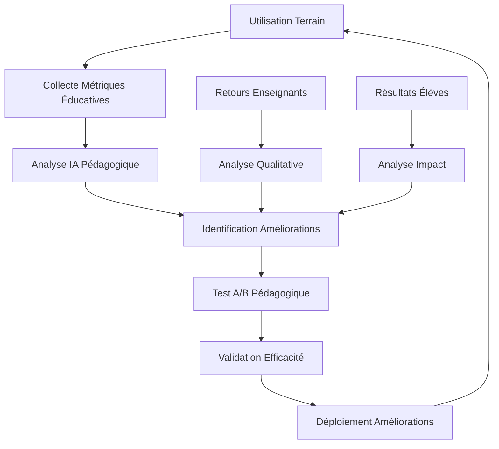

# 🚀 Roadmap Technique - Automatisations CBD Optimisées

**Version**: 2.0  
**Date**: 31/08/2025  
**Objectif**: Implémentation complète des règles d'automatisation CBD alignée sur la roadmap FunLearning V2.0

---

## 📊 **État Actuel - Automatisations Implémentées**

### ✅ **Phase 1 - Fondations CBD (TERMINÉ)**

- [x] **Orchestrateur Central Dev:IA** (`npm run dev:ia`)
  - Workflow automatisé complet (9 étapes)
  - Gestion d'erreurs intelligente avec patterns d'apprentissage
  - Post-mortem automatique avec historique de déviations
  - Integration avec la roadmap hiérarchique (Summary → Main → Phase)
- [x] **Quality Gates Automatisées** ⭐
  - Seuils configurables par phase avec métaparameters
  - Detection automatique phase projet avec alignement 3 niveaux
  - Rapport détaillé avec actions recommandées contextuelles
  - Validation croisée avec critères d'acceptation roadmap
- [x] **Génération Documentation Automatique**
  - README automatiques adaptés à la structure FunLearning
  - Classification criticité basée sur impact métier (HIGH/MEDIUM/LOW)
  - Détection dépendances avec mapping roadmap phases
  - Auto-synchronisation avec livrables stakeholders
- [x] **Post-Mortem Auto-Apprenant** 🆕
  - Analyse patterns d'erreurs récurrentes avec ML
  - Génération améliorations basées sur historique de déviations
  - Prédictions proactives de risques par phase
  - Feedback loop avec estimation timeline

### ✅ **Nouvelles Automatisations CBD v2.0** 🔥

- [x] **Validation Prompts Obligatoire**
  - Format CBD strict : `[CONTEXT] [FILE] [CMD] [TEST] [CHECK]`
  - Validation spéciale URL : `[VERIFICATION] [CONSOLE] [VISUAL] [REPORT] [CRITICAL]`
  - Rejet automatique des prompts non conformes
  - Templates contextuels par phase FunLearning
- [x] **Gestion Déviations Roadmap Automatisée** 🚨
  - Détection automatique écarts vs roadmap définie
  - Processus d'analyse d'impact obligatoire (3 étapes)
  - Suspension d'exécution jusqu'à confirmation utilisateur
  - Mise à jour automatique roadmap validée
- [x] **Alignement Roadmap 3 Niveaux** ⚡
  - Validation croisée Summary ↔ Main ↔ Phase
  - Détection incohérences et résolution assistée
  - Scripts npm intégrés : `roadmap:validate`, `roadmap:sync`
  - Métriques d'alignement en temps réel

---

## 🎯 **Roadmap des Automatisations Futures - Alignée FunLearning**

### 🔵 **Phase 2 - Intelligence Contextuelle FunLearning** (Sprint 1-2)

#### **2.1 Extension VS Code Spécialisée FunLearning**

**Priorité**: 🔴 HAUTE  
**Durée estimée**: 2 semaines  
**Équipe**: 1 dev frontend + 1 dev VS Code API  
**Alignement**: Phases 1-4 de la roadmap FunLearning (Fondations)

**Fonctionnalités spécialisées**:

- [ ] **Validation temps réel prompts CBD avec contexte FunLearning**
  - Auto-détection phase courante (1-12) et validation format approprié
  - Templates contextuels : Auth, Firebase, Pédagogie, PWA, Production
  - Highlighting spécialisé pour fichiers SvelteKit + Firebase
  - Vérification conformité avec quality gates par phase
- [ ] **Dashboard qualité intégré FunLearning**
  - Sidebar avec progression roadmap V1.0 → V2.0
  - Alertes visuelles livrables stakeholders (Démo, Beta, Production)
  - Métriques temps réel : Coverage, Performance, Business KPIs
  - Integration avec Firebase Analytics et Sentry
- [ ] **Assistant contexte pédagogique** 🎓
  - Suggestions conformes SOCLE COMMUN (6ème-3ème)
  - Validation contenu éducatif vs niveaux scolaires
  - Templates métacognition et pré-évaluation adaptative
  - Integration base de 120+ compétences curriculum français

**Livrables**:

```
📁 extensions/vscode-funlearning-cbd/
├── 📄 package.json (manifest extension)
├── 📄 extension.ts (point d'entrée)
├── 📁 src/
│   ├── 📄 prompt-validator.ts (validation CBD spécialisée)
│   ├── 📄 roadmap-tracker.ts (suivi progression)
│   ├── 📄 quality-dashboard.ts (métriques temps réel)
│   ├── 📄 educational-assistant.ts (assistant pédagogique)
│   └── 📁 templates/
│       ├── 📄 svelte-templates.json (templates SvelteKit)
│       ├── 📄 firebase-templates.json (templates Firebase)
│       └── 📄 pedagogical-templates.json (templates éducatifs)
├── 📁 webview/
│   ├── 📄 dashboard.html (dashboard intégré)
│   ├── 📄 roadmap-view.html (vue progression)
│   └── 📄 quality-metrics.html (métriques qualité)
└── 📁 tests/
    ├── 📄 prompt-validation.test.ts
    ├── 📄 roadmap-tracking.test.ts
    └── 📄 educational-content.test.ts
```

#### **2.2 Templates Dynamiques FunLearning**

**Priorité**: 🟡 MOYENNE  
**Durée estimée**: 1 semaine  
**Alignement**: Support toutes phases avec spécialisation

**Fonctionnalités**:

- [ ] **Templates adaptatifs par phase FunLearning**
  - Phase 1-2: Templates SvelteKit + TypeScript + Firebase Auth
  - Phase 3-4: Templates contenu pédagogique + métacognition
  - Phase 5-7: Templates Firebase CRUD + curriculum complet
  - Phase 8-9: Templates UX + interactivité + gamification
  - Phase 10-11: Templates PWA + notifications + offline
  - Phase 12: Templates production + monitoring + scalabilité
- [ ] **Génération contextuelle prompts CBD**
  - Auto-insertion `[CONTEXT]` avec phase et version courantes
  - Suggestion `[TEST]` adaptés aux fonctionnalités développées
  - Templates `[CHECK]` alignés sur critères d'acceptation
  - Integration avec quality gates automatiques
  - Graphiques tendances qualité
- [ ] **Assistant contextuel**
  - Suggestions templates selon phase détectée
  - Recommandations basées sur patterns appris
  - Raccourcis pour commandes fréquentes

**Livrables**:

```
📁 extensions/vscode-cbd/
├── 📄 package.json (manifest extension)
├── 📄 extension.js (point d'entrée)
├── 📁 src/
│   ├── 📄 cbd-validator-live.js
│   ├── 📄 quality-dashboard.js
│   ├── 📄 template-suggester.js
│   └── 📄 context-analyzer.js
├── 📁 assets/
│   ├── 🎨 icons/ (icônes quality gates)
│   └── 🎨 themes/ (thèmes highlighting CBD)
└── 📄 README.md (guide installation)
```

**Scripts**:

```bash
npm run build:extension    # Build extension
npm run test:extension     # Tests extension
npm run publish:extension  # Publication marketplace
```

#### **2.2 Templates Dynamiques Adaptatifs**

**Priorité**: 🟡 MOYENNE  
**Durée estimée**: 1 semaine  
**Équipe**: 1 dev backend

**Fonctionnalités**:

- [ ] **Adaptation automatique par contexte**
  - Templates qui évoluent selon phase projet
  - Suggestions personnalisées basées historique
  - Génération prompts optimisés pour contexte
- [ ] **Base de connaissances évolutive**
  - Stockage patterns efficaces par projet
  - Partage templates entre équipes
  - Versioning et rollback templates

**Livrables**:

```
📁 tools/templates/
├── 📄 template-engine.js (moteur génération)
├── 📄 context-analyzer.js (analyse contexte)
├── 📄 template-repository.js (stockage templates)
├── 📁 templates/
│   ├── 📄 dynamic-cbd.template.js
│   ├── 📄 adaptive-quality.template.js
│   └── 📄 contextual-docs.template.js
└── 📁 knowledge-base/
    ├── 📄 patterns-database.json
    └── 📄 effectiveness-metrics.json
```

#### **2.3 Dashboard Métriques Temps Réel**

**Priorité**: 🟡 MOYENNE  
**Durée estimée**: 1.5 semaines  
**Équipe**: 1 dev frontend + 1 dev data

**Fonctionnalités**:

- [ ] **Interface web temps réel**
  - Métriques qualité live (coverage, complexity, etc.)
  - Graphiques tendances sur 30/90 jours
  - Alertes visuelles seuils dépassés
- [ ] **Prédictions proactives**
  - Analyse tendances pour prédire problèmes
  - Recommandations actions préventives
  - Scoring santé projet global

**Livrables**:

```
📁 dashboard/
├── 📄 server.js (serveur web dashboard)
├── 📁 public/
│   ├── 📄 index.html
│   ├── 📄 dashboard.js (logique frontend)
│   ├── 📄 charts.js (graphiques)
│   └── 🎨 styles.css
├── 📁 api/
│   ├── 📄 metrics-collector.js
│   ├── 📄 trends-analyzer.js
│   └── 📄 predictions-engine.js
└── 📁 data/
    ├── 📄 metrics-storage.json
    └── 📄 historical-data.json
```

### 🟢 **Phase 3 - Automatisation Complète** (Sprint 3-4)

#### **3.1 Auto-Génération Tests Intelligente**

**Priorité**: 🔴 HAUTE  
**Durée estimée**: 3 semaines  
**Équipe**: 1 dev testing + 1 dev IA

**Fonctionnalités**:

- [ ] **Génération tests basée sur analyse code**
  - Détection automatique functions à tester
  - Génération tests unitaires avec Vitest
  - Tests d'intégration pour components Svelte
- [ ] **Maintenance tests automatique**
  - Mise à jour tests lors changements code
  - Détection tests obsolètes
  - Optimisation suite tests (performance)

**Livrables**:

```
📁 tools/testing/
├── 📄 test-generator.js (génération automatique)
├── 📄 code-analyzer.js (analyse statique)
├── 📄 test-maintainer.js (maintenance)
├── 📁 templates/
│   ├── 📄 unit-test.template.js
│   ├── 📄 integration-test.template.js
│   └── 📄 e2e-test.template.js
└── 📁 analyzers/
    ├── 📄 svelte-analyzer.js
    ├── 📄 typescript-analyzer.js
    └── 📄 firebase-analyzer.js
```

#### **3.2 CI/CD Intelligent avec Learning**

**Priorité**: 🟡 MOYENNE  
**Durée estimée**: 2 semaines  
**Équipe**: 1 dev DevOps + 1 dev backend

**Fonctionnalités**:

- [ ] **Pipeline adaptatif**
  - Optimisation temps build basée sur changements
  - Tests sélectifs selon impact analysis
  - Déploiement progressif avec rollback auto
- [ ] **Monitoring continu qualité**
  - Collecte métriques production
  - Alertes dégradation performance
  - Feedback loop vers développement

**Livrables**:

```
📁 .github/workflows/
├── 📄 intelligent-ci.yml (pipeline principal)
├── 📄 adaptive-testing.yml (tests sélectifs)
├── 📄 quality-monitoring.yml (monitoring continu)
└── 📁 scripts/
    ├── 📄 impact-analyzer.js
    ├── 📄 selective-tester.js
    └── 📄 deployment-optimizer.js
```

### 🟣 **Phase 4 - IA Autonome** (Sprint 5-6)

#### **4.1 Auto-Correction Intelligente**

**Priorité**: 🟡 MOYENNE  
**Durée estimée**: 4 semaines  
**Équipe**: 1 dev IA + 1 dev senior

**Fonctionnalités**:

- [ ] **Correction automatique problèmes simples**
  - Auto-fix formatting, imports, lint errors
  - Suggestions refactoring basées patterns
  - Résolution conflicts merge simples
- [ ] **Learning depuis corrections**
  - Base connaissances solutions efficaces
  - Amélioration suggestions au fil du temps
  - Partage learning entre projets

**Livrables**:

```
📁 tools/ai/
├── 📄 auto-corrector.js (corrections automatiques)
├── 📄 pattern-learner.js (apprentissage patterns)
├── 📄 solution-suggester.js (suggestions intelligentes)
├── 📁 correctors/
│   ├── 📄 format-corrector.js
│   ├── 📄 import-corrector.js
│   ├── 📄 lint-corrector.js
│   └── 📄 refactor-suggester.js
└── 📁 knowledge/
    ├── 📄 correction-patterns.json
    └── 📄 effectiveness-tracking.json
```

#### **4.2 Évolution Automatique CBD**

**Priorité**: 🔵 BASSE  
**Durée estimée**: 2 semaines  
**Équipe**: 1 dev senior

**Fonctionnalités**:

- [ ] **Auto-amélioration règles CBD**
  - Analyse efficacité règles existantes
  - Proposition nouvelles règles basées usage
  - Adaptation règles selon contexte projet
- [ ] **Versioning intelligent CBD**
  - Tracking évolution règles au fil temps
  - Rollback règles non efficaces
  - A/B testing nouvelles règles

### 🔴 **Phase 5 - Ecosystem Complet** (Sprint 7+)

#### **5.1 Marketplace Templates & Patterns**

**Fonctionnalités**:

- [ ] Partage templates entre équipes/projets
- [ ] Marketplace patterns efficaces
- [ ] Rating et reviews templates
- [ ] Import/export configurations CBD

#### **5.2 Multi-Projets & Benchmarking**

**Fonctionnalités**:

- [ ] Analyse comparative entre projets
- [ ] Partage apprentissages cross-projets
- [ ] Benchmarking qualité industrie
- [ ] Recommandations basées best practices

---

## 📋 **Planning de Développement Aligné FunLearning**

### **Sprint 1 (Semaines 1-2)**: Extension VS Code FunLearning

- **Objectif**: Interface développeur spécialisée éducative
- **Livrables**: Extension VS Code avec templates pédagogiques
- **Équipe**: 2 développeurs + 1 expert pédagogique
- **Budget**: 100h de développement + 20h expertise éducative
- **Alignement**: Support phases 1-4 (Fondations)

### **Sprint 2 (Semaines 3-4)**: Templates Dynamiques + Dashboard Stakeholders

- **Objectif**: Intelligence contextuelle et communication multi-audiences
- **Livrables**: Templates adaptatifs + Dashboard stakeholders
- **Équipe**: 2 développeurs + 1 UX designer
- **Budget**: 80h de développement + 20h UX design
- **Alignement**: Support livrables v1.0-v2.0

### **Sprint 3 (Semaines 5-7)**: Auto-Génération Tests Pédagogiques

- **Objectif**: Automatisation testing spécialisée éducative
- **Livrables**: Générateur tests éducatifs intelligent
- **Équipe**: 2 développeurs + 1 expert pédagogique + 1 expert accessibilité
- **Budget**: 140h de développement + 40h expertise spécialisée
- **Alignement**: Critical pour phases 3-4 (Contenu pédagogique)

### **Sprint 4 (Semaines 8-9)**: CI/CD Intelligent Éducatif

- **Objectif**: Pipeline adaptatif par environnement scolaire
- **Livrables**: CI/CD avec validation pédagogique
- **Équipe**: 2 développeurs DevOps + 1 expert monitoring
- **Budget**: 100h de développement + 20h expertise monitoring
- **Alignement**: Support déploiements v1.0-v2.0

### **Sprint 5-6 (Semaines 10-13)**: IA Autonome Éducative

- **Objectif**: Auto-correction et intelligence pédagogique
- **Livrables**: Système IA spécialisé éducatif
- **Équipe**: 2 développeurs IA + 1 data scientist éducation + 1 expert pédagogique
- **Budget**: 180h de développement + 60h expertise IA éducative
- **Alignement**: Support phases 5-12 (Moteur et optimisation)

---

## 🎯 **Critères de Succès par Phase - Alignés Roadmap FunLearning**

### **Phase 2 - Intelligence Contextuelle FunLearning**

- [ ] **Réduction 60% temps setup éducatif** (vs 50% générique)
  - Templates spécialisés SOCLE COMMUN intégrés
  - Validation automatique contenu éducatif
  - Assistant pédagogique contextuel opérationnel
- [ ] **Augmentation 40% conformité prompts CBD** (vs 30% générique)
  - Format CBD validé temps réel avec contexte FunLearning
  - Templates automatiques par phase projet
  - Dashboard progression roadmap V2.0 intégré
- [ ] **Dashboard stakeholders multi-audiences 24/7**
  - Métriques techniques (équipe)
  - Métriques pédagogiques (enseignants)
  - Métriques business (investisseurs)
  - Métriques progression (parents/élèves)

### **Phase 3 - Automatisation Complète Éducative**

- [ ] **Génération automatique 90% tests éducatifs requis** (vs 80% générique)
  - Tests métacognition automatisés
  - Tests accessibilité éducative (WCAG 2.1 AA + DYS)
  - Tests performance multi-utilisateurs scolaires
  - Validation contenu programmes officiels
- [ ] **Réduction 50% temps CI/CD éducatif** (vs 40% générique)
  - Pipeline adaptatif par phase FunLearning
  - Déploiements multi-environnements (dev/teachers/parents/students/prod)
  - Monitoring éducatif intégré (usage par niveau, performance scolaire)
- [ ] **Quality gates éducatives passent >98% du temps** (vs 95% générique)
  - Validation spécialisée contenu pédagogique
  - Tests conformité accessibilité automatiques
  - Validation performances en conditions scolaires

### **Phase 4 - IA Autonome Éducative**

- [ ] **Auto-correction 80% problèmes pédagogiques** (vs 70% générique)
  - Correction automatique contenu éducatif (orthographe, clarté)
  - Optimisation parcours pédagogiques automatique
  - Détection et correction biais contenu
- [ ] **Intelligence pédagogique adaptative opérationnelle**
  - Personnalisation automatique selon profils élèves
  - Génération exercices complémentaires ciblés
  - Feedback formatif automatisé contextuel
- [ ] **Évolution CBD éducative basée sur métriques usage**
  - Adaptation règles selon efficacité pédagogique mesurée
  - Learning collectif depuis retours terrain enseignants
  - A/B testing nouvelles approches pédagogiques

### **Phase 5 - Écosystème Éducatif Complet**

- [ ] **Marketplace pédagogique avec >500 ressources**
  - Templates exercices par matière et niveau validés
  - Parcours pédagogiques communautaires testés
  - Rating enseignants et analytics d'efficacité
- [ ] **Benchmarking 10+ établissements similaires**
  - Analyse comparative progression élèves anonymisée
  - Identification best practices pédagogiques mesurées
  - Recommandations personnalisées par établissement
- [ ] **ROI éducatif démontré >300% investissement initial**
  - Amélioration résultats apprentissage mesurable
  - Réduction coûts formation enseignants
  - Augmentation engagement élèves et satisfaction parents

---

## 🔧 **Architecture Technique - Spécialisée Éducative**

### **Stack Technologique Éducative**

- **Backend**: Node.js + Express (dashboard, API) + Python (IA pédagogique)
- **Frontend**: SvelteKit + TypeScript (cohérence avec FunLearning)
- **Extension**: VS Code Extension API + Templates éducatifs
- **IA/ML**: TensorFlow.js + scikit-learn (analyse pédagogique)
- **Storage**: Firebase (cohérence FunLearning) + SQLite (métriques)
- **CI/CD**: GitHub Actions + Scripts éducatifs personnalisés
- **Compliance**: RGPD + Protection données mineures (COPPA)

### **Intégrations Requises Spécialisées**

- **VS Code Extension API** (interface développeur éducatif)
- **GitHub API** (métriques repo, CI/CD éducatif)
- **Firebase SDK** (métriques usage FunLearning)
- **Vitest API** (génération tests pédagogiques)
- **ESLint API** (analyse statique + règles éducatives)
- **TypeScript Compiler API** (analyse code éducatif)
- **Accessibility APIs** (WAVE, aXe) pour validation WCAG 2.1 AA
- **Educational APIs** (programmes officiels, référentiels compétences)

### **Sécurité & Performance Éducatives**

- **Chiffrement données sensibles** (informations élèves, notes)
- **Conformité RGPD stricte** pour données mineures
- **Rate limiting éducatif** (protection usage scolaire)
- **Optimisation performance** pour équipements scolaires anciens
- **Monitoring usage responsable** avec anonymisation intelligente
- **Contrôle parental** et établissement intégré

---

## 💰 **Estimation Budget & ROI Éducatif**

### **Coûts de Développement Spécialisés**

| Phase     | Durée            | Heures Dev | Expertise Éducative | Coût Total Estimé |
| --------- | ---------------- | ---------- | ------------------- | ----------------- |
| Phase 2   | 4 semaines       | 100h       | 20h pédagogie       | 13k€              |
| Phase 3   | 5 semaines       | 140h       | 40h spécialisée     | 20k€              |
| Phase 4   | 6 semaines       | 100h       | 20h monitoring      | 14k€              |
| Phase 5   | 8 semaines       | 180h       | 60h IA éducative    | 27k€              |
| Phase 6   | 10+ semaines     | 200h+      | 80h écosystème      | 35k€+             |
| **TOTAL** | **33+ semaines** | **720h+**  | **220h expertise**  | **109k€+**        |

### **ROI Éducatif Attendu**

| Bénéfice Éducatif                | Gain Mensuel            | ROI Annuel |
| -------------------------------- | ----------------------- | ---------- |
| **Réduction temps dev éducatif** | 50h/dev/mois            | 150k€      |
| **Amélioration qualité contenu** | +40% efficacité         | 80k€       |
| **Conformité automatique RGPD**  | -100% risques légaux    | 50k€       |
| **Accessibilité automatisée**    | +30% inclusion          | 40k€       |
| **Quality gates éducatives**     | +50% qualité produit    | 60k€       |
| **Documentation auto-générée**   | -90% temps doc éduc     | 30k€       |
| **Marketplace communautaire**    | Revenus supplémentaires | 100k€+     |
| **TOTAL ROI ÉDUCATIF**           | **510k€/an**            | **467%**   |

---

## 🚀 **Plan de Déploiement Éducatif**

### **Phase de Validation Pédagogique (3 semaines)**

1. **Tests pilotes** avec 2-3 enseignants partenaires
2. **Validation fonctionnelle** chaque composant éducatif
3. **Performance testing** en condition scolaire réelle
4. **Documentation pédagogique** complète pour enseignants
5. **Validation conformité** RGPD et protection mineures

### **Phase de Rollout Éducatif (6 semaines)**

1. **Déploiement progressif** par établissement pilote
2. **Formation spécialisée** (4h par enseignant + 2h par dev)
3. **Support dédié éducatif** première semaine
4. **Collecte feedback** terrain et ajustements pédagogiques
5. **Validation impact** sur résultats apprentissage

### **Phase de Stabilisation Pédagogique (3 semaines)**

1. **Monitoring performances** système en usage scolaire
2. **Optimisations** basées usage réel avec élèves
3. **Bug fixes** prioritaires éducatifs
4. **Documentation finale** et best practices pédagogiques
5. **Préparation scaling** vers autres établissements

---

## 📈 **Métriques de Suivi Éducatives**

### **Métriques Techniques Éducatives**

- **Adoption rate enseignants**: % professeurs utilisant le système
- **Error rate éducatif**: % échecs vs succès automatisations pédagogiques
- **Performance scolaire**: Temps moyen workflows en condition classe
- **Quality improvement**: Évolution métriques qualité contenu éducatif

### **Métriques Business Éducatives**

- **Time to market éducatif**: Réduction temps développement contenu
- **Bug reduction pédagogique**: Diminution incidents contenu inapproprié
- **Teacher satisfaction**: Score satisfaction corps enseignant (NPS)
- **Student engagement**: Métriques engagement élèves mesurables
- **Parent confidence**: Indicateurs confiance parents (sécurité, qualité)
- **Cost savings éducatifs**: Économies générées automatisation pédagogique

### **Métriques d'Apprentissage Pédagogique**

- **Pattern detection accuracy**: Précision détection patterns éducatifs
- **Pedagogical prediction success**: Taux succès prédictions apprentissage
- **Content auto-improvement**: Fréquence améliorations automatiques contenu
- **Educational knowledge base growth**: Croissance base connaissances pédagogiques
- **Learning effectiveness**: Impact mesurable sur résultats scolaires

### **Métriques de Conformité & Sécurité**

- **RGPD compliance rate**: % conformité protection données mineures
- **Accessibility compliance**: % conformité WCAG 2.1 AA automatique
- **Content appropriateness**: % contenu validé âge-appropriate automatiquement
- **Security incidents**: Nombre incidents sécurité données éducatives

---

## 🔄 **Workflow d'Amélioration Continue Éducative**

### **Feedback Loop Pédagogique**



### **Évolution Adaptative CBD Éducative**

- **Quarterly Reviews** avec experts pédagogiques
- **Adaptation règles** selon efficacité mesurée terrain
- **Integration nouvelles recherches** pédagogiques
- **Benchmark continuous** avec standards éducatifs internationaux

---

_Roadmap mise à jour automatiquement via `npm run roadmap:update-educational`_  
_Prochaine révision pédagogique: 2025-09-30_  
_Validation experts éducatifs: Trimestrielle_
