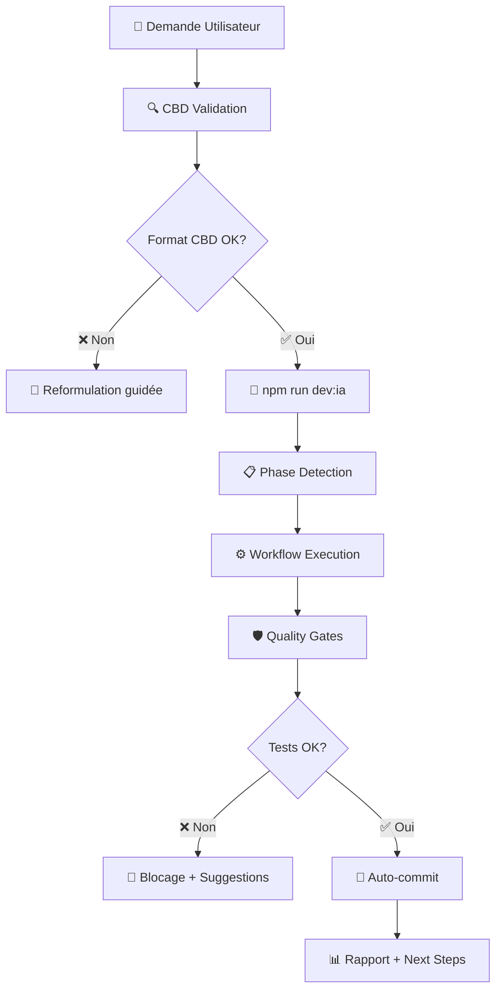

# 📋 FunLearning - Roadmap Summary

> **Résumé exécutif** : Vue d'ensemble pratique pour comprendre le QUOI et le COMMENT du projet FunLearning.

## 📊 **TABLEAU DE BORD PROJET**

**🎯 [Voir Dashboard Complet](DASHBOARD.md)** - Suivi temps réel progression par phases

```
Progress Global: ████████░░░░░░░░░░░░░░ 8.3% (1/12 phases)
Phase Actuelle: Phase 2 - Authentication (40% complété)
Prochaine Étape: Finaliser système auth Firebase
```

---

## 🎯 **L'Essentiel**

### **QUOI ?**

- **Plateforme d'apprentissage interactive** : SvelteKit + Firebase + PWA
- **Cible** : Collège français (6ème → 3ème) avec 120+ compétences
- **Innovation** : Métacognition, pré-évaluation adaptative, mode offline
- **Livraisons** : 6 versions incrémentales (v1.0 → v2.0) sur 6-8 semaines

### **COMMENT ?**

- **12 phases séquentielles** organisées en 5 groupes logiques
- **Approche IA-First** : Instructions granulaires pour Copilot
- **Quality Gates** : Tests automatisés à chaque phase
- **Scripts de validation** : `npm run validate [phase]`

---

## 🗂️ **Les 5 Groupes de Phases**

### 🏗️ **GROUPE 1 : FONDATIONS** (3-4 semaines, v1.0-v1.2)

**Objectif** : Base technique solide et authentification

| Phase                      | Durée | Quoi                             | Validation             | Récap                                  |
| -------------------------- | ----- | -------------------------------- | ---------------------- | -------------------------------------- |
| **1** Setup & Architecture | 3-4j  | SvelteKit + TypeScript + Tests   | `npm run validate 1`   | [📋 Recap](phases/phase-1-recap.md) ✅ |
| **2** Firebase & Auth      | 1 sem | Google OAuth + protection routes | `npm run test:auth`    | [📋 Recap](phases/phase-2-recap.md) 🔄 |
| **3** Contenu & Markdown   | 1 sem | Système contenu dynamique        | `npm run test:content` | [📋 Recap](phases/phase-3-recap.md) 🎯 |
| **4** Pédagogie Avancée    | 3j    | Métacognition + pré-évaluation   | Tests pédagogiques     | [📋 Recap](phases/phase-4-recap.md) 🎯 |

**Livrable v1.2** : MVP avec auth + contenu de base

### ⚙️ **GROUPE 2 : PHASE MOTEUR** (1 semaine, v1.5)

**Objectif** : Données et contenu complets

| Phase                      | Durée | Quoi                           | Comment                        | Récap                                  |
| -------------------------- | ----- | ------------------------------ | ------------------------------ | -------------------------------------- |
| **5** Firebase Integration | 3h    | Services CRUD Firebase         | Migration data layer           | [📋 Recap](phases/phase-5-recap.md) 🎯 |
| **6** Curriculum Complet   | 2j    | 120+ compétences auto-générées | Scripts génération             | [📋 Recap](phases/phase-6-recap.md) 🎯 |
| **7** Interface Dynamique  | 1-2j  | UI 100% connectée Firebase     | Remplacement données statiques | [📋 Recap](phases/phase-7-recap.md) 🎯 |

**Livrable v1.5** : Contenu complet et dynamique

### 🎮 **GROUPE 3 : PHASE UX** (1.5 semaines, v1.7)

**Objectif** : Expérience utilisateur et interactivité

| Phase                         | Durée | Quoi                             | Focus                      | Récap                                  |
| ----------------------------- | ----- | -------------------------------- | -------------------------- | -------------------------------------- |
| **8** Navigation UX           | 1-2j  | Navigation hiérarchique complète | Matière→Niveau→Compétences | [📋 Recap](phases/phase-8-recap.md) 🎯 |
| **9** Exercices & Progression | 1 sem | QCM interactifs + gamification   | Système scoring            | [📋 Recap](phases/phase-9-recap.md) 🎯 |

**Livrable v1.7** : Expérience complète utilisateur

### 📱 **GROUPE 4 : ÉCOSYSTÈME** (2 semaines, v1.9)

**Objectif** : Solution complète multi-plateforme

| Phase                 | Durée | Quoi                           | Bénéfice             | Récap                                   |
| --------------------- | ----- | ------------------------------ | -------------------- | --------------------------------------- |
| **10** PWA & Offline  | 1 sem | App installable + mode offline | Accessibilité totale | [📋 Recap](phases/phase-10-recap.md) 🎯 |
| **11** Admin & Import | 1 sem | Dashboard admin + import masse | Gestion contenu      | [📋 Recap](phases/phase-11-recap.md) 🎯 |

**Livrable v1.9** : Solution professionnelle

### 🚀 **GROUPE 5 : PRODUCTION** (1 semaine, v2.0)

**Objectif** : Optimisation et déploiement

| Phase                       | Durée | Quoi                         | Standard         | Récap                                   |
| --------------------------- | ----- | ---------------------------- | ---------------- | --------------------------------------- |
| **12** Polish & Performance | 1 sem | Lighthouse >90% + monitoring | Production-ready | [📋 Recap](phases/phase-12-recap.md) 🎯 |

**Livrable v2.0** : Plateforme production complète

---

## 📋 **Suivi des Réalisations**

### **🎯 Index des Récapitulatifs**

- **📊 Vue d'ensemble** : [Index Récapitulatifs](phases/README-RECAPS.md)
- **✅ Phases Complétées** : Status détaillé dans chaque récap
- **🔄 Phases En Cours** : Suivi temps réel
- **🎯 Phases Planifiées** : Templates prêts

### **⚙️ Génération Automatique**

```bash
npm run roadmap:generate-recaps    # Créer nouveaux récapitulatifs
npm run roadmap:check              # Valider cohérence phases
```

---

## 🎯 **Stratégie d'Exécution**

### **Commandes Clés**

```bash
# Démarrage phase
npm run validate [phase-number]    # Valide avant progression
npm run test:[domain]              # Tests spécialisés
npm run quality:gates              # Quality Gates complets
```

### **Points de Contrôle**

- ✅ **Validation obligatoire** avant passage phase suivante
- ✅ **Tests automatisés** à chaque commit
- ✅ **Buffer temps** intégré pour corrections
- ✅ **Releases incrémentales** testables

### **Dépendances Critiques**

- **Firebase → Toutes les phases data** (5-7)
- **Navigation → Exercices** (8→9)
- **UX Complete → PWA/Admin** (9→10/11)
- **Tout → Production** (1-11→12)

---

## 🔀 **Orchestration Workflow**

### **Architecture 3-Niveaux**

```
📊 ROADMAP_LEARNING_SUMMARY.md     ← Vue stratégique (QUOI)
📋 ROADMAP_LEARNING.md             ← Vue tactique (COMMENT)
🤖 ROADMAP_AUTOMATISATIONS_TECHNIQUES.md ← Vue processus (AUTOMATISATION)
```

### **Workflow Type : Demande Utilisateur → Exécution**



### **Commandes d'Orchestration**

```bash
# Workflow principal
npm run dev:ia                     # Orchestrateur IA complet
npm run dev:ia -- --no-commit      # Sans auto-commit
npm run dev:ia -- --no-strict      # Mode tolérant aux erreurs

# Validation qualité
npm run quality:gates              # Quality Gates complets
npm run quality:gates -- --fail-fast  # Arrêt au premier échec
npm run quality:gates -- --skip security  # Ignorer audit sécurité

# Validation cohérence roadmap
npm run roadmap:check              # Vérification alignement multi-niveaux
npm run validate [phase]           # Validation phase spécifique
```

### **Intégration CBD (Check Before Doing)**

- ✅ **Format obligatoire** : `[CONTEXT] → [ACTION] → [EXPECTED]`
- ✅ **Validation automatique** dans `dev:ia`
- ✅ **Gestion déviations** avec reformulation guidée
- ✅ **URL testing** pour ressources externes

---

## 📊 **Métriques de Succès**

### **Par Release**

| Version  | Fonctionnalités     | Tests         | Performance       |
| -------- | ------------------- | ------------- | ----------------- |
| **v1.0** | Auth + Base         | >80% coverage | Basic             |
| **v1.2** | + Pédagogie         | >85% coverage | Optimisé          |
| **v1.5** | + Données complètes | >90% coverage | Firebase optimisé |
| **v1.7** | + UX complète       | >90% coverage | UX fluide         |
| **v1.9** | + PWA/Admin         | >95% coverage | Multi-plateforme  |
| **v2.0** | Production          | >95% coverage | Lighthouse >90%   |

### **Quality Gates Finaux**

- 🎯 **Performance** : Lighthouse >90% toutes métriques
- 🎯 **Tests** : >95% coverage avec E2E complets
- 🎯 **PWA** : App installable + offline fonctionnel
- 🎯 **Scalabilité** : 1000+ utilisateurs simultanés

---

## 🚀 **Infrastructure Production-First : Configurée Dès le Début**

### **Stratégie Innovante**

> Au lieu d'attendre la fin, l'infrastructure production est configurée dès **Phase 1** pour éviter les surprises et refactorisations coûteuses.

#### **Phase 1 : Infrastructure Complète**

```bash
✅ Vercel deployment configuré avec multi-environnements
✅ Sentry monitoring + error tracking opérationnel
✅ Lighthouse CI pour audits automatiques
✅ GitHub Actions avec quality gates
✅ Variables d'environnement sécurisées (dev/staging/prod)
```

#### **Phase 2 : Firebase Production**

```bash
✅ Firebase Security Rules production-grade
✅ Backup automatique quotidien configuré
✅ Monitoring Firebase avec alertes
✅ Authentication multi-provider sécurisée
```

#### **Phase 5 : Monitoring Avancé**

```bash
✅ Firebase Performance monitoring
✅ Cost monitoring et alertes budgétaires
✅ Analytics avancées et métriques custom
✅ Health checks automatisés
```

#### **Phase 12 : Optimisation & Scalabilité**

```bash
🎯 Focus sur l'optimisation des performances existantes
🎯 Tests de charge pour 10k+ utilisateurs simultanés
🎯 Auto-scaling intelligent et monitoring temps réel
🎯 Dashboard business metrics et alerting avancé
```

### **Avantages de cette Approche**

- ✅ **Pas de dette technique** en fin de projet
- ✅ **Monitoring dès le premier déploiement**
- ✅ **Détection précoce** des problèmes de performance
- ✅ **Confiance totale** pour le lancement production
- ✅ **Phase 12 dédiée à l'optimisation** plutôt qu'à la configuration

---

## 🚀 **Points Forts de l'Approche**

### **Avantages Structurels**

- ✅ **Progression logique** : Chaque groupe prépare le suivant
- ✅ **Livraisons régulières** : Démo possible à chaque version
- ✅ **Parallélisation possible** : Phases 10-11 indépendantes
- ✅ **Risques maîtrisés** : Validation continue et buffers temps

### **Innovation Pédagogique**

- ✅ **Métacognition** : Réflexion guidée sur l'apprentissage
- ✅ **Pré-évaluation adaptative** : Contenu personnalisé
- ✅ **Progression gamifiée** : Motivation par le jeu
- ✅ **Mode offline** : Apprentissage sans contraintes

### **Excellence Technique**

- ✅ **Architecture moderne** : SvelteKit + TypeScript + Firebase
- ✅ **PWA native** : Installation mobile/desktop
- ✅ **Performance optimisée** : Code splitting + cache intelligent
- ✅ **Monitoring avancé** : Sentry + analytics

---

## 🎯 **Prochaines Étapes Immédiates**

### **Phase 1 - Setup (À DÉMARRER)**

1. **Initialiser** projet SvelteKit avec TypeScript
2. **Configurer** structure dossiers et tests
3. **Valider** avec `npm run validate 1`
4. **Passer** à Phase 2 si ✅

### **Logique de Progression**

- **Une phase à la fois** : Focus total sur l'étape courante
- **Validation systématique** : Jamais passer sans tests ✅
- **Documentation continue** : Mise à jour roadmap si besoin
- **Communication régulière** : Point après chaque phase

---

**🎯 FOCUS** : Commencer par [Phase 1 - Setup & Architecture](phases/phase-1-setup.md)

**📋 SUIVI** : Mettre à jour ce summary après chaque groupe de phases

**🚀 OBJECTIF** : v2.0 Production Ready en 6-8 semaines
