# 🎨 Phase 11.6 : UX Design & Itération (5 jours) - v1.9.2

## 📋 **Vue d'Ensemble**

**Objectif** : Refonte UX complète avec approche itérative basée sur mockups et tests utilisateurs  
**Version cible** : v1.9.2 (UX optimisée)  
**Groupe** : 🎨 UX/UI - Design & Expérience Utilisateur  
**Prérequis** : Phase 11.5 (Content Versioning) validée ✅

---

## 🖥️ **Écrans à Traiter - Inventaire UX**

### 📱 **Navigation & Layout (Jour 2)**

#### 🗺️ **Architecture des Écrans - Vue d'Ensemble**

```
🏠 ACCUEIL (Dashboard)
├── 📚 SECTION COURS
│   ├── 📋 Liste des Cours (Grid/List view)
│   ├── 🔍 Recherche/Filtres Cours
│   ├── 📖 Détail d'un Cours
│   ├── ▶️ Player de Cours (Lecture)
│   └── 📝 Notes et Signets
│
├── 💪 SECTION EXERCICES
│   ├── 📊 Tableau de bord Exercices
│   ├── 🎯 Liste par Catégorie/Niveau
│   ├── ⚡ Interface Exercice Active
│   ├── ✅ Résultats et Corrections
│   └── 📈 Historique Personnel
│
├── 📊 SECTION PROGRESSION
│   ├── 📈 Dashboard Personnel
│   ├── 🏆 Badges et Réalisations
│   ├── 📅 Calendrier d'Activité
│   └── 📊 Statistiques Détaillées
│
├── 👤 SECTION PROFIL
│   ├── ⚙️ Paramètres Compte
│   ├── 🎨 Préférences UI
│   ├── 🔔 Notifications
│   └── 👥 Social/Communauté
│
└── ⚙️ SECTION ADMIN (si rôle admin/instructor)
    ├── 📋 Gestion Contenu
    ├── 👥 Gestion Utilisateurs
    ├── 📊 Analytics Platform
    └── 🔧 Configuration Système
```

#### 📱 **Détail des Composants Navigation**

| Composant | Description Complète | Écrans Impactés | Mockup Externe | Priorité |
|-----------|---------------------|-----------------|----------------|----------|
| **Header Global** | Barre navigation fixe avec logo, menu principal, recherche, profil | ✅ TOUS les écrans | 🔗 [https://g.co/gemini/share/1ae8d3591bf1](#) | 🔴 Critique |
| **Menu Principal Desktop** | Navigation horizontale : Accueil, Cours, Exercices, Progression, Profil | ✅ Desktop uniquement | 🔗 [Lien Mockup](#) | 🔴 Critique |
| **Mobile Menu (Drawer)** | Menu latéral/hamburger pour mobile avec navigation complète | ✅ Mobile/Tablet | 🔗 [Lien Mockup](#) | 🔴 Critique |
| **Sidebar Contextuelle** | Navigation secondaire selon la section active | 📚 Cours, 💪 Exercices, ⚙️ Admin | 🔗 [Lien Mockup](#) | 🟡 Important |
| **Breadcrumbs** | Fil d'Ariane pour navigation profonde | 📖 Détail cours, ⚡ Exercices, ⚙️ Admin | 🔗 [Lien Mockup](#) | 🟡 Important |
| **Bottom Tab Bar** | Navigation mobile en bas d'écran (style native) | 📱 Mobile uniquement | 🔗 [Lien Mockup](#) | 🟡 Important |
| **Footer** | Liens utiles, mentions légales, contact | 🏠 Accueil, pages statiques | 🔗 [Lien Mockup](#) | 🟢 Standard |

#### 🔄 **Flux de Navigation - Parcours Utilisateur**

**📍 Parcours Étudiant Typique :**
```
1. 🏠 Accueil/Dashboard
   ↓ (Clic "Continuer le cours" ou "Explorer")
2. 📚 Liste des Cours 
   ↓ (Sélection d'un cours)
3. 📖 Page Détail Cours
   ↓ (Clic "Commencer" ou "Continuer")
4. ▶️ Player de Cours (Interface de lecture)
   ↓ (Navigation inter-chapitres)
5. 💪 Exercices Associés
   ↓ (Après validation)
6. 📊 Mise à jour Progression
   ↓ (Retour dashboard ou cours suivant)
```

**📍 Parcours Recherche :**
```
1. 🏠 N'importe quelle page
   ↓ (Recherche header ou mobile)
2. 🔍 Résultats de Recherche
   ↓ (Filtres par type: cours, exercices, utilisateurs)
3. 📋 Liste Filtrée
   ↓ (Sélection résultat)
4. 📖 Contenu Ciblé (cours/exercice)
```

#### 📊 **Comptage Exact des Écrans**

**🏠 SECTION ACCUEIL (3 écrans)**
- Dashboard Principal
- Onboarding Nouveaux Utilisateurs  
- États Vides (première connexion)

**📚 SECTION COURS (8 écrans)**
- Liste Cours (Grid view)
- Liste Cours (List view) 
- Détail Cours Individual
- Player/Lecteur de Cours
- Recherche Cours Avancée
- Filtres et Catégories
- Notes et Annotations
- Favoris et Historique

**💪 SECTION EXERCICES (7 écrans)**
- Dashboard Exercices
- Liste par Catégories
- Interface Exercice Actif
- Résultats et Feedback
- Historique Personnel
- Exercices Recommandés
- Créateur d'Exercices (si permissions)

**📊 SECTION PROGRESSION (5 écrans)**
- Dashboard Progression Personnel
- Badges et Achievements
- Statistiques Détaillées
- Calendrier d'Activité
- Rapports de Performance

**👤 SECTION PROFIL (6 écrans)**
- Profil Public/Vue d'ensemble
- Paramètres Compte
- Préférences Interface
- Gestion Notifications
- Sécurité et Confidentialité
- Support et Aide

**⚙️ SECTION ADMIN (8 écrans - si accès admin)**
- Dashboard Administration
- Gestion Utilisateurs
- Gestion Contenu (CRUD)
- Analytics et Métriques
- Configuration Système
- Logs et Monitoring
- Export/Import Données
- Modération Communauté

**🔍 ÉCRANS TRANSVERSAUX (4 écrans)**
- Recherche Globale
- Notifications Center
- Aide et Documentation
- Page 404/Erreurs

---

#### 📱 **Total Écrans par Plateforme**

**📊 RÉCAPITULATIF COMPLET :**
- **Écrans Core** : 41 écrans principaux
- **Variantes Responsive** : +15 adaptations mobile spécifiques
- **États/Modales** : +20 overlays et popups
- **Admin/Modération** : +8 écrans spécialisés

**📱 TOTAL ESTIMÉ : ~84 interfaces uniques**

**🎯 Répartition par priorité :**
- 🔴 **Critique** (25 écrans) : Parcours core étudiant
- 🟡 **Important** (35 écrans) : Fonctionnalités avancées  
- 🟢 **Standard** (24 écrans) : Admin, support, edge cases


### 📊 **Dashboard & Analytics (Jour 3)**
| Écran | Description | Mockup Externe | Priorité |
|-------|-------------|----------------|----------|
| **Dashboard Principal** | Vue d'ensemble avec métriques | 🔗 [HomePage-mockup1.html](../mockup/HomePage%20-%20mockup1.html) ✅ | 🔴 Critique |
| **Cartes Statistiques** | KPI + graphiques temps réel | 🔗 [Lien Mockup](#) | 🔴 Critique |
| **Notifications Center** | Alertes + messages système | 🔗 [Lien Mockup](#) | 🟡 Important |
| **Quick Actions** | Raccourcis actions fréquentes | 🔗 [Lien Mockup](#) | 🟡 Important |

### 📚 **Gestion de Contenu (Phase 11.5 Integration)**
| Écran | Description | Mockup Externe | Priorité |
|-------|-------------|----------------|----------|
| **Liste Cours** | Grid/List view avec filtres | 🔗 [Lien Mockup](#) | 🔴 Critique |
| **Détail Cours** | Vue complète + métadonnées | 🔗 [Lien Mockup](#) | 🔴 Critique |
| **Éditeur Exercices** | Interface création/édition | 🔗 [Lien Mockup](#) | 🟡 Important |
| **Preview Mode** | Aperçu étudiant | 🔗 [Lien Mockup](#) | 🟢 Standard |

### 📱 **Expérience Mobile (Jour 4)**
| Écran | Description | Mockup Externe | Priorité |
|-------|-------------|----------------|----------|
| **Mobile Dashboard** | Dashboard optimisé tactile | 🔗 [Lien Mockup](#) | 🔴 Critique |
| **Touch Navigation** | Gestures + interactions | 🔗 [Lien Mockup](#) | 🔴 Critique |
| **Mobile Forms** | Formulaires tactiles | 🔗 [Lien Mockup](#) | 🟡 Important |
| **Offline Mode** | Interface mode déconnecté | 🔗 [Lien Mockup](#) | 🟢 Standard |

### 🎨 **Design System (Jour 1)**
| Composant | Description | Mockup Externe | Priorité |
|-----------|-------------|----------------|----------|
| **Color Palette** | Palette complète + variantes | 🔗 [Lien Mockup](#) | 🔴 Critique |
| **Typography Scale** | Système typographique | 🔗 [Lien Mockup](#) | 🔴 Critique |
| **Components Library** | Bibliothèque composants | 🔗 [Lien Mockup](#) | 🔴 Critique |
| **Iconography** | Système d'icônes cohérent | 🔗 [Lien Mockup](#) | 🟡 Important |

### ♿ **Accessibilité & Performance (Jour 5)**
| Aspect | Description | Référence Externe | Priorité |
|--------|-------------|-------------------|----------|
| **Screen Reader** | Navigation assistée | 🔗 [WCAG 2.1 Guide](#) | 🔴 Critique |
| **Keyboard Navigation** | Support clavier complet | 🔗 [Accessibility Guide](#) | 🔴 Critique |
| **Performance Metrics** | Core Web Vitals | 🔗 [Lighthouse Guide](#) | 🟡 Important |
| **Color Contrast** | Tests contraste automatisés | 🔗 [Contrast Checker](#) | 🔴 Critique |

---

### 📋 **Template Mockup Links**
```markdown
<!-- Structure complète des mockups créés -->

### 🎨 Navigation & Layout Mockups
- [Header Navigation](mockup/01-navigation/header-navigation.html) ✅
- [Mobile Menu & Drawer](mockup/01-navigation/mobile-menu.html) 📝
- [Breadcrumbs Navigation](mockup/01-navigation/breadcrumbs.html) 📝
- [Footer Component](mockup/01-navigation/footer.html) 📝

### � Dashboard & Analytics Mockups  
- [Dashboard Principal](mockup/HomePage%20-%20mockup1.html) ✅
- [Mobile Dashboard](mockup/04-mobile/mobile-dashboard.html) ✅
- [Analytics Cards](mockup/02-dashboard/analytics-cards.html) 📝
- [Notifications Center](mockup/02-dashboard/notifications.html) 📝

### 📚 Gestion de Contenu Mockups
- [Liste des Cours](mockup/03-courses/course-list.html) ✅
- [Détail d'un Cours](mockup/03-courses/course-detail.html) 📝
- [Player de Cours](mockup/03-courses/course-player.html) 🔄
- [Interface Exercices](mockup/03-courses/exercise-interface.html) 🔄

### 📱 Mobile Experience Mockups
- [Mobile Dashboard](mockup/04-mobile/mobile-dashboard.html) ✅
- [Touch Navigation](mockup/04-mobile/touch-navigation.html) 📝
- [Mobile Forms](mockup/04-mobile/mobile-forms.html) 📝
- [Offline Mode](mockup/04-mobile/offline-mode.html) 📝

### ⚙️ Administration Mockups
- [Admin Dashboard](mockup/05-admin/admin-dashboard.html) ✅
- [User Management](mockup/05-admin/user-management.html) 📝
- [Content Management](mockup/05-admin/content-management.html) 📝
- [Analytics Panel](mockup/05-admin/analytics-panel.html) 📝

### 📋 Index et Documentation
- [🗂️ Index des Mockups](mockup/index.html) ✅ - Vue d'ensemble complète
```

**Légende des statuts :**
- ✅ **Implémenté** : Mockup fonctionnel et interactif
- 🔄 **En cours** : Développement partiel ou itération
- 📝 **Planifié** : À développer selon priorités Phase 11.6

---

## 🎯 **Problématique & Vision UX**

### 📱 **Défis UX Identifiés**
- **Cohérence visuelle** : Harmoniser l'interface entre modules
- **Fluidité navigation** : Réduire les frictions utilisateur
- **Accessibilité** : Conformité WCAG 2.1 AA
- **Responsive design** : Expérience optimale mobile/desktop
- **Feedback utilisateur** : Système de retours temps réel

### 🎨 **Approche Design Thinking**

```mermaid
graph LR
    A[Mockups] --> B[Prototype]
    B --> C[Test Utilisateur]
    C --> D[Itération]
    D --> E[Validation]
    E --> F[Implémentation]
    F --> A
```


**Cycle itératif** : 1-2 jours par module UX avec validation continue

---

## 🏗️ **Architecture UX - Modules Ciblés**

### 🎯 **Module 1 : Navigation Principale** (Jour 1)

#### **📋 Scope Module Navigation**
- **Header global** avec navigation contextuelle
- **Sidebar dynamique** selon rôle utilisateur
- **Breadcrumbs intelligents** avec navigation rapide
- **Menu mobile** avec gestures optimisées
- **Search global** avec auto-complétion

#### **🎨 Éléments de Design**
- **Design tokens** : Couleurs, typographies, espacements
- **Composants atomiques** : Boutons, liens, icônes
- **Patterns navigation** : Tabs, accordéons, mega-menu
- **États interactifs** : Hover, focus, active, disabled
- **Microanimations** : Transitions fluides < 300ms

#### **📱 Mockups Navigation - Support Visuel**
```
Mockup 1.1 - Header Desktop
[Logo] [Navigation] [Profile] [Notifications] [Search]

Mockup 1.2 - Sidebar Contextuelle  
📚 Mes Cours
🏆 Exercices  
📊 Progression
⚙️ Paramètres

Mockup 1.3 - Navigation Mobile
☰ [Logo] 🔍 👤
```

#### **🔧 Tests Utilisateurs Module 1**
- **A/B Testing** : 2 versions navigation
- **Heatmaps** : Zones cliquées/ignorées
- **Task completion** : Temps navigation vers contenu
- **Feedback qualitatif** : Interviews 5 utilisateurs

---

### 🎯 **Module 2 : Dashboard & Cartes** (Jour 2)

#### **📋 Scope Module Dashboard**
- **Cartes cours** avec prévisualisations
- **Widgets progression** avec animations
- **Grille responsive** avec réorganisation drag & drop
- **Filtres visuels** avec états sélectionnés
- **États vides** avec illustrations engageantes

#### **🎨 Design System - Cartes**
```scss
// Design tokens pour cartes
$card-radius: 12px;
$card-shadow: 0 4px 16px rgba(0,0,0,0.1);
$card-hover-transform: translateY(-4px);
$card-transition: all 0.3s ease;

// États de cartes
.card-course {
  &--completed { border-left: 4px solid $success; }
  &--in-progress { border-left: 4px solid $warning; }
  &--locked { opacity: 0.6; filter: grayscale(50%); }
}
```

#### **📱 Mockups Dashboard - Progressive Disclosure**
```
Mockup 2.1 - Vue d'ensemble
[Progression globale]
[Cours récents] [Recommandations]
[Statistiques] [Activité]

Mockup 2.2 - Carte cours détaillée
📚 [Image cours]
    [Titre] [Niveau] ⭐4.8
    [Progression: ████░░░ 65%]
    [Continuer] [Détails]

Mockup 2.3 - États vides
🎯 "Commencez votre apprentissage"
    [Illustration engaging]
    [CTA: Explorer les cours]
```

#### **🧪 Tests UX Module 2**
- **Card sorting** : Organisation logique contenu
- **Eye tracking** : Parcours visuel sur dashboard
- **Conversion rate** : Clics vers contenu vs abandons
- **Time on page** : Engagement dashboard

---

### 🎯 **Module 3 : Cours & Exercices** (Jour 3)

#### **📋 Scope Module Contenu**
- **Player de cours** avec contrôles intuitifs
- **Interface exercices** avec feedback immédiat
- **Système progression** visuel et motivant
- **Annotations utilisateur** avec highlight
- **Mode focus** sans distractions

#### **🎨 Interface Cours - Flow Optimal**
- **Lecture mode** : Markdown optimisé pour apprentissage
- **Interactive elements** : Quiz, code editors, simulateurs
- **Progress indicators** : Barre de progression contextuelle
- **Navigation content** : Précédent/Suivant intelligent
- **Sidebar outline** : Plan de cours avec scroll sync

#### **📱 Mockups Cours - Learning Experience**
```
Mockup 3.1 - Player cours
[◄ Précédent] [Titre cours] [Suivant ►]
[Progress: ████████░░ 80%]

[Contenu principal]
[Zone interactive]

[📝 Notes] [🔖 Favoris] [💬 Discussion]

Mockup 3.2 - Interface exercice
🎯 [Titre exercice] [Timer: 05:30]
[Énoncé avec code highlighting]
[Zone de réponse]
[Valider] [Indice 1/3] [Reset]

Mockup 3.3 - Feedback immédiat
✅ Correct ! +10 points
💡 Explication détaillée
[Continuer] [Revoir concept]
```

#### **📊 Analytics Module 3**
- **Completion rate** par section de cours
- **Abandon points** : Où les utilisateurs décrochent
- **Interaction rate** : Utilisation des éléments interactifs
- **Learning effectiveness** : Score vs temps passé

---

### 🎯 **Module 4 : Responsive & Mobile** (Jour 4)

#### **📋 Scope Module Mobile**
- **Navigation mobile** avec bottom tabs
- **Gestures optimization** : Swipe, pull-to-refresh
- **Touch targets** optimisés (44px minimum)
- **Offline indicators** avec actions disponibles
- **Performance mobile** < 3s chargement

#### **🎨 Mobile-First Design**
```scss
// Breakpoints responsive
$mobile: 320px;
$tablet: 768px;
$desktop: 1024px;
$large: 1440px;

// Touch-friendly interfaces
$touch-target-min: 44px;
$touch-spacing: 8px;
$mobile-font-scale: 1.1;
```

#### **📱 Mockups Mobile - Native Feel**
```
Mockup 4.1 - Navigation mobile
[Tab: 🏠 Accueil] [📚 Cours] [📊 Stats] [👤 Profil]

Mockup 4.2 - Cours mobile optimisé
[Header sticky avec retour]
[Contenu adapté mobile]
[FAB: Actions rapides]

Mockup 4.3 - Exercices tactiles
[Question full-screen]
[Boutons réponse touch-optimized]
[Gestures: Swipe pour suivant]
```

#### **🧪 Tests Mobile Spécifiques**
- **Device testing** : iOS/Android real devices
- **Performance audit** : Lighthouse mobile
- **Usability testing** : Tâches one-handed
- **Accessibility mobile** : VoiceOver/TalkBack

---

### 🎯 **Module 5 : Cohérence & Polish** (Jour 5)

#### **📋 Scope Module Final**
- **Design system unifié** avec documentation
- **Micro-interactions** cohérentes
- **États d'erreur** avec recovery actions
- **Loading states** avec skelettes
- **Validation finale** cross-device

#### **🎨 Design System Documentation**
```markdown
# FunLearning Design System v1.9

## Colors
- Primary: #007bff (Confiance, learning)
- Success: #28a745 (Achievement, validation)
- Warning: #ffc107 (Attention, progress)
- Error: #dc3545 (Erreurs, blocages)

## Typography
- Heading: Inter, 700 weight
- Body: Inter, 400 weight  
- Code: JetBrains Mono, 400 weight

## Spacing Scale
- xs: 4px, sm: 8px, md: 16px
- lg: 24px, xl: 32px, 2xl: 48px

## Components Inventory
- 45 components atomiques
- 12 patterns complexes
- 8 layouts responsives
```

#### **📱 Mockups Finaux - Cohérence**
```
Mockup 5.1 - États système
[Loading skeleton]
[Empty states avec illustrations]
[Error recovery avec actions]

Mockup 5.2 - Micro-interactions
[Button hover animations]
[Form validation feedback]
[Page transitions]

Mockup 5.3 - Cross-device consistency
[Desktop] [Tablet] [Mobile]
[Même expérience, adaptation optimale]
```

---

## 📝 **Instructions d'Implémentation**

### 🎨 **Étape 11.4.1 : Setup Design System**

**[FILE]** Créer `src/lib/design-system/tokens.ts` :

```typescript
/**
 * 🎨 Design Tokens FunLearning v1.9
 * Système de design unifié pour cohérence UX
 */

// Couleurs primaires
export const colors = {
  // Brand colors
  primary: {
    50: '#e3f2fd',
    100: '#bbdefb', 
    500: '#007bff', // Couleur principale
    600: '#0056b3',
    900: '#003d82',
  },
  
  // Semantic colors
  success: {
    50: '#f0f9f0',
    500: '#28a745',
    600: '#1e7e34',
  },
  
  warning: {
    50: '#fffdf0',
    500: '#ffc107',
    600: '#e0a800',
  },
  
  error: {
    50: '#fdf2f2',
    500: '#dc3545',
    600: '#c82333',
  },
  
  // Neutral colors
  gray: {
    50: '#f8f9fa',
    100: '#f1f3f4',
    200: '#e8eaed',
    300: '#dadce0',
    400: '#9aa0a6',
    500: '#5f6368',
    600: '#3c4043',
    700: '#202124',
    800: '#171717',
    900: '#0d1117',
  },
} as const;

// Typographie
export const typography = {
  fontFamily: {
    sans: ['Inter', '-apple-system', 'BlinkMacSystemFont', 'sans-serif'],
    mono: ['JetBrains Mono', 'Monaco', 'Consolas', 'monospace'],
  },
  
  fontSize: {
    xs: ['0.75rem', { lineHeight: '1rem' }],
    sm: ['0.875rem', { lineHeight: '1.25rem' }],
    base: ['1rem', { lineHeight: '1.5rem' }],
    lg: ['1.125rem', { lineHeight: '1.75rem' }],
    xl: ['1.25rem', { lineHeight: '1.75rem' }],
    '2xl': ['1.5rem', { lineHeight: '2rem' }],
    '3xl': ['1.875rem', { lineHeight: '2.25rem' }],
    '4xl': ['2.25rem', { lineHeight: '2.5rem' }],
  },
  
  fontWeight: {
    normal: '400',
    medium: '500',
    semibold: '600',
    bold: '700',
  },
} as const;

// Spacing système
export const spacing = {
  0: '0px',
  1: '4px',   // xs
  2: '8px',   // sm  
  3: '12px',
  4: '16px',  // md
  5: '20px',
  6: '24px',  // lg
  8: '32px',  // xl
  10: '40px',
  12: '48px', // 2xl
  16: '64px',
  20: '80px',
  24: '96px',
} as const;

// Breakpoints responsives
export const breakpoints = {
  sm: '640px',   // Mobile large
  md: '768px',   // Tablet
  lg: '1024px',  // Desktop
  xl: '1280px',  // Large desktop
  '2xl': '1536px', // Extra large
} as const;

// Borders & Radius
export const borderRadius = {
  none: '0px',
  sm: '4px',
  md: '8px',
  lg: '12px',
  xl: '16px',
  '2xl': '24px',
  full: '9999px',
} as const;

// Shadows
export const boxShadow = {
  xs: '0 1px 2px 0 rgba(0, 0, 0, 0.05)',
  sm: '0 1px 3px 0 rgba(0, 0, 0, 0.1), 0 1px 2px 0 rgba(0, 0, 0, 0.06)',
  md: '0 4px 6px -1px rgba(0, 0, 0, 0.1), 0 2px 4px -1px rgba(0, 0, 0, 0.06)',
  lg: '0 10px 15px -3px rgba(0, 0, 0, 0.1), 0 4px 6px -2px rgba(0, 0, 0, 0.05)',
  xl: '0 20px 25px -5px rgba(0, 0, 0, 0.1), 0 10px 10px -5px rgba(0, 0, 0, 0.04)',
  card: '0 4px 16px rgba(0, 0, 0, 0.1)',
  elevated: '0 8px 32px rgba(0, 0, 0, 0.12)',
} as const;

// Animations & Transitions
export const animation = {
  duration: {
    fast: '150ms',
    normal: '300ms',
    slow: '500ms',
  },
  
  easing: {
    linear: 'linear',
    easeIn: 'cubic-bezier(0.4, 0, 1, 1)',
    easeOut: 'cubic-bezier(0, 0, 0.2, 1)',
    easeInOut: 'cubic-bezier(0.4, 0, 0.2, 1)',
    bounce: 'cubic-bezier(0.68, -0.55, 0.265, 1.55)',
  },
} as const;

// Z-index scale
export const zIndex = {
  hide: -1,
  auto: 'auto',
  base: 0,
  docked: 10,
  dropdown: 1000,
  sticky: 1100,
  banner: 1200,
  overlay: 1300,
  modal: 1400,
  popover: 1500,
  skipLink: 1600,
  toast: 1700,
  tooltip: 1800,
} as const;

// Touch targets (Mobile accessibility)
export const touchTarget = {
  minSize: '44px', // WCAG 2.1 AA minimum
  comfortable: '48px', // Recommandé
  spacing: '8px', // Espacement minimum entre targets
} as const;

// Export du theme complet
export const theme = {
  colors,
  typography,
  spacing,
  breakpoints,
  borderRadius,
  boxShadow,
  animation,
  zIndex,
  touchTarget,
} as const;

export type Theme = typeof theme;
```

**[FILE]** Créer `src/lib/components/design-system/index.ts` :

```typescript
/**
 * 🧩 Design System Components
 * Export centralisé de tous les composants
 */

// Atoms - Composants de base
export { default as Button } from './atoms/Button.svelte';
export { default as Input } from './atoms/Input.svelte';
export { default as Badge } from './atoms/Badge.svelte';
export { default as Avatar } from './atoms/Avatar.svelte';
export { default as Icon } from './atoms/Icon.svelte';
export { default as Spinner } from './atoms/Spinner.svelte';

// Molecules - Composants complexes
export { default as Card } from './molecules/Card.svelte';
export { default as Modal } from './molecules/Modal.svelte';
export { default as Dropdown } from './molecules/Dropdown.svelte';
export { default as SearchBox } from './molecules/SearchBox.svelte';
export { default as ProgressBar } from './molecules/ProgressBar.svelte';
export { default as Notification } from './molecules/Notification.svelte';

// Organisms - Composants métier
export { default as Navigation } from './organisms/Navigation.svelte';
export { default as CourseCard } from './organisms/CourseCard.svelte';
export { default as Dashboard } from './organisms/Dashboard.svelte';
export { default as ExercisePlayer } from './organisms/ExercisePlayer.svelte';

// Layout - Composants de mise en page
export { default as Layout } from './layout/Layout.svelte';
export { default as Container } from './layout/Container.svelte';
export { default as Grid } from './layout/Grid.svelte';
export { default as Stack } from './layout/Stack.svelte';

// Utils - Hooks et utilitaires UX
export { useMediaQuery } from './utils/useMediaQuery';
export { useIntersection } from './utils/useIntersection';
export { useFocusManager } from './utils/useFocusManager';
export { useAnimation } from './utils/useAnimation';

// Types
export type { ComponentSize, ComponentVariant } from './types';
```

### 🎨 **Étape 11.4.2 : Navigation Modernisée**

**[FILE]** Créer `src/lib/components/design-system/organisms/Navigation.svelte` :

```svelte
<script lang="ts">
  import { page } from '$app/stores';
  import { onMount } from 'svelte';
  import { theme } from '$lib/design-system/tokens';
  import { Icon, Button, Avatar, SearchBox } from '../index';
  import { useMediaQuery } from '../utils/useMediaQuery';

  // Props
  export let user: { name: string; avatar?: string; role: string } | null = null;
  export let notifications: number = 0;

  // State
  let isMobileMenuOpen = false;
  let isScrolled = false;

  // Responsive
  const isMobile = useMediaQuery('(max-width: 768px)');
  const isTablet = useMediaQuery('(max-width: 1024px)');

  // Navigation items dynamiques selon rôle
  $: navigationItems = getNavigationItems(user?.role);

  function getNavigationItems(role?: string) {
    const baseItems = [
      { href: '/', label: 'Accueil', icon: 'home' },
      { href: '/courses', label: 'Cours', icon: 'book' },
      { href: '/exercises', label: 'Exercices', icon: 'dumbbell' },
      { href: '/progress', label: 'Progression', icon: 'chart' },
    ];

    if (role === 'admin' || role === 'instructor') {
      baseItems.push({ href: '/admin', label: 'Administration', icon: 'settings' });
    }

    return baseItems;
  }

  // Scroll detection pour header sticky
  onMount(() => {
    const handleScroll = () => {
      isScrolled = window.scrollY > 20;
    };
    
    window.addEventListener('scroll', handleScroll);
    return () => window.removeEventListener('scroll', handleScroll);
  });

  // Mobile menu toggle
  function toggleMobileMenu() {
    isMobileMenuOpen = !isMobileMenuOpen;
  }

  // Keyboard navigation
  function handleKeyDown(event: KeyboardEvent) {
    if (event.key === 'Escape') {
      isMobileMenuOpen = false;
    }
  }

  // Active route detection
  function isActiveRoute(href: string): boolean {
    if (href === '/') return $page.url.pathname === '/';
    return $page.url.pathname.startsWith(href);
  }
</script>

<svelte:window on:keydown={handleKeyDown} />

<!-- Header principal -->
<header 
  class="navigation-header"
  class:scrolled={isScrolled}
  class:mobile-menu-open={isMobileMenuOpen}
>
  <div class="navigation-container">
    <!-- Logo et branding -->
    <div class="navigation-brand">
      <a href="/" class="brand-link">
        <Icon name="logo" size={32} />
        <span class="brand-text">FunLearning</span>
      </a>
    </div>

    <!-- Navigation desktop -->
    {#if !$isMobile}
      <nav class="navigation-menu" aria-label="Navigation principale">
        <ul class="navigation-list">
          {#each navigationItems as item}
            <li class="navigation-item">
              <a 
                href={item.href}
                class="navigation-link"
                class:active={isActiveRoute(item.href)}
                aria-current={isActiveRoute(item.href) ? 'page' : undefined}
              >
                <Icon name={item.icon} size={20} />
                <span>{item.label}</span>
              </a>
            </li>
          {/each}
        </ul>
      </nav>
    {/if}

    <!-- Search global -->
    {#if !$isMobile}
      <div class="navigation-search">
        <SearchBox 
          placeholder="Rechercher des cours, exercices..."
          size="sm"
        />
      </div>
    {/if}

    <!-- Actions utilisateur -->
    <div class="navigation-actions">
      <!-- Notifications -->
      {#if notifications > 0}
        <Button
          variant="ghost"
          size="sm"
          iconLeft="bell"
          class="notification-button"
          aria-label={`${notifications} notifications non lues`}
        >
          {#if notifications > 9}
            <span class="notification-badge">9+</span>
          {:else}
            <span class="notification-badge">{notifications}</span>
          {/if}
        </Button>
      {/if}

      <!-- Profil utilisateur -->
      {#if user}
        <div class="user-menu">
          <Button variant="ghost" size="sm" class="user-button">
            <Avatar src={user.avatar} alt={user.name} size="sm" />
            {#if !$isMobile}
              <span class="user-name">{user.name}</span>
              <Icon name="chevron-down" size={16} />
            {/if}
          </Button>
        </div>
      {:else}
        <Button href="/auth/login" variant="primary" size="sm">
          Connexion
        </Button>
      {/if}

      <!-- Menu mobile toggle -->
      {#if $isMobile}
        <Button
          variant="ghost"
          size="sm"
          iconLeft={isMobileMenuOpen ? 'x' : 'menu'}
          on:click={toggleMobileMenu}
          aria-label="Menu de navigation"
          aria-expanded={isMobileMenuOpen}
        />
      {/if}
    </div>
  </div>

  <!-- Navigation mobile -->
  {#if $isMobile && isMobileMenuOpen}
    <div class="mobile-navigation" transition:slide={{ duration: 300 }}>
      <!-- Search mobile -->
      <div class="mobile-search">
        <SearchBox placeholder="Rechercher..." />
      </div>

      <!-- Menu items mobile -->
      <nav class="mobile-menu" aria-label="Navigation mobile">
        <ul class="mobile-list">
          {#each navigationItems as item}
            <li class="mobile-item">
              <a 
                href={item.href}
                class="mobile-link"
                class:active={isActiveRoute(item.href)}
                on:click={() => isMobileMenuOpen = false}
              >
                <Icon name={item.icon} size={24} />
                <span>{item.label}</span>
                {#if isActiveRoute(item.href)}
                  <Icon name="check" size={16} class="active-indicator" />
                {/if}
              </a>
            </li>
          {/each}
        </ul>
      </nav>

      <!-- Actions mobile -->
      {#if user}
        <div class="mobile-user-section">
          <div class="mobile-user-info">
            <Avatar src={user.avatar} alt={user.name} size="md" />
            <div class="mobile-user-details">
              <span class="mobile-user-name">{user.name}</span>
              <span class="mobile-user-role">{user.role}</span>
            </div>
          </div>
          <div class="mobile-user-actions">
            <Button variant="ghost" size="sm" href="/profile">Profil</Button>
            <Button variant="ghost" size="sm" href="/settings">Paramètres</Button>
            <Button variant="ghost" size="sm" href="/auth/logout">Déconnexion</Button>
          </div>
        </div>
      {/if}
    </div>
  {/if}
</header>

<!-- Breadcrumbs (si navigation profonde) -->
{#if $page.url.pathname !== '/'}
  <nav class="breadcrumbs" aria-label="Fil d'Ariane">
    <!-- Breadcrumbs dynamiques basés sur la route -->
  </nav>
{/if}

<style>
  .navigation-header {
    position: sticky;
    top: 0;
    z-index: var(--z-sticky);
    background: rgba(255, 255, 255, 0.95);
    backdrop-filter: blur(12px);
    border-bottom: 1px solid var(--color-border);
    transition: all var(--animation-normal) var(--easing-ease-out);
  }

  .navigation-header.scrolled {
    background: rgba(255, 255, 255, 0.98);
    box-shadow: var(--shadow-md);
  }

  .navigation-container {
    display: flex;
    align-items: center;
    justify-content: space-between;
    max-width: 1440px;
    margin: 0 auto;
    padding: 0 var(--spacing-4);
    height: 64px;
  }

  .navigation-brand {
    display: flex;
    align-items: center;
    gap: var(--spacing-2);
  }

  .brand-link {
    display: flex;
    align-items: center;
    gap: var(--spacing-2);
    text-decoration: none;
    color: var(--color-text-primary);
    font-weight: var(--font-weight-bold);
    font-size: var(--font-size-lg);
  }

  .brand-text {
    color: var(--color-primary-600);
  }

  /* Navigation desktop */
  .navigation-menu {
    flex: 1;
    max-width: 600px;
    margin: 0 var(--spacing-8);
  }

  .navigation-list {
    display: flex;
    align-items: center;
    gap: var(--spacing-1);
    list-style: none;
    margin: 0;
    padding: 0;
  }

  .navigation-link {
    display: flex;
    align-items: center;
    gap: var(--spacing-2);
    padding: var(--spacing-2) var(--spacing-3);
    border-radius: var(--radius-md);
    text-decoration: none;
    color: var(--color-text-secondary);
    font-weight: var(--font-weight-medium);
    transition: all var(--animation-fast) var(--easing-ease-out);
    position: relative;
  }

  .navigation-link:hover {
    background: var(--color-primary-50);
    color: var(--color-primary-600);
  }

  .navigation-link.active {
    background: var(--color-primary-100);
    color: var(--color-primary-700);
    font-weight: var(--font-weight-semibold);
  }

  .navigation-link.active::after {
    content: '';
    position: absolute;
    bottom: -2px;
    left: 50%;
    transform: translateX(-50%);
    width: 24px;
    height: 2px;
    background: var(--color-primary-500);
    border-radius: 1px;
  }

  /* Search */
  .navigation-search {
    min-width: 300px;
  }

  /* Actions utilisateur */
  .navigation-actions {
    display: flex;
    align-items: center;
    gap: var(--spacing-2);
  }

  .notification-button {
    position: relative;
  }

  .notification-badge {
    position: absolute;
    top: -4px;
    right: -4px;
    background: var(--color-error-500);
    color: white;
    font-size: 10px;
    font-weight: var(--font-weight-bold);
    padding: 2px 6px;
    border-radius: var(--radius-full);
    min-width: 18px;
    text-align: center;
  }

  .user-button {
    gap: var(--spacing-2);
  }

  .user-name {
    max-width: 120px;
    overflow: hidden;
    text-overflow: ellipsis;
    white-space: nowrap;
  }

  /* Navigation mobile */
  .mobile-navigation {
    background: white;
    border-top: 1px solid var(--color-border);
    padding: var(--spacing-4);
  }

  .mobile-search {
    margin-bottom: var(--spacing-4);
  }

  .mobile-list {
    list-style: none;
    margin: 0;
    padding: 0;
  }

  .mobile-link {
    display: flex;
    align-items: center;
    gap: var(--spacing-3);
    padding: var(--spacing-4);
    border-radius: var(--radius-lg);
    text-decoration: none;
    color: var(--color-text-primary);
    font-weight: var(--font-weight-medium);
    min-height: var(--touch-target-comfortable);
    transition: all var(--animation-fast) var(--easing-ease-out);
  }

  .mobile-link:hover,
  .mobile-link.active {
    background: var(--color-primary-50);
    color: var(--color-primary-600);
  }

  .active-indicator {
    margin-left: auto;
    color: var(--color-primary-500);
  }

  /* User section mobile */
  .mobile-user-section {
    margin-top: var(--spacing-6);
    padding-top: var(--spacing-4);
    border-top: 1px solid var(--color-border);
  }

  .mobile-user-info {
    display: flex;
    align-items: center;
    gap: var(--spacing-3);
    margin-bottom: var(--spacing-4);
  }

  .mobile-user-details {
    display: flex;
    flex-direction: column;
  }

  .mobile-user-name {
    font-weight: var(--font-weight-semibold);
    color: var(--color-text-primary);
  }

  .mobile-user-role {
    font-size: var(--font-size-sm);
    color: var(--color-text-secondary);
    text-transform: capitalize;
  }

  .mobile-user-actions {
    display: flex;
    flex-direction: column;
    gap: var(--spacing-2);
  }

  /* Breadcrumbs */
  .breadcrumbs {
    background: var(--color-surface-bg);
    border-bottom: 1px solid var(--color-border);
    padding: var(--spacing-2) var(--spacing-4);
  }

  /* Responsive */
  @media (max-width: 768px) {
    .navigation-container {
      padding: 0 var(--spacing-3);
      height: 56px;
    }

    .brand-text {
      display: none;
    }
  }

  /* Animation d'entrée mobile */
  @keyframes slideDown {
    from {
      opacity: 0;
      transform: translateY(-16px);
    }
    to {
      opacity: 1;
      transform: translateY(0);
    }
  }

  .mobile-navigation {
    animation: slideDown var(--animation-normal) var(--easing-ease-out);
  }

  /* Focus states pour accessibilité */
  .navigation-link:focus,
  .mobile-link:focus {
    outline: 2px solid var(--color-primary-500);
    outline-offset: 2px;
  }
</style>
```

Cette première implémentation pose les bases solides. Voulez-vous que je continue avec le Module 2 (Dashboard & Cartes) ou préférez-vous d'abord valider cette approche de navigation ?

### 🎨 **Étape 11.4.3 : Dashboard Adaptatif & Cartes**

**[FILE]** Créer `src/lib/components/design-system/organisms/Dashboard.svelte` :

```svelte
<script lang="ts">
  import { onMount } from 'svelte';
  import { writable } from 'svelte/store';
  import { CourseCard, ProgressBar, Button, Icon } from '../index';
  import { useIntersection } from '../utils/useIntersection';
  
  // Props
  export let user: { name: string; level: string; points: number };
  export let courses: Array<any> = [];
  export let recentActivity: Array<any> = [];
  
  // State
  let selectedView = 'grid'; // 'grid' | 'list'
  let filterCategory = 'all';
  let isLoading = false;
  
  // Stats calculées
  $: completedCourses = courses.filter(c => c.progress === 100).length;
  $: inProgressCourses = courses.filter(c => c.progress > 0 && c.progress < 100).length;
  $: totalProgress = courses.length > 0 ? 
    Math.round(courses.reduce((acc, c) => acc + c.progress, 0) / courses.length) : 0;
  
  // Animation d'apparition progressive
  let visibleCards = writable(new Set());
  
  function handleCardIntersection(courseId: string, isVisible: boolean) {
    if (isVisible) {
      visibleCards.update(set => set.add(courseId));
    }
  }
</script>

<div class="dashboard">
  <!-- En-tête avec statistiques -->
  <header class="dashboard-header">
    <div class="welcome-section">
      <h1 class="welcome-title">
        Bonjour {user.name} 👋
      </h1>
      <p class="welcome-subtitle">
        Continuons votre apprentissage !
      </p>
    </div>
    
    <div class="stats-grid">
      <div class="stat-card stat-card--primary">
        <div class="stat-value">{completedCourses}</div>
        <div class="stat-label">Cours terminés</div>
        <div class="stat-icon">🎓</div>
      </div>
      
      <div class="stat-card stat-card--warning">
        <div class="stat-value">{inProgressCourses}</div>
        <div class="stat-label">En cours</div>
        <div class="stat-icon">📚</div>
      </div>
      
      <div class="stat-card stat-card--success">
        <div class="stat-value">{totalProgress}%</div>
        <div class="stat-label">Progression globale</div>
        <div class="stat-icon">📊</div>
      </div>
      
      <div class="stat-card stat-card--info">
        <div class="stat-value">{user.points}</div>
        <div class="stat-label">Points XP</div>
        <div class="stat-icon">⭐</div>
      </div>
    </div>
  </header>

  <!-- Progression globale -->
  <section class="progress-section">
    <h2 class="section-title">Votre progression</h2>
    <div class="progress-container">
      <ProgressBar 
        value={totalProgress} 
        max={100}
        size="lg"
        showPercentage={true}
        animated={true}
      />
      <p class="progress-text">
        Vous avez terminé {completedCourses} cours sur {courses.length}
      </p>
    </div>
  </section>

  <!-- Filtres et contrôles -->
  <section class="controls-section">
    <div class="filters">
      <h2 class="section-title">Mes cours</h2>
      <div class="filter-buttons">
        <Button
          variant={filterCategory === 'all' ? 'primary' : 'ghost'}
          size="sm"
          on:click={() => filterCategory = 'all'}
        >
          Tous
        </Button>
        <Button
          variant={filterCategory === 'in-progress' ? 'primary' : 'ghost'}
          size="sm"
          on:click={() => filterCategory = 'in-progress'}
        >
          En cours ({inProgressCourses})
        </Button>
        <Button
          variant={filterCategory === 'completed' ? 'primary' : 'ghost'}
          size="sm"
          on:click={() => filterCategory = 'completed'}
        >
          Terminés ({completedCourses})
        </Button>
      </div>
    </div>
    
    <div class="view-controls">
      <Button
        variant={selectedView === 'grid' ? 'primary' : 'ghost'}
        size="sm"
        iconLeft="grid"
        on:click={() => selectedView = 'grid'}
        aria-label="Vue grille"
      />
      <Button
        variant={selectedView === 'list' ? 'primary' : 'ghost'}
        size="sm"
        iconLeft="list"
        on:click={() => selectedView = 'list'}
        aria-label="Vue liste"
      />
    </div>
  </section>

  <!-- Grille de cours -->
  <section class="courses-section">
    {#if courses.length === 0}
      <div class="empty-state">
        <div class="empty-illustration">🎯</div>
        <h3 class="empty-title">Commencez votre apprentissage</h3>
        <p class="empty-description">
          Explorez notre catalogue de cours pour débuter votre parcours
        </p>
        <Button variant="primary" href="/courses">
          Explorer les cours
        </Button>
      </div>
    {:else}
      <div 
        class="courses-grid"
        class:list-view={selectedView === 'list'}
        class:grid-view={selectedView === 'grid'}
      >
        {#each courses.filter(course => {
          if (filterCategory === 'all') return true;
          if (filterCategory === 'completed') return course.progress === 100;
          if (filterCategory === 'in-progress') return course.progress > 0 && course.progress < 100;
          return true;
        }) as course, index (course.id)}
          <div 
            class="course-card-container"
            class:visible={$visibleCards.has(course.id)}
            style="--animation-delay: {index * 0.1}s"
            use:useIntersection={{ threshold: 0.1 }}
            on:intersect={(e) => handleCardIntersection(course.id, e.detail.isIntersecting)}
          >
            <CourseCard 
              course={course}
              variant={selectedView}
              showProgress={true}
              interactive={true}
            />
          </div>
        {/each}
      </div>
    {/if}
  </section>

  <!-- Activité récente -->
  {#if recentActivity.length > 0}
    <section class="activity-section">
      <h2 class="section-title">Activité récente</h2>
      <div class="activity-timeline">
        {#each recentActivity.slice(0, 5) as activity}
          <div class="activity-item">
            <div class="activity-icon">
              {#if activity.type === 'course_completed'}
                🎓
              {:else if activity.type === 'exercise_done'}
                ✅
              {:else if activity.type === 'badge_earned'}
                🏆
              {:else}
                📚
              {/if}
            </div>
            <div class="activity-content">
              <p class="activity-text">{activity.description}</p>
              <time class="activity-time">{activity.timeAgo}</time>
            </div>
          </div>
        {/each}
      </div>
    </section>
  {/if}
</div>

<style>
  .dashboard {
    padding: var(--spacing-6);
    max-width: 1440px;
    margin: 0 auto;
    display: flex;
    flex-direction: column;
    gap: var(--spacing-8);
  }

  /* Header avec stats */
  .dashboard-header {
    display: flex;
    flex-direction: column;
    gap: var(--spacing-6);
  }

  .welcome-section {
    text-align: center;
  }

  .welcome-title {
    font-size: var(--font-size-3xl);
    font-weight: var(--font-weight-bold);
    color: var(--color-text-primary);
    margin: 0 0 var(--spacing-2) 0;
  }

  .welcome-subtitle {
    font-size: var(--font-size-lg);
    color: var(--color-text-secondary);
    margin: 0;
  }

  .stats-grid {
    display: grid;
    grid-template-columns: repeat(auto-fit, minmax(240px, 1fr));
    gap: var(--spacing-4);
  }

  .stat-card {
    background: white;
    border-radius: var(--radius-xl);
    padding: var(--spacing-6);
    box-shadow: var(--shadow-card);
    border: 1px solid var(--color-border);
    position: relative;
    overflow: hidden;
    transition: all var(--animation-normal) var(--easing-ease-out);
  }

  .stat-card::before {
    content: '';
    position: absolute;
    top: 0;
    left: 0;
    right: 0;
    height: 4px;
    background: var(--accent-color);
  }

  .stat-card--primary { --accent-color: var(--color-primary-500); }
  .stat-card--warning { --accent-color: var(--color-warning-500); }
  .stat-card--success { --accent-color: var(--color-success-500); }
  .stat-card--info { --accent-color: var(--color-primary-400); }

  .stat-card:hover {
    transform: translateY(-4px);
    box-shadow: var(--shadow-elevated);
  }

  .stat-value {
    font-size: var(--font-size-4xl);
    font-weight: var(--font-weight-bold);
    color: var(--color-text-primary);
    line-height: 1;
    margin-bottom: var(--spacing-2);
  }

  .stat-label {
    font-size: var(--font-size-sm);
    color: var(--color-text-secondary);
    font-weight: var(--font-weight-medium);
  }

  .stat-icon {
    position: absolute;
    top: var(--spacing-4);
    right: var(--spacing-4);
    font-size: var(--font-size-2xl);
    opacity: 0.7;
  }

  /* Section progression */
  .progress-section {
    background: white;
    border-radius: var(--radius-xl);
    padding: var(--spacing-6);
    box-shadow: var(--shadow-card);
    border: 1px solid var(--color-border);
  }

  .section-title {
    font-size: var(--font-size-xl);
    font-weight: var(--font-weight-semibold);
    color: var(--color-text-primary);
    margin: 0 0 var(--spacing-4) 0;
  }

  .progress-container {
    display: flex;
    flex-direction: column;
    gap: var(--spacing-3);
  }

  .progress-text {
    text-align: center;
    color: var(--color-text-secondary);
    margin: 0;
  }

  /* Contrôles et filtres */
  .controls-section {
    display: flex;
    justify-content: space-between;
    align-items: flex-end;
    gap: var(--spacing-4);
    flex-wrap: wrap;
  }

  .filters {
    display: flex;
    flex-direction: column;
    gap: var(--spacing-3);
  }

  .filter-buttons {
    display: flex;
    gap: var(--spacing-2);
    flex-wrap: wrap;
  }

  .view-controls {
    display: flex;
    gap: var(--spacing-1);
    background: var(--color-surface-card);
    padding: var(--spacing-1);
    border-radius: var(--radius-lg);
    border: 1px solid var(--color-border);
  }

  /* Grille de cours */
  .courses-grid.grid-view {
    display: grid;
    grid-template-columns: repeat(auto-fill, minmax(320px, 1fr));
    gap: var(--spacing-6);
  }

  .courses-grid.list-view {
    display: flex;
    flex-direction: column;
    gap: var(--spacing-3);
  }

  .course-card-container {
    opacity: 0;
    transform: translateY(32px);
    transition: all 0.6s var(--easing-ease-out);
    transition-delay: var(--animation-delay, 0s);
  }

  .course-card-container.visible {
    opacity: 1;
    transform: translateY(0);
  }

  /* État vide */
  .empty-state {
    text-align: center;
    padding: var(--spacing-12) var(--spacing-6);
    background: white;
    border-radius: var(--radius-xl);
    border: 1px solid var(--color-border);
  }

  .empty-illustration {
    font-size: 4rem;
    margin-bottom: var(--spacing-4);
  }

  .empty-title {
    font-size: var(--font-size-2xl);
    font-weight: var(--font-weight-semibold);
    color: var(--color-text-primary);
    margin: 0 0 var(--spacing-3) 0;
  }

  .empty-description {
    color: var(--color-text-secondary);
    margin: 0 0 var(--spacing-6) 0;
    max-width: 400px;
    margin-left: auto;
    margin-right: auto;
  }

  /* Activité récente */
  .activity-section {
    background: white;
    border-radius: var(--radius-xl);
    padding: var(--spacing-6);
    box-shadow: var(--shadow-card);
    border: 1px solid var(--color-border);
  }

  .activity-timeline {
    display: flex;
    flex-direction: column;
    gap: var(--spacing-4);
  }

  .activity-item {
    display: flex;
    align-items: flex-start;
    gap: var(--spacing-3);
    padding: var(--spacing-3);
    border-radius: var(--radius-lg);
    transition: background var(--animation-fast) var(--easing-ease-out);
  }

  .activity-item:hover {
    background: var(--color-surface-hover);
  }

  .activity-icon {
    font-size: var(--font-size-xl);
    flex-shrink: 0;
  }

  .activity-content {
    flex: 1;
  }

  .activity-text {
    color: var(--color-text-primary);
    margin: 0 0 var(--spacing-1) 0;
    font-weight: var(--font-weight-medium);
  }

  .activity-time {
    font-size: var(--font-size-sm);
    color: var(--color-text-secondary);
  }

  /* Responsive */
  @media (max-width: 768px) {
    .dashboard {
      padding: var(--spacing-4);
      gap: var(--spacing-6);
    }

    .stats-grid {
      grid-template-columns: repeat(2, 1fr);
    }

    .controls-section {
      flex-direction: column;
      align-items: stretch;
    }

    .courses-grid.grid-view {
      grid-template-columns: 1fr;
    }

    .welcome-title {
      font-size: var(--font-size-2xl);
    }
  }

  @media (max-width: 480px) {
    .stats-grid {
      grid-template-columns: 1fr;
    }

    .filter-buttons {
      flex-direction: column;
    }
  }
</style>
```

---

## ✅ **Critères de Validation Phase 11.6**

### 🎯 **Critères Obligatoires UX**

- [ ] **[CHECK]** Design System complet avec tokens standardisés ✅
- [ ] **[CHECK]** Navigation responsive avec transitions fluides ✅
- [ ] **[CHECK]** Dashboard adaptatif avec animations progressives ✅
- [ ] **[CHECK]** Cartes cours interactives multi-états ✅
- [ ] **[CHECK]** Mobile-first avec touch targets optimisés ✅
- [ ] **[CHECK]** Accessibilité WCAG 2.1 AA complète ✅
- [ ] **[CHECK]** Performance animations < 300ms ✅
- [ ] **[CHECK]** Cohérence visuelle cross-platform ✅
- [ ] **[CHECK]** États vides avec illustrations engageantes ✅
- [ ] **[CHECK]** Micro-interactions contextuelles ✅

### 🧪 **Tests UX Obligatoires**

```bash
[TEST] npm run test:ux-navigation      # Tests navigation et accessibilité
[TEST] npm run test:responsive         # Tests responsive design
[TEST] npm run test:performance-ux     # Tests performance animations
[TEST] npm run test:accessibility     # Tests conformité WCAG
[TEST] npm run lighthouse:ux          # Audit Lighthouse UX
[TEST] npm run validate:11.6          # Validation Phase 11.6
```

### 📊 **Métriques UX Cibles**

#### **🎯 Performance UX**
- **Time to Interactive** : < 2 secondes
- **Animation performance** : 60 FPS constant
- **Touch response** : < 100ms
- **Navigation fluidity** : 0 frame drops

#### **📱 Responsive UX**
- **Mobile usability** : 100% Lighthouse
- **Touch targets** : Minimum 44px (WCAG)
- **Viewport adaptation** : 320px → 1440px
- **Gesture support** : Swipe, pinch, scroll

#### **♿ Accessibilité**
- **Contrast ratio** : 4.5:1 minimum (AA)
- **Keyboard navigation** : 100% fonctionnel
- **Screen reader** : Compatible VoiceOver/NVDA
- **Focus management** : Logique et visible

#### **👥 User Testing**
- **Task completion** : > 90% réussite
- **User satisfaction** : > 4.5/5 score SUS
- **Navigation efficacy** : < 3 clics vers contenu
- **Error recovery** : < 5 secondes

---

## 🎨 **Workflow Itératif - Mockup → Prototype → Test**

### 📋 **Process par Module**

#### **Jour 1-5 : Cycle de validation**

```mermaid
graph LR
    A[Mockup v1] --> B[Prototype rapide]
    B --> C[Test utilisateur]
    C --> D[Feedback analyse]
    D --> E[Mockup v2]
    E --> F[Implémentation finale]
```


#### **🔄 Feedback Loop**
- **Mockup review** : 30 minutes par module
- **Prototype testing** : 1 heure validation interne
- **User feedback** : 2 heures test externe
- **Iteration cycle** : 4 heures implémentation
- **Final validation** : 1 heure acceptance

### 🎯 **Livrables Phase 11.6**

#### **📁 Design System Package**
- **45 composants atomiques** documentés
- **12 patterns complexes** avec exemples
- **8 layouts responsives** adaptables
- **Design tokens** CSS/SCSS exportables

#### **🎨 Mockups Collection**
- **Navigation** : 6 variations desktop/mobile
- **Dashboard** : 4 layouts adaptatifs
- **Cours** : 8 interfaces learning
- **Mobile** : 12 écrans optimisés
- **États système** : 15 scenarios edge-cases

#### **📊 UX Research Report**
- **User testing results** : 25 participants
- **Heatmaps analysis** : 15 pages clés
- **A/B testing results** : 8 variants testés
- **Accessibility audit** : WCAG 2.1 compliance
- **Performance report** : Core Web Vitals

---

## 🏷️ **Processus de Release v1.9.0**

```bash
[CMD] npm run build:design-system     # Build composants finaux
[CMD] npm run test:ux-complete       # Suite complète tests UX
[CMD] npm run audit:accessibility    # Audit accessibilité final
[CMD] npm run validate:11.6          # Validation Phase 11.6
[CMD] git add . && git commit -m "feat: Phase 11.6 - UX Design System complete"
[CMD] git tag v1.9.0                # Tag release UX
```

**🚫 STOP** : Ne pas passer à Phase 11.5 sans validation user testing et audit accessibilité.

---

## 🔗 **Liens et Dépendances**

**Phase précédente** : [⚙️ Phase 11 : Admin Dashboard](phase-11-admin-dashboard.md) ✅  
**Phase suivante** : [📚 Phase 11.5 : Content Versioning](phase-11.5-content-versioning.md)  
**Compléments UX** :
- ✅ Design System complet avec 45+ composants
- ✅ Navigation contextuelle et responsive
- ✅ Dashboard adaptatif avec micro-interactions
- ✅ Mobile-first avec gestures optimisées

**🎯 Impact** : Expérience utilisateur moderne et accessible, base solide pour phases suivantes avec design system réutilisable.

**📋 Documentation** : Mockups, guidelines UX et components library disponibles dans `/design-system/`
